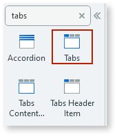

# Tabs

You can use the Tabs UI Pattern to display large sets of information, which can be split into different areas, while always remaining a click away. 

**How to use the Tabs UI Pattern**

1. In Service Studio, in the Toolbox, search for `Tabs`. 

    The Tabs widget is displayed.
    
    
    

1. From the Toolbox, drag the Tabs widget onto your application's screen. 

    
  
1. Add the necessary number of Tabs Header Item blocks to the Header placeholder and Tabs Content Item blocks to the Content placeholders.

1. On the **Properties** tab, set the relevant properties.

After following these steps and publishing the module, you can test the pattern in your app.

  
## Demo

<iframe width="750" height="500" src="https://www.youtube.com/embed/97uPVx-Q1lQ" frameborder="0" allow="accelerometer; autoplay; encrypted-media; gyroscope; picture-in-picture" allowfullscreen="allowfullscreen"></iframe>

## Properties

### Tabs

| **Property** |  **Description** |  **Usage** | 
|---|---|---|
| ActiveTab (Text): Optional  |  Set the active tab. | 
| Orientation (Orientation Identifier): Optional  |  If Vertical, header is displayed beside the content. If Horizontal, header is displayed above the content. | 
| IsJustified (Boolean): Optional  |  The Tabs Header items are evenly distributed. |
| IsRight (Boolean): Optional  |  Aligns the Tabs Header items to the right. Only active if the Orientation parameter is set to Vertical. | 
| ExtendedClass (Text): Optional  |  Adds custom style classes to the block. | 

### Tabs Header Item

| **Property** |  **Description** |  **Usage** | 
|---|---|---|
| DataTab (Text): Mandatory  |  Sets the name to connect to the Tabs Content Item. Should be the same as the paired Header Item and unique. |  

### Tabs Content Item

| **Property** |  **Description** |  **Usage** | 
|---|---|---|
| DataTab (Text): Mandatory  |  Value that connects with the Tabs Header Item. Should be the same as the paired Content Item and unique. | 

## See also

* OutSystems UI Live Style Guide: [Tabs](https://outsystemsui.outsystems.com/WebStyleGuidePreview/Tabs.aspx)
* OutSystems UI Pattern Page: [Tabs](https://outsystemsui.outsystems.com/OutSystemsUIWebsite/PatternDetail?PatternId=73)
