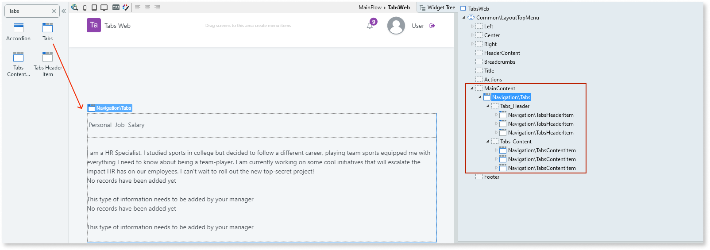
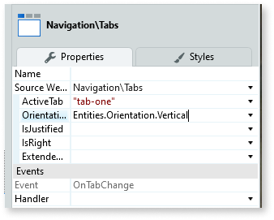

# Tabs

You can use the Tabs UI Pattern to display large sets of information, which can be split into different areas, while always remaining a click away.

**How to use the Tabs UI Pattern**

1. In Service Studio, in the Toolbox, search for `Tabs`.

    The Tabs widget is displayed.

    

    If the UI widget doesn't display, it's because the dependency isn't added. For example, if you are using a ready-made app, it deletes unused widgets from the module. Make the widget available in your app:

    1. In the Toolbox, click **Search in other modules**.
    
    1. In **Search in other Modules**, select the widget you want to add from the **OutSystemsUIWeb** module, and click **Add Dependency**. 
    
    1. In the Toolbox, search for the widget again.

1. From the Toolbox, drag the Tabs widget into the Main Content area of your application's screen.

    

    By default, the Tabs widget contains 3 Header Items (tab titles) and 3 Content Items (tab content). You can add or delete as many as required.
  
1. Add the relevant content to each of the Header Item and Content Item placeholders. In this example, we add text. You can add forms, images, labels, etc.

1. On the **Properties** tab, you can customize the Tabs look and feel by setting any of the optional properties, for example, which tab is displayed as the active tab when the page loads and whether the tabs are displayed vertically or horizontally.

    

After following these steps and publishing the module, you can test the pattern in your app.

## Demo

<iframe width="750" height="500" src="https://www.youtube.com/embed/97uPVx-Q1lQ" frameborder="0" allow="accelerometer; autoplay; encrypted-media; gyroscope; picture-in-picture" allowfullscreen="allowfullscreen">
</iframe>

## Properties

### Tabs

| **Property** |  **Description** |
|---|---|
| ActiveTab (Text): Optional  |  Defines which tab is active when the page loads. 
Examples
<ul><li>_Blank_ - The first tab is the active tab.</li><li>_"tab-two"_ - The second tab is the active tab. </li></ul> | 
| Orientation (Orientation Identifier): Optional  |  If Vertical, the tabs are displayed vertically. If Horizontal, the tabs are displayed horizontally. This is the default.|
| IsJustified (Boolean): Optional  | If True, the Tabs are evenly distributed in the space available. If False, the Tabs are left aligned. This is the default.|
| IsRight (Boolean): Optional  | If True, the Tabs are displayed to the right of the Tab content. If False, the Tabs are displayed to the left of the Tab content. This is the default. **Note**: This setting is only applicable if the **Orientation** property is set to **Vertical**. |
| ExtendedClass (Text): Optional  |  Adds custom style classes to the Pattern. You define your [custom style classes](../../../../../../develop/ui/look-feel/css.md) in your application using CSS. 
Examples <ul><li>_Blank_ - No custom styles are added (default value).</li><li>_''myclass''_ - Adds the _myclass_ style to the UI styles being applied.</li><li>_''myclass1'' ''myclass2''_ - Adds the _myclass1_ and _myclass2_ styles to the UI styles being applied.</li></ul>
You can also use the classes available on the OutSystems UI. For more information, see the [OutSystems UI Live Style Guide](https://outsystemsui.outsystems.com/StyleGuidePreview/Styles). |

### Tabs Header Item

| **Property** |  **Description** |
|---|---|
| DataTab (Text): Mandatory  |  Sets the name to connect to the Tabs Content Item. Should be the same as the paired Header Item and unique. |  

### Tabs Content Item

| **Property** |  **Description** |  
|---|---|
| DataTab (Text): Mandatory  |  Value that connects with the Tabs Header Item. Should be the same as the paired Content Item and unique. |
