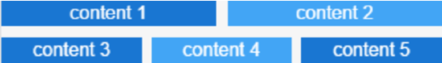
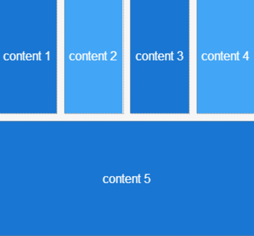

# Columns

Applies only to Traditional Web Apps.

You can use the Columns UI Pattern to split content into separate columns, improving the way information is displayed on screen.

**How to use the Columns UI Pattern**

1. In Service Studio, in the Toolbox, search for `Columns`.

    The various Column widgets are displayed.

    

    If the UI widget doesn't display, it's because the dependency isn't added. This happens because the Remove unused references setting is enabled. To make the widget available in your app:

    1. In the Toolbox, click **Search in other modules**.

    1. In **Search in other Modules**, remove any spaces between words in your search text.
    
    1. Select the widget you want to add from the **OutSystemsUIWeb** module, and click **Add Dependency**. 
    
    1. In the Toolbox, search for the widget again.

1. From the Toolbox, drag the required Column widget into the Main Content area of your application's screen. In this example, we drag the Columns 2 widget onto the screen.

    

1. Add the required content to the Column widget, for example, images, forms, text. In this example, we add some images and text.

    

1. On the **Properties** tab, you can  customize the Colums's look and feel by setting any of the optional properties, for example, the size of columns and space between each of the columns (GutterSize), and in what order the columns display on different device types.

    

After following these steps and publishing the module, you can test the pattern in your app.
  
## Properties

| **Property**                                       | **Description**                                                                                                                                                                                                                                                                                                                                                                                                                                                                                                                                                                                                                    |
|----------------------------------------------------|------------------------------------------------------------------------------------------------------------------------------------------------------------------------------------------------------------------------------------------------------------------------------------------------------------------------------------------------------------------------------------------------------------------------------------------------------------------------------------------------------------------------------------------------------------------------------------------------------------------------------------|
| GutterSize (GutterSize Identifier): Optional       | Set the gutter size. The default Gutter size is large.
Examples <ul><li>Blank - A large white space between each column (default value).</li><li>_Entities.GutterSize.Gutter_None - No white space between each of the columns</li><li>Entities.GutterSize.Gutter_XS - An extra small white space between each of the columns</li></ul>
                                                                                                                                                                                                                                                                                      |
| TabletBehavior (BreakColumns Identifier): Optional | Defines how the columns are displayed on tablets. The predefined options for the tablet behavior are: 
<ul><li>All</li><li>First</li><li>Last</li><li>Middle</li><li>None (default).</li></ul>

See below for an example of how each setting displays.
                                                                                                                                                                                                                                                                                                                                                                  |
| PhoneBehavior (BreakColumns Identifier): Optional  | Defines how the columns are displayed on phones. The predefined options for the phone behavior are: 
<ul><li>All (default).</li><li>First</li><li>Last</li><li>Middle</li><li>None</li></ul>

See below for an example of how each setting displays.
                                                                                                                                                                                                                                                                                                                                                                    |
| ExtendedClass (Text): Optional                     | Adds custom style classes to the Pattern. You define your [custom style classes](../../../look-feel/css.md) in your application using CSS.  Examples   <ul><li>Blank - No custom styles are added (default value).</li><li>"myclass" - Adds the ``myclass`` style to the UI styles being applied.</li><li>"myclass1 myclass2" - Adds the ``myclass1`` and ``myclass2`` styles to the UI styles being applied.</li></ul>You can also use the classes available on the OutSystems UI. For more information, see the [OutSystems UI Cheat Sheet](https://outsystemsui.outsystems.com/OutSystemsUIWebsite/CheatSheet). |

The following are examples of how the columns are displayed on each of the devices, depending on which property you select.

**Entities.BreakColumns.None**

**Entities.BreakColumns.Middle**

**Entities.BreakColumns.Last**

**Entities.BreakColumns.First**

