# Gallery

Applies only to Traditional Web Apps.

You can use the Gallery UI Pattern to display groups of content. This UI pattern allows users to sequentially browse images, with the notion of a beginning and an end. 

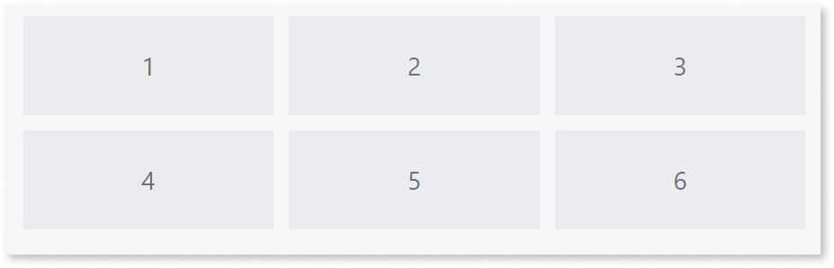

**How to use the Gallery UI Pattern**

The Gallery UI Pattern usually displays dynamic information. In most cases, prior to using this pattern, you will need [to retrieve or update the Data](../../../../data/intro.md) that contains the information you want to display on screen. You do this by using an [Action](../../../../logic/action-web.md). In this use case, we use local resources.

1. In Service Studio, in the Toolbox, search for `Gallery`. 

    The Gallery widget is displayed.

    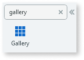

    If the UI widget doesn't display, it's because the dependency isn't added. This happens because the Remove unused references setting is enabled. To make the widget available in your app:

    1. In the Toolbox, click **Search in other modules**.

    1. In **Search in other Modules**, remove any spaces between words in your search text.
    
    1. Select the widget you want to add from the **OutSystemsUIWeb** module, and click **Add Dependency**. 
    
    1. In the Toolbox, search for the widget again.

1. From the Toolbox, drag the Gallery widget into the Main Content area of your application's screen.

    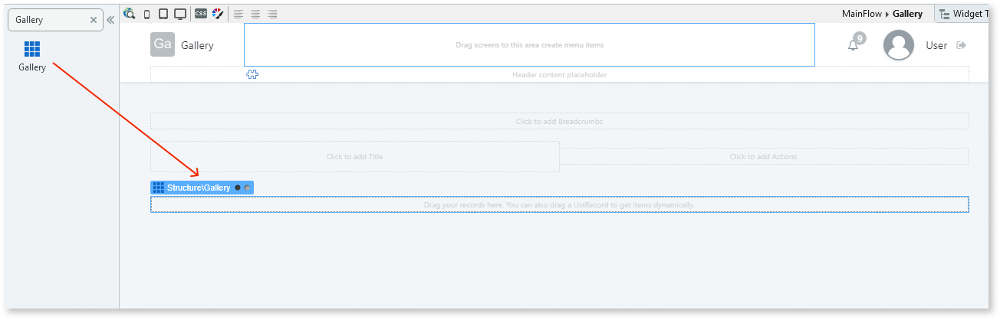

1. Add the required content to the Gallery widget. 

    By default, the Gallery widget expects a list.

    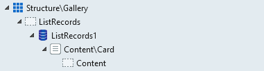

     To use the Gallery UI Pattern with items from a database, drag a [List Record](<../../../../../ref/lang/auto/class-list-records-widget.md>) into the Gallery widget and create your custom content. 

    In this example, we delete the list and add images by dragging the Image widget into the Gallery widget and selecting an image from the OutSystems UI images. You can add as many as required.

    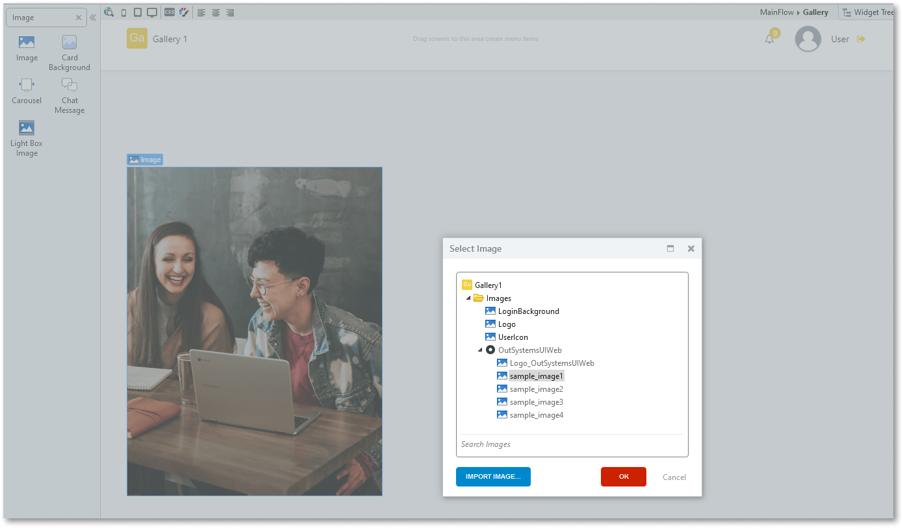

1. On the **Properties** tab, you can set the number of items to display on each row for different device types (see below for examples).
    
    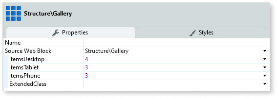

After following these steps and publishing the module, you can test the pattern in your app.

The following are examples of how the items are display depending on how many you specify for each row.

**4 items per row**

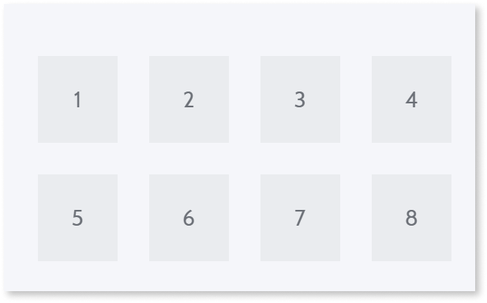

**3 items per row**
    
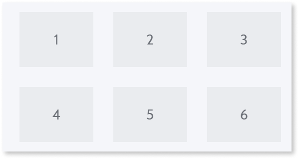

**2 items per row**

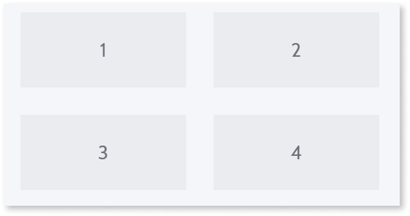

**1 item per row**

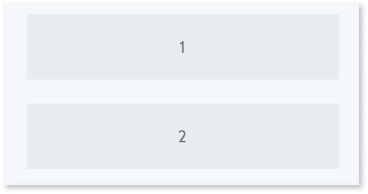

## Properties

| **Property**                     | **Description**                                                                                                                                                                                                                                                                                                                                                                                                                                                                                                                                                                                                                    |
|----------------------------------|------------------------------------------------------------------------------------------------------------------------------------------------------------------------------------------------------------------------------------------------------------------------------------------------------------------------------------------------------------------------------------------------------------------------------------------------------------------------------------------------------------------------------------------------------------------------------------------------------------------------------------|
| ItemsDesktop (Integer): Optional | Number of Items displayed per line on a desktop.                                                                                                                                                                                                                                                                                                                                                                                                                                                                                                                                                                                   |
| ItemsTablet (Integer): Optional  | Number of Items displayed per line on a tablet.                                                                                                                                                                                                                                                                                                                                                                                                                                                                                                                                                                                    |
| ItemsPhone (Integer): Optional   | Number of Items displayed per line on a phone.                                                                                                                                                                                                                                                                                                                                                                                                                                                                                                                                                                                     |
| ExtendedClass (Text): Optional   | Adds custom style classes to the Pattern. You define your [custom style classes](../../../look-feel/css.md) in your application using CSS.  Examples   <ul><li>Blank - No custom styles are added (default value).</li><li>"myclass" - Adds the ``myclass`` style to the UI styles being applied.</li><li>"myclass1 myclass2" - Adds the ``myclass1`` and ``myclass2`` styles to the UI styles being applied.</li></ul>You can also use the classes available on the OutSystems UI. For more information, see the [OutSystems UI Cheat Sheet](https://outsystemsui.outsystems.com/OutSystemsUIWebsite/CheatSheet). |

## Additional notes

Line Separator for ListRecords should be **None**.

   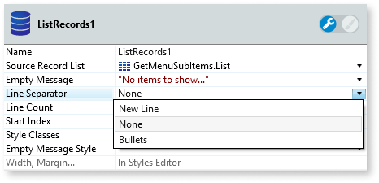
