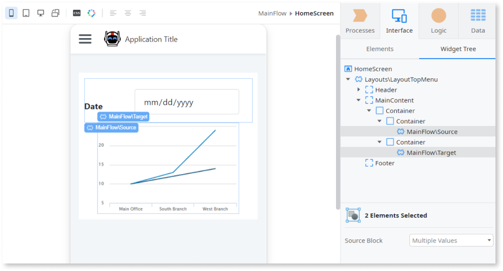
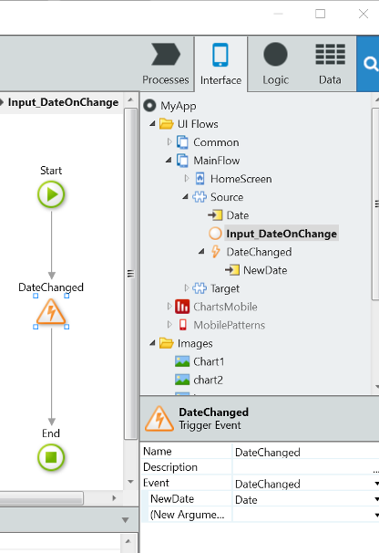
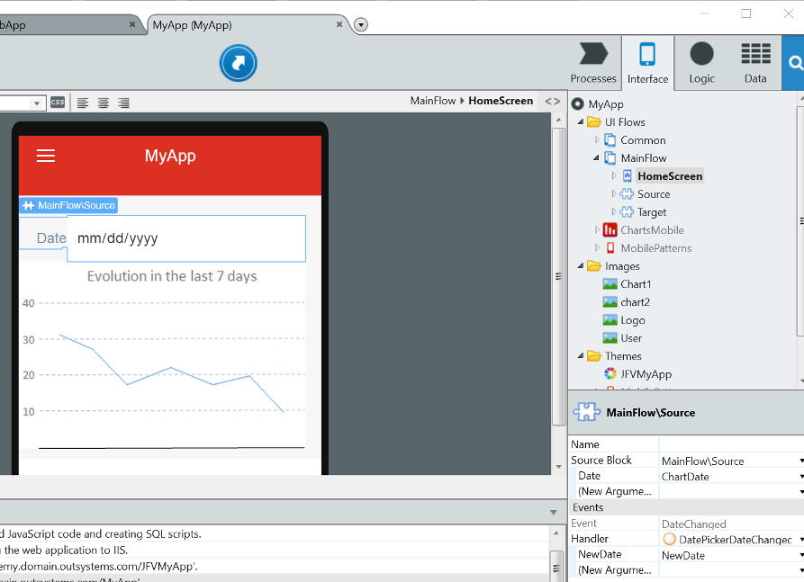
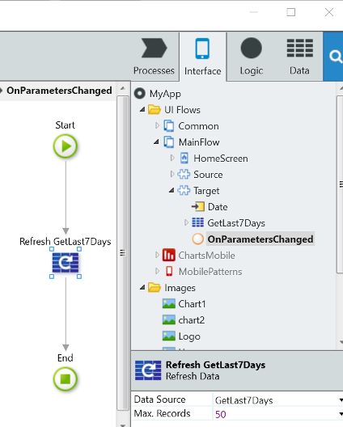

# Pass Data Between Blocks

In a screen or block with child blocks, it can happen that an event in a child block requires updating another block. For example, a block containing a date picker that, when changed, requires updating a chart plotted by another block. 

For example, suppose there is a screen that is the parent of two blocks:

* The **Source** block that implements a date picker.
* The **Target** block that plots a chart based on a date.

When the date changes in the Source block the Target block needs to be refreshed.

The following is an overview of the communication between blocks:

1. On the **Source** block, create and trigger an Event to notify the Parent screen or block and pass the necessary data;
1. On the **Parent** screen or block, handle the event triggered by the Source block and update the input parameters of the Target block;
1. Finally, in Reactive Web and Mobile apps, execute logic in the OnParametersChanged event handler on the **Target** block, if necessary. In Traditional Web apps, explicitly refresh the **Target** block.

Follow the steps below to implement this communication mechanism.

On the **Source** block:

1. Right-click the Source block on the Elements tree and add an Event. If necessary, add input parameters to the Event to pass values to the parent;

1. Create an action where you trigger the Event using the Trigger Event tool. If necessary, pass the necessary data as the input parameters of the Event;

    

1. Call the action to trigger the Event.

On the **Parent** screen or block:

1. In the interface editor, select the widget of the Source block instance.

1. In the Properties Pane, edit the Event and Handler properties under the Events section to add a new event handler action for the Event triggered by the Source block.

    

1. In the newly created action, implement the logic to set new values for the input parameters of the Target block. When this happens, the Target block is automatically updated.

In **Reactive Web** and **Mobile** apps, if the **Target** block needs to execute logic in response to the updated input parameter values:

1. In the Elements tree, select the Target block.

1. In the Properties Pane, edit the On Parameters Changed property under the Events section and select **(New Client Action)** to create a Client Action that runs when the values of the input parameters change.

1. In the newly created Client Action, implement the logic to refresh the queries or deal with the new values of the input parameters.

    

In **Traditional Web** apps, if the **Target** block needs to execute logic in response to the updated input parameter values:

1. Go to the event handler action.

1. Update the **Target** block with the Ajax Refresh tool.
