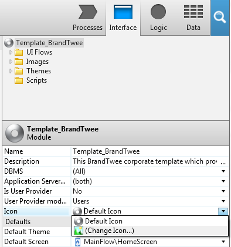

# Create a Custom Application Template

In OutSystems, a Custom Application Template is a module that you can use as a starting point to develop your application. You can use templates to define the look and feel of your apps, put in place common functionality or to manage dependencies.

To create a template for an application:

1. Create a new application, select the type of app for which you want this template to be used. 

1. Create a module and name it as `Template_<module_name>`, where `<module_name>` is the name you wish to assign to the new template. 

1. Open the module. In the properties of the module , insert a description and an icon. Along with the syntax of the module name in the step before, for a module to be considered a template it must have a description and an icon. 

1. Add to your module the developments you want to provide to the applications based on the template, like blocks or user permission logic. 

1. Publish to make the template available. Next time you create an app, this module will appear as a template in the templates list. 

Once an application is created based on a template, further changes to the template will not impact this same application.

When a new app is created based on a template, its modules will have the same colors defined for the template even if you choose a different color in the new app wizard. To allow users creating apps based on your template to bootstrap the applications primary color via the new application wizard, in the CSS of your template suffix the CSS declarations you want to make customizable with the comment `/*primary-color*/`. A Custom Application Template is listed under the name you provide and support the features supported by the UI framework on which the template is based.

## Example

Imagine you plan to develop a group of mobile applications for a company called BrandTwee. These applications need to follow the branding guidelines of the company, containing a set of screens with forms with custom validations.

To help with that task, we will create a template to be the base of all planned applications:

1. Create a new application. and select Mobile App as the type of app to build.

1. Write down the name `BrandTweeTemplates` as the app's name. 

1. Since the Margarita template has some of the features we want our template to have, select it as the template for our module. 

1. Create the module that will be the template. 

1. Insert the name `Template_BrandTwee`, where `Template_` is a required prefix to your name to set the module as a template. 

1. Open the module. Along with a name, for it to be considered a template it also needs a description and an icon. 

1. Go to the module’s properties and insert a description:

    `This is the BrandTwee corporate template which provides a set of common forms using our corporate image guidelines.`

1. Define an icon for the module.

    

1. Now we can develop what you want to provide with this template, such as the form screens, its validations, and adjust the base theme to follow the company's brand image. 

1. Publish. Once published, it becomes available in the templates list when we create a new application. 
