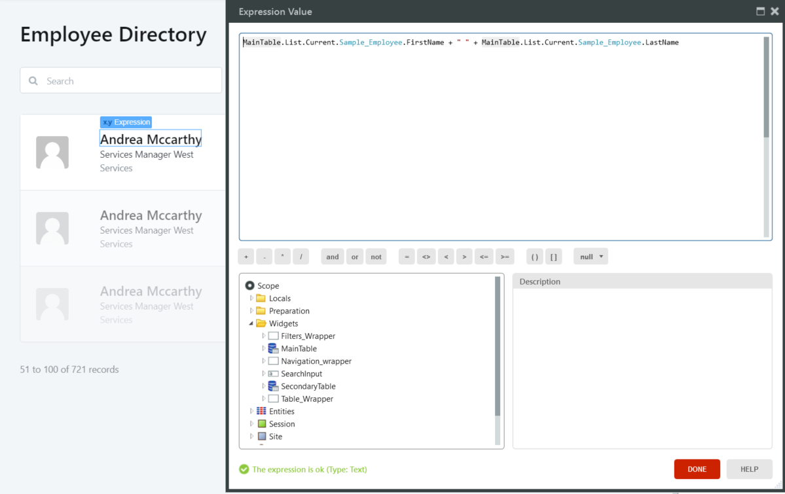
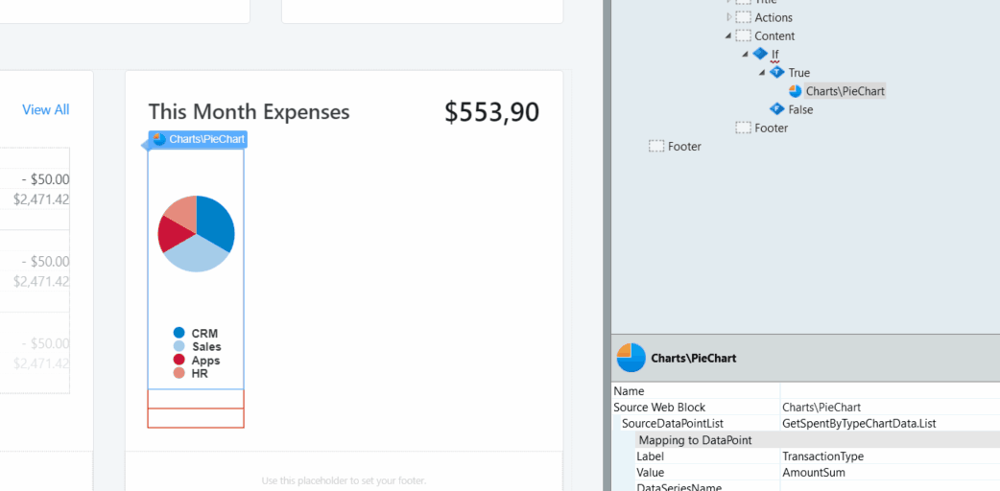

# Guidelines for creating Screen Templates

You should create such Screen Templates that, when used by developers, produce Screens with excellent UX and performance. This document helps you to do that.

In general, you should:

* Use public Blocks and UI elements to avoid duplicates in the target module. 
* Enter the metadata to help developers find the Screen Template they need.
* Create logic that is sufficient to support the UI.
* Make your Screen Templates as reusable as possible.

Test your Screen Templates so they are without errors and warnings. Once developers create a Screen from your Screen Template, they should be able to publish it and do a demo.

## Replace Data guidelines

The Replace Data feature enables developers to replace the data sources and related labels in a Screen by dragging and dropping an Entity or Attribute. This can accelerate the work of developers or slow them down if the Data Replacement causes many errors that need to be fixed manually.

Here are the tips for creating Screen Templates with good support for Data Replacement.

### Aggregates

The main points about using Aggregates:

* Use Aggregates in elements such as List, TableRecords, Charts, Forms to populate them with data.
* You should not use the word "sample" in the Aggregate names, as this might conflict with the performance of the Replace Data algorithm.

### Enable the replacement for non-default Widgets

If you want to provide the Data Replacement feature in elements other than lists, tables, forms, and charts, in the Extended Properties pane add `servicestudio-showRecord` and set it to `True`.

### Expressions

Design Screen Templates in such way that it's quick to understand how the UI elements and attributes work together, as this makes Screens quicker to troubleshoot. 

### Data sources

You should design the data in Widgets without mixing the local and server sources. The Data Replacement can only replace server data with server data, and local data with local data.

### Naming

Use generic names, like Table, List, Form etc. for the Widgets. When there are more identical elements, use something like MainTable and SecondaryTable.

### Prompts

When designing prompts make them generic and different from the Entity names. For example, use "Search" instead of "Search name or department".

### Sample Data and business logic

If you are creating Screen Templates specific to some use cases and you know the data model, it makes sense to implement business logic. Otherwise, target simple logic that works in many cases.

### Variables

If you want to protect variables from Data Replacement in, for example, counters, isolated Widgets, search implementations, use local variables with names different than Entity Attributes.

## References and copied content

You should create a module to centralize your generic logic and reference the elements from it in the Custom Screens Template Module. That way only the references are added to the target module. If you make logic local to the Custom Screen Template module, the developers end up with duplicated content in the target module.

On the other hand, you should create content local to the Custom Screen Template module if you need that content copied to the target module.

## Custom styles

Use the OutSystems UI Framework CSS classes or classes from your default Theme. This makes your design consistent and without duplicated CSS in the target modules. Also, if the developers select a Screen Template without a compatible Theme in the target module, they see a message warning them about the incompatibility.

## Preview and testing

In cases where an element collapses within a branch of the If tool and breaks the preview in the main editor, wrap the element inside a Container. This forces the element to take the full width of the parent Container and fixes the preview. 
 

Use "Work in progress" category, or similar, to let the developers know which Screen Templates are not finished.
