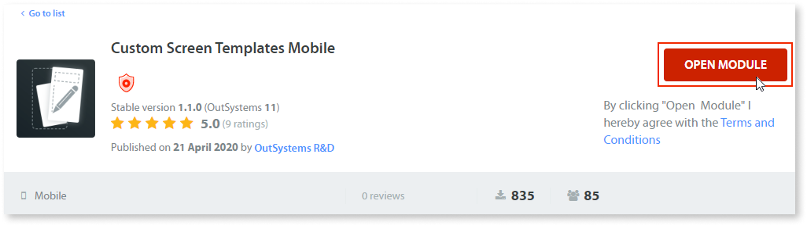
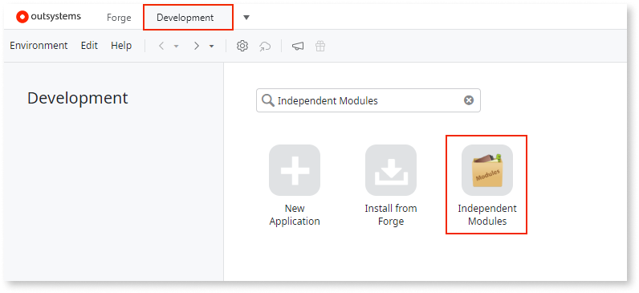
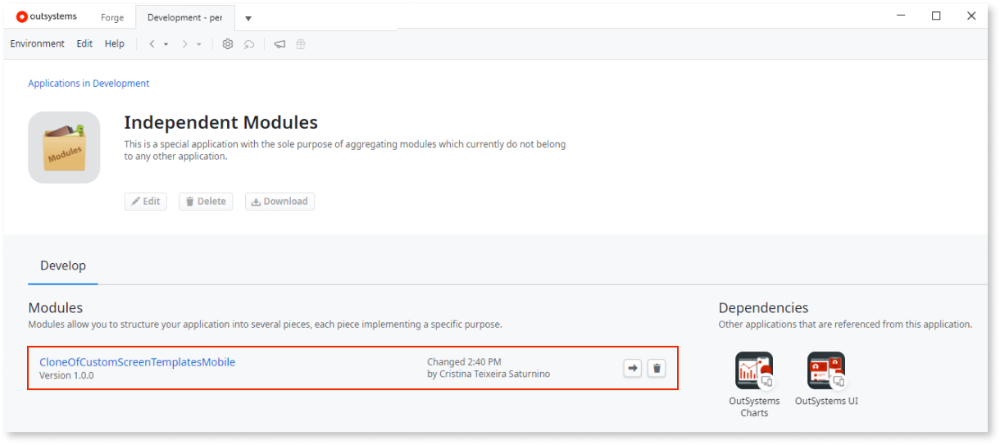
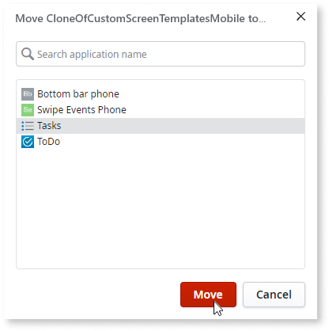
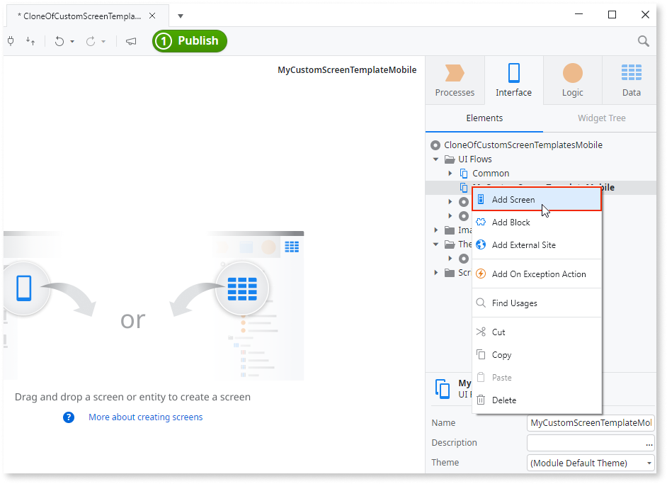
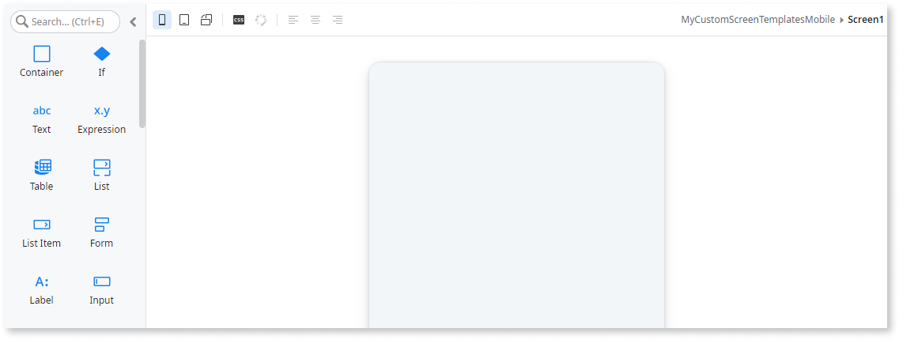
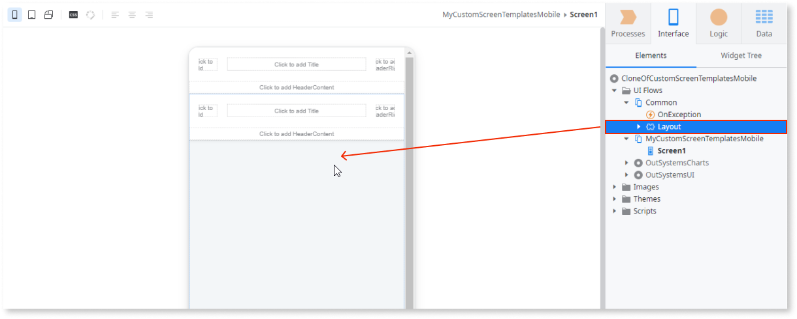

# Creating Screen Templates

Create new Screen Templates and make them available in your environment by adding them to a Custom Screen Templates Module.

## Creating a Custom Screen Templates Module

To add new Screen Templates to your environment, you first need to clone one of the Screen Template components: 

* [Custom Screen Templates Reactive](https://www.outsystems.com/forge/component-overview/7127/custom-screen-templates-reactive) for Reactive Web Apps
* [Custom Screen Templates Mobile](<https://www.outsystems.com/forge/component-overview/5060/custom-screen-templates-mobile>) for Mobile Apps
* [Custom Screen Templates Traditional Web](<https://www.outsystems.com/forge/component-overview/5089/custom-screen-templates-web>) for Traditional Web Apps

Follow these steps:

1. In Service Studio, go to the **Forge** tab and search for **Custom Screen Templates**. Find the Screen Template component for the type of app you need. 

    
    
1. Click one of the components and then click **Open Module**. 
     
    

    A new tab opens in Service Studio displaying a warning message.
     
1. Click **Open a Clone**.

    

    Service Studio takes a few seconds to clone the module.

1. Click **Close**.

    

1. This is an optional, but a highly recommended step. 

    Go to the **Interface** tab, click the module title in the element tree, and edit the **Name** property to, for example, `MyCustomScreenTemplatesReactive` or `MyCustomScreenTemplatesMobile`. 
    
    
    
    This makes the names of the cloned modules more meaningful.

1. Publish the module. 

    The module is now available on the **Development** tab, in **Independent Modules**.

    

    

1. From **Independent Modules**, move your Custom Screen Templates Module to the app you want to use it in. 

    To do this, click the Move module icon, select the app you want to move the template to, and click **Move**.
    
    
        
    

    The template module is now part of the app you selected.

## Creating new Screen Templates

1. Open the Custom Screen Templates Module where you want to add a new Screen Template. If you don't have such a module, follow the [instructions for creating it](<#creating-custom-screen-templates-module>) and then return to this step.

1. On the **Interface** tab, from the **UI Flows** folder, right-click your screen template UI flow and select **Add Screen**.

    

1. In the **New Screen** window, select either a Screen Template with some content to bootstrap your template or choose **Empty** and click **Create Screen**. 

    In this example, we select **Empty**.

    

    The new screen opens: 

    

1. Go to the **UI Flows** folder, expand the **Common** folder, and drag the **Layout** block onto the screen.

    

    Note: This step only applies if you selected the **Empty** screen in the previous step.

1. [Set the preview image](<reference-metadata.md#preview-image>) and enter the [metadata](<reference-metadata.md>) for the Screen Template.

1. Publish the module.

    Your Screen Template is now available to all developers in the environment.

    

## Editing Screen Templates

You can edit your Screen Templates in your Custom Screen Templates Module. Republish the module to update the Screen Templates in the environment.

If you want to edit a Screen based on a template, edit the Screen. Editing a Screen Template won't change the Screens you created from the template. 

## Creating Screen Templates with a custom Theme

You can use a different Theme in each Custom Screen Template Module. The Custom Screen Templates Modules from Forge use the default Theme from the OutSystems UI. Screen Templates inherit the styles from the Theme. 

1. Follow the steps for [creating a Custom Screen Templates Module](<#creating-custom-screen-templates-module>).

1. Edit the module so it uses your Theme.

1. Follow the steps for [creating new Screen Templates](<#creating-new-screen-templates>).

OutSystems provides the following Forge components to assist you in creating your own style guide and Screen Templates:

* [OutSystems UI Style Guide Preview](https://www.outsystems.com/forge/component-overview/7527/outsystems-ui-style-guide-preview)
* [OutSystems UI Reactive Style Guide Template](https://www.outsystems.com/forge/component-overview/7526/outsystems-ui-reactive-style-guide-template)
* [OutSystems UI Style Guide Theme](https://www.outsystems.com/forge/component-overview/8240/outsystems-ui-style-guide-theme)