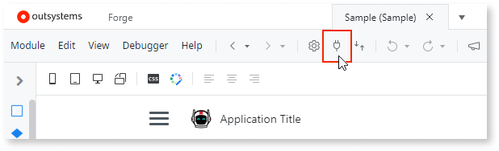
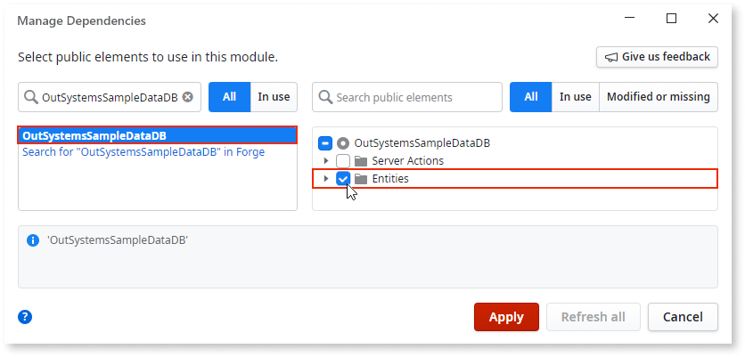
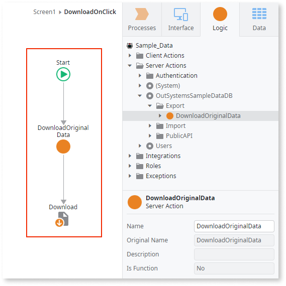

# Sample data

Sample data consists of example records from domains related to several industries. **Screen Templates** use this sample data to create screen instances which are useful to create a prototype, a proof of concept, or to follow a tutorial that requires it. 

## Referencing sample data in apps

To reference sample data, include the **OutSystemsSampleDataDB** module in your app, as described below:

1. Click the manage dependencies icon in the Service Studio toolbar (or press CTRL+Q) to open the **Manage Dependencies** window.

    

2. Search for **OutSystemsSampleDataDB** and select it in the results pane. In the right pane select all **Entities** of the module, then click **Apply** to confirm and close the **Manage Dependencies** window.

    

The Entities are now available in the **Data** tab of **Service Studio**.

If your search for **OutSystemsSampleDataDB** gives no results, that may mean that the [OutSystems Sample Data](https://www.outsystems.com/forge/component-overview/4145/outsystems-sample-data) component, which is usually installed with **Platform Server**, is not present in your environment. Click the **Forge** tab in Service Studio and install the component manually.

## Managing OutSystems sample data

The **OutSystemsSampleDataDB** module provides a collection of public APIs that let you export original data, import your own sample data, and reset the sample data.

Sample data entities are public, so you can create a custom back office.

### Import your sample data

You may create entities to suit your own business requirements by changing the sample data used in your **Screen Templates**.

1. Create download logic by referencing **DownloadOriginalData**  and adding it to a server action.
1. In the **Logic** tab expand **Server Actions**  and then expand **OutSystemsSampleDataDB**.   
1. Expand **Export** and **DownloadOriginalData** Server Action from **Logic** > **Server Actions** > **OutSystemsSampleDataDB** > **Export** to save the original source files in a zip archive. You need to create a logic flow to download a file by adding a **Download** element at the end of the flow.  

    

1. Edit the source files in the zip archive with your own data.

1. Use the **Import** Server Action from **Logic** > **Server Actions** > **OutSystemsSampleDataDB** > **Import** to upload the updated file and replace the current data. You need to create logic for the import, similar to what was created for the export.

### Reset the sample data

Sample data is automatically created when the application is published. However, you may need to reset it.

If any app extends the provided entities, the **Foreign Key** constraint will not let the timer run successfully. In this case delete such references (records) before resetting the sample data.

1. Access `http://<yourserver>/ServiceCenter/` and, from the **Factory** > **Application** area, search for **OutSystems Sample Data** and click it. 
    
    
    
1. Click **OutSystemsSampleDataDB** in the **Application OutSystems Sample Data** window.
   
    

1. In the **Timers** tab in the module details window, select **Reset_SampleData**, and then click **Run Now**.
    
    

Other timers that may be reset in the same way are described in the list below:

* **Bootstrap_SampleData**: Runs when the module is published, bootstraping the sample data for all entities.
* **DailyRefresh**: Runs the bootstrap action to make sure sample data is available.
* **Delete_SampleData**: Deletes data from all sample data entities.
* **Reset_SampleData**: Resets data from all sample data entities by deleting sample data and then bootstrapping it.
* **ResetDates**: Resets dates only, done periodically to ensure, for instance, that data in charts are displayed properly.
