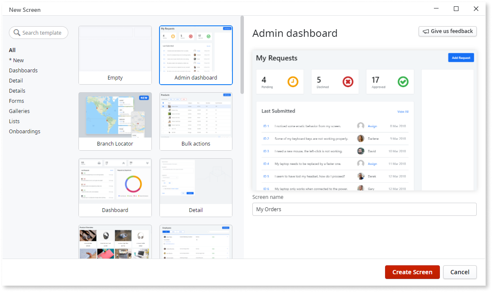

# Screen Templates

Check <a href="https://outsystemsui.outsystems.com/OutSystemsUIWebsite/ScreenOverview" title="Demos and previews of Screen Templates">Screen Templates</a> on the OutSystems UI website for the list of templates and their previews.

Screen Templates enable you to create [Screens](../screens/intro.md) with predefined layouts, widgets, components, styles, and logic. The Screens you create from the built-in Screen Templates have sample data. Having sample data in the Screen is a good way to see how the Screen is designed and to get inspired for developing your app.

Screen Templates help you develop faster. For example, create a work order template and make it onto a Screen that shows the statuses of your project tasks. You can change the Screens by [dropping](<replace-data.md>) an Entity over the widget. When the Entity changes, Service Studio updates the user interface.

Service Studio comes with the default Screen Templates that are based on the OutSystems UI Framework. You can [create your Screen Templates](<../screen-templates-create/intro.md>) as well.

