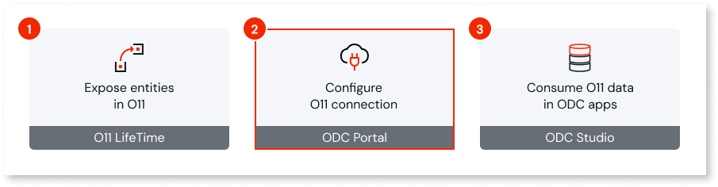
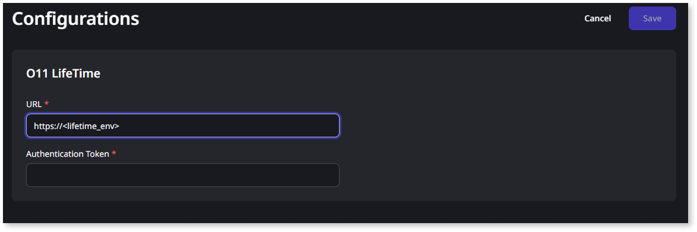
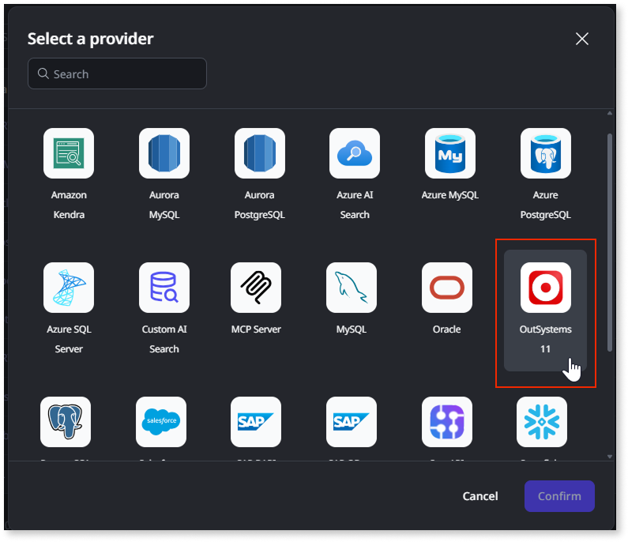
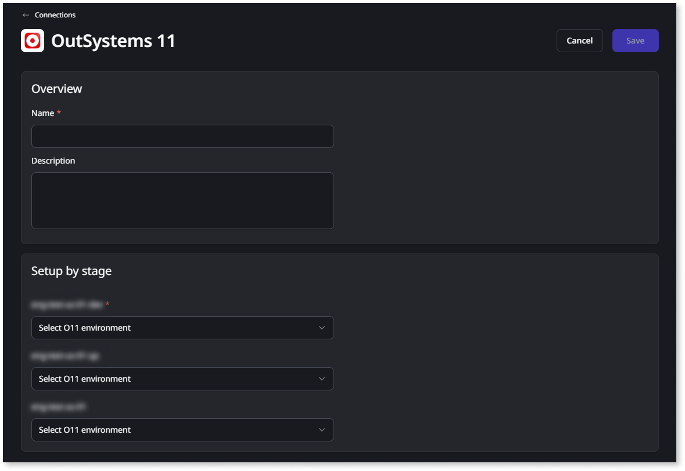
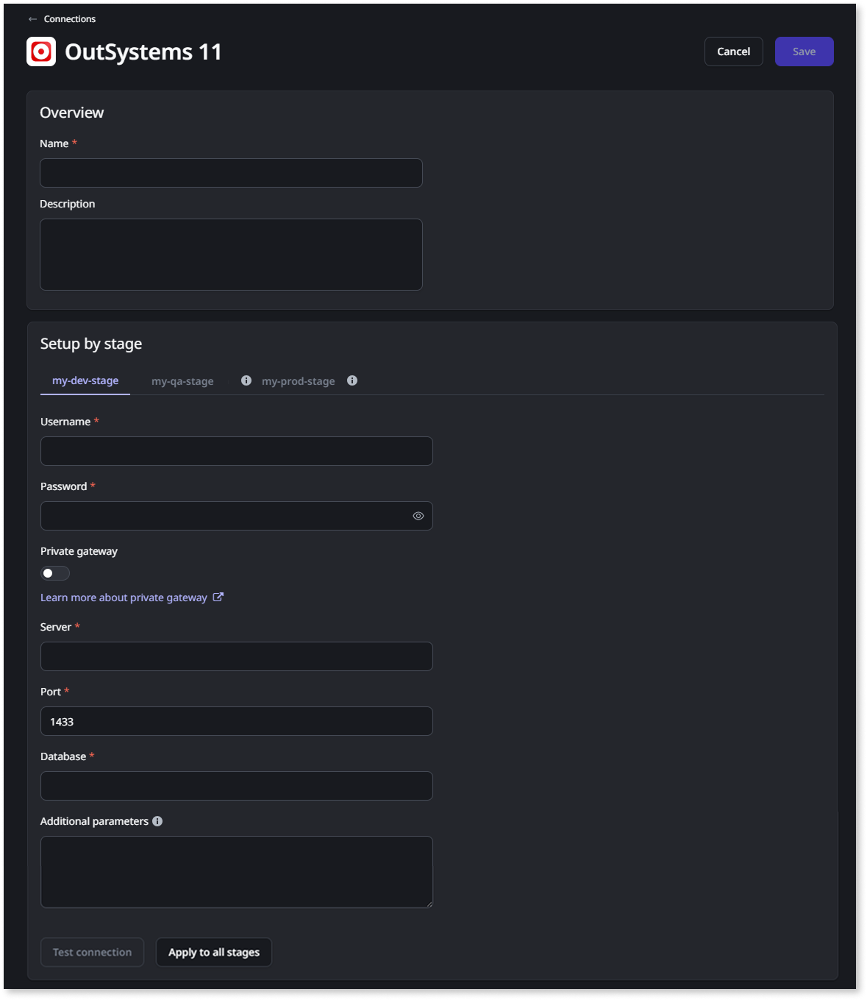
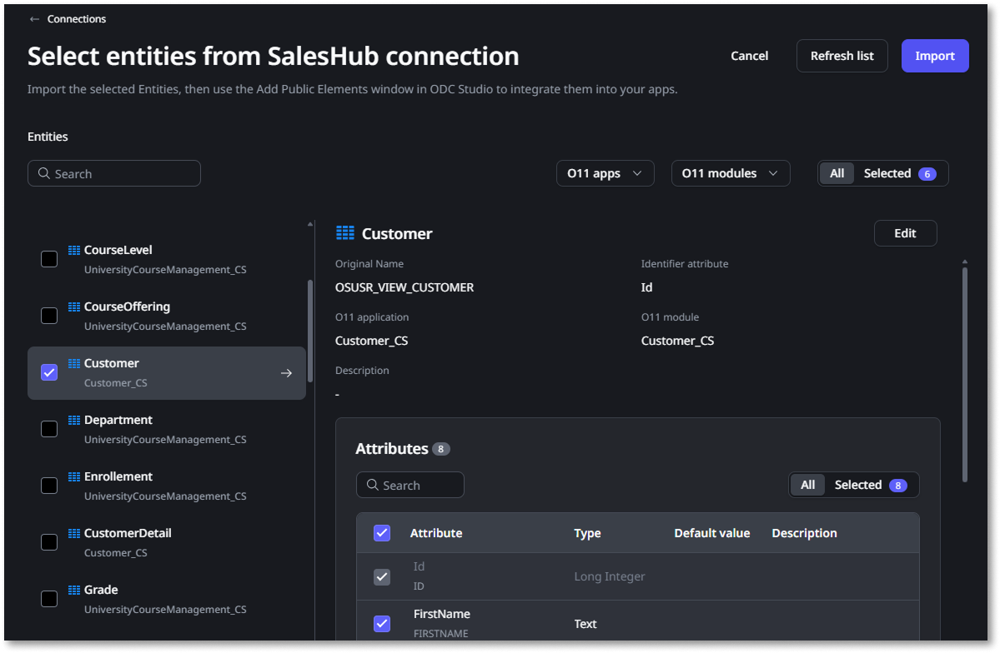

# Configure the O11 connection in ODC Portal

After [exposing your O11 entities](expose-entities.md), you need to configure the O11 connection to make those entities available in ODC.

Start by [connecting ODC to your O11 infrastructure](#connect-o11-infrastructure). Then, you can [create data connections](#create-connection) to [import the O11 entities](#import-exposed) that developers can [use in their ODC apps](consume-entities.md).

## Prerequisites

Before you start, ensure the following requirements are met:

* The O11 entities you want to use in ODC have already [been exposed using the Expose Entities LifeTime plugin](expose-entities.md).

* The user connecting ODC to the O11 infrastructure has the **Administrator** role.

* The user creating the data connection has **Connection management > Create** permission.

* The user defining which entities are imported in the data connection has the **Configuration management > Configure connections** permission.

* If you have an O11 self-managed infrastructure, ensure the following:

    * The [required network connectivity](intro.md#prerequisites), from ODC to your O11 self-managed infrastructure.

    * A database administrator performed the [required database operations](data-interop-self-managed.md#on-expose) for the O11 environments where developers exposed or propagated entities.

    * You have the details of the database connection (Server, Port, Database Name or Host, Port, Service Name), and database dedicated user (username and password) for each of the [O11 environments to map](intro.md#mapping).

## Connect ODC to your O11 infrastructure {#connect-o11-infrastructure}

This step requires the **Administrator** role.

This is a one-time setup that establishes the link between your ODC organization and your O11 infrastructure. Follow these steps:

1. Log into the ODC Portal.

1. Go to **OUTSYSTEMS 11 > Configurations**.

1. If it's not configured yet, configure the connection to the O11 infrastructure that you want to integrate with:

    * Set the **URL** of the LifeTime environment.

    * Set the **Authentication Token** of the [service account](https://www.outsystems.com/tk/redirect?g=1f0c3b37-45b9-4a4d-b640-016dac5f5d6b) you'll use to access the LifeTime environment.

    

    This service account must have the **Administrator** role.

    

    

## Create an O11 data connection {#create-connection}

This step requires the **Connection management > Create** permission.

After linking your infrastructures, let's create a data connection to O11. Follow these steps:

1. In the ODC Portal, go to **INTEGRATE > Connections**.

1. Click **Create connection**.

1. Select the **OutSystems 11** provider.

    

1. Enter a unique **Name** and an optional **Description** for your connection.

1. Map each ODC stage to the [corresponding O11 environment](intro.md#mapping). The configuration is different for O11 Cloud and O11 self-managed infrastructures:

    * For O11 Cloud:

        You map each ODC stage to an O11 environment. ODC automatically handles the underlying complexity, such as creating the dedicated database users and connection details for each mapping.

        In the **Setup by stage** section, use the dropdowns to map each ODC stage to the corresponding O11 environment.

        

    * For O11 self-managed infrastructures:

        You must provide the database connection details for each ODC stage, similar to when [creating connections to external data sources](https://www.outsystems.com/tk/redirect?g=32004a44-1a95-46b2-abcb-88ad76f51961).

        In the **Setup by stage** section, provide the database connection details and test the connection for each ODC stage:

        * Set the **Username** and **Password** of the dedicated database user for interoperability created during [the initial setup](data-interop-self-managed.md#setup).

        * For SQL Server, set the **Server**, **Port**, and **Database** for each O11 environment.

        * For Oracle, set the **Host**, **Port**, and **Service name** for each O11 environment.

        

        If you are using a **Private gateway**, switch the toggle on and fill the corresponding information.

        

        

1. Click **Save**. The system now begins the connection setup process in the background.

For O11 cloud infrastructures, creating the connection is an asynchronous process that may take a few minutes. You can monitor its progress on the Connections screen. If the setup fails, the status updates to **Failed**, and the page displays an error message to help you diagnose the issue. You can use the **Retry** option to attempt the setup again.

## Import exposed O11 entities {#import-exposed}

This step requires the **Configuration management > Configure connections** permission.

Once the connection is successfully created, you can import the exposed entities you want to use. The connection automatically preserves the familiar logical names from O11, so you can work with entities like `Customer` directly.

Follow these steps to import the exposed entities:

1. In the ODC Portal, go to **INTEGRATE > Connections**.

1. In the connections list, click **Import** for the OutSystems 11 connection you want to use.

1. Select the exposed O11 entities you want to import. OutSystems automatically selects and imports all the attributes for each O11 entity.

1. Click **Import**.

Developers can now [consume the imported O11 entities](consume-entities.md) in their ODC apps.

## Refresh the exposed O11 entities {#refresh-exposed}

When there's a [change to the exposed O11 entities](expose-entities.md#update-exposed), you need to refresh the connection in ODC:

1. In the ODC Portal, go to **INTEGRATE > Connections**.

1. In the connections list, click **Import** for the OutSystems 11 connection including the entities you want to refresh.

1. Click **Refresh list**.

Developers can now update the dependencies in their ODC apps to reflect the changes. For further details, see how to [handle O11 data model changes in ODC apps](handle-o11-data-model-changes.md).
