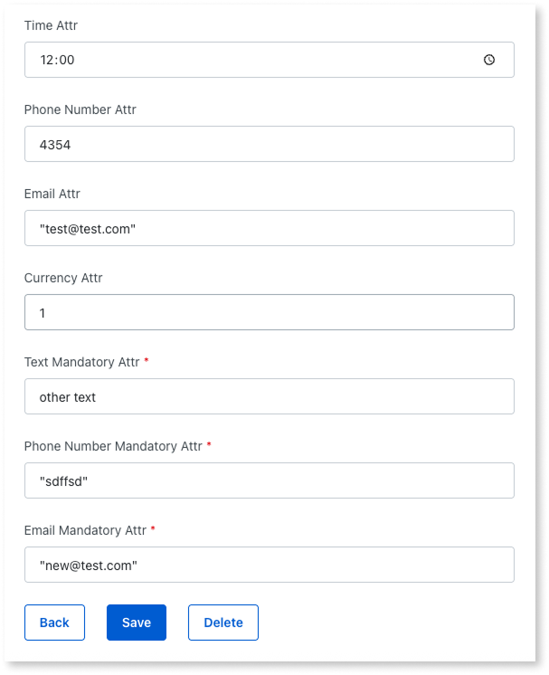

# Best practices for consuming O11 entities in ODC apps

This page describes development behaviors and best practices to consider when [consuming O11 entities in ODC apps](consume-entities.md).

## Writing SQL queries

When writing SQL queries for these entities, you must use a **syntax based on ANSI-92**. For more information, refer to [how to use ANSI-92 syntax in SQL nodes](https://www.outsystems.com/tk/redirect?g=4d569b71-1430-4801-96da-cce2e9984174).

## Working with O11 static entities {#o11-static-entities}

OutSystems is working to enable the consumption of O11 static entities as ODC static entities, which is a [limitation](intro.md#temporary-limitations) for now.

Currently, when you expose a static entity from an O11 app, it becomes a regular, read-only external entity in ODC. The "static" nature and its records are not available at design time in ODC Studio.

**Auto-number** record identifiers (IDs) for an O11 static entity are not guaranteed to be the same across your different O11 environments. For these cases, avoid writing logic in ODC that compares with a specific hard-coded ID from an O11 static entity, as this can lead to unexpected behavior in different stages.

## Transactions

Similarly to other [external data source integrations](https://www.outsystems.com/tk/redirect?g=05934d09-1852-40c7-8b4f-cafd0f93f2a3), ODC creates an independent transaction on the O11 database for each O11 entity action.

When combining O11 entities with other external data sources in your ODC app, be aware of the [transaction behavior in data mashup scenarios](https://www.outsystems.com/tk/redirect?g=4d56d131-ab84-401a-950f-ba81eebd716c), especially when performing write operations before querying the combined data.

[Data mashup with O11 Oracle entities](#oracle-mashup) is currently not supported.

If you require transactional consistency across multiple O11 records - for example, creating an Order and the Order Lines together - create a wrapper REST API in O11 that handles the transaction internally. Then, use [logic interoperability](https://www.outsystems.com/tk/redirect?g=1edc897d-d7ca-494f-9379-d8ce57467cc9) to consume that O11 logic in your ODC app.

## Performance

The scalability of your ODC apps that consume O11 data depends on the performance and capacity of the underlying O11 database. At the same time, high volumes of requests from ODC - such as those from high-traffic B2C apps or AI agents - can increase the load on your O11 database, potentially affecting the performance of your O11 applications.

To ensure stability across both platforms:

* **Design your O11 data model for performance:** Ensure proper indexing and normalization to handle queries efficiently. Refer to the [O11 data model best practices](https://success.outsystems.com/documentation/11/onboarding_developers/outsystems_platform_best_practices/#data-model) for more details.

* **Write efficient queries in your ODC apps:** Optimize data fetching by selecting only necessary columns and limiting result sets. Avoid executing SQL queries inside logic loops, as this generates database communication overhead. For more details, refer to the best practices for [fetching and displaying data](https://www.outsystems.com/tk/redirect?g=65834d5d-b36c-47b0-afc5-43ae35b5bd7d) and [querying data using SQL](https://www.outsystems.com/tk/redirect?g=22b6fa5c-e6d7-49db-a2bc-861465aa1419). When combining O11 entities with other external data sources in your ODC app, follow the [best practices for data mashup queries](https://www.outsystems.com/tk/redirect?g=eb941889-6a5e-4e81-a570-80321841e5c1).

    

    [Data mashup with O11 Oracle entities](#oracle-mashup) is currently not supported.

    

* **Test your apps:** Conduct load testing to verify that your O11 database can handle the additional concurrent load from ODC apps without degradation. Refer to [Testing apps](https://www.outsystems.com/tk/redirect?g=B1B1C48B-A7E2-4E13-83F7-104B97075CB2) for further details.

* **Monitor performance:** Use [ODC Analytics](https://www.outsystems.com/tk/redirect?g=e190d5fb-6b99-4d9b-a64f-a3b34be3588d) to track the performance of your ODC app. Since the data resides in O11, use [O11 monitoring tools](../../monitor-and-troubleshoot/intro.md) to detect potential issues or bottlenecks.

## Consuming O11 Oracle entities in ODC apps

This section describes ODC behavior when you consume O11 Oracle entities in an app, and some known issues that you need to consider.

### Handling empty text

Due to [Oracle DBMS's representation of empty strings](../../ref/data/database/database-compatibility-issues.md#using-empty-strings-in-query-conditions), when using an Oracle database, OutSystems 11 writes a single space character (`" "`) to represent an empty text value, instead of an empty string (`""`). This behavior applies to **Text**, **PhoneNumber**, and **Email** data types.

When consuming O11 Oracle entities in ODC apps, **Data Fabric follows the same O11 behavior** for read and write operations, adding a single space character (`" "`) to represent an empty text value.

However, the following situations in ODC may differ from the behavior you are used to in O11:

* ODC maintains a **consistent behavior across aggregates and SQL nodes** for comparisons with an empty string `("")` or `Trim()` function. This contrasts with O11, where SQL nodes don't include the single space character (`" "`) to match aggregates behavior.

* When evaluating logic involving **trimmed entity attributes**, ODC replaces the outputs of the `Trim()` function with a single space character (`" "`). This ensures that expressions evaluate as `True` for string-to-string equality. Consequently, some expressions that evaluate as `False` in O11, evaluate as `True` in ODC, for example:

    * `Trim("") = Trim("")`
    * `Trim(" ") = Trim("")`
    * `Trim("") = Trim(" ")`
    * `Trim("") = " "`

### Known issues

There are currently some known issues that you need to account for in your ODC apps when consuming O11 Oracle entities.

#### Built-in functions

Currently, for the below built-in functions or text operators, ODC isn't adding a single space character (" ") to represent an empty text value as expected. Thus, beware of the following function-specific behaviors in your ODC apps when handling empty text:

* `ToLower()`/`ToUpper()` - To have the same behavior as O11, you must compare with a single space character:

    * `MyO11Entity.Description = ToLower(" ")`
    * `MyO11Entity.Description = ToUpper(" ")`

* `+` operator - If a concatenation results in an empty string, ODC doesn't automatically add a single space character:

    * `MyO11Entity.Description = "" + ""`

* `Substr()` - If the result is an empty string, ODC doesn't add a single space character:

    * `MyO11Entity.Description = Substr(MyO11Entity.Name,2,0)`

* `Index()` - Searching for a single space character using the `Index()` function only returns records containing a single space character, and not null values:

    * `Index(MyO11Entity.Description, " ") = 0`

#### Redundant empty filters in aggregates

In aggregates, when filtering by an empty string and a single space at the same time on the same literal column, no records are returned, even though these filters are equivalent. For example:

* `MyO11Entity.TextAttribute = ""` and `MyO11Entity.TextAttribute = " "`

#### Displayed default values

When creating new records in runtime, the default values for **Email** and **Phone** types are being shown with quotation marks in the UI.

#### Data mashup not supported {#oracle-mashup}

Using [data mashup](https://www.outsystems.com/tk/redirect?g=49e82c30-f818-4e76-9961-1ccae5852e4e) to combine O11 Oracle entities with other external systems isn't currently supported in ODC apps.

Although basic queries might occasionally work, the system may not reliably handle complex queries in this setup.
