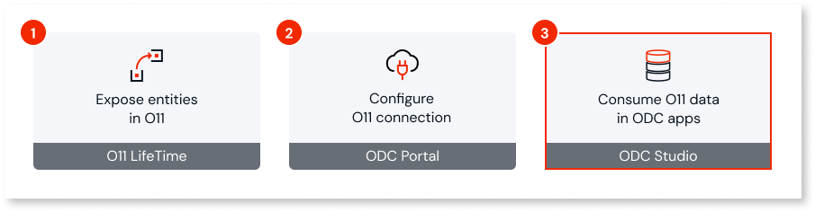
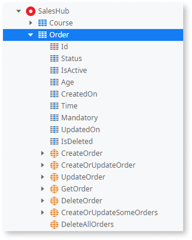

# Consume O11 entities in ODC apps

After the [O11 connection is configured](configure-connection.md) and the [O11 entities imported](configure-connection.md#import-exposed), they become available in ODC Studio as external entities. Developers can use them in their apps just like any other entity from an external data source: adding an O11 entity as a dependency to use in aggregates or SQL queries, and using the available entity actions in the app logic.

The way [how the O11 entity is exposed](expose-entities.md#control-data) determines how you can use it in ODC:

* Only entities with the **Public** property set to **Yes** can be exposed to ODC.

* **Exposed Read Only** property set to **Yes** - The entity is read-only in ODC. The only entity action available is `Get<Entity>`.

* **Exposed Read Only** property set to **No** - The entity is read-write in ODC with the following entity actions available:
    * `Create<Entity>`
    * `CreateOrUpdate<Entity>`
    * `Update<Entity>`
    * `Get<Entity>`
    * `Delete<Entity>`
    * `CreateOrUpdateSome<Entity>`
    * `DeleteAll<Entity>`

    

    

    Currently, the writing capability isn't yet supported for the following scenarios:

    * Oracle databases  
    * O11 static entities (except those defined in libraries, which can't be exposed)  
    * O11 multi-tenant entities

    See the [data interoperability limitations](intro.md#limitations) for further details.

    

When consuming O11 entities in your ODC apps, make sure you follow the [best practices](#best-practices) and you understand how to [handle O11 data model changes](handle-o11-data-model-changes.md).

## Development best practices {#best-practices}

This section describes development behaviors and best practices to consider when working with O11 entities in ODC apps.

### Writing SQL queries

When writing SQL queries against these entities, you must use a **syntax based on ANSI-92**. For more information, refer to [how to use ANSI-92 syntax in SQL nodes](https://www.outsystems.com/tk/redirect?g=4d569b71-1430-4801-96da-cce2e9984174).

### Working with O11 static entities {#o11-static-entities}

OutSystems is working to enable the consumption of O11 static entities as ODC static entities, which is a [limitation](intro.md#temporary-limitations) for now.

Currently, when you expose a static entity from an O11 app, it becomes a regular, read-only external entity in ODC. The "static" nature and its records are not available at design time in ODC Studio.

**Auto-number** record identifiers (IDs) for an O11 static entity are not guaranteed to be the same across your different O11 environments. For these cases, avoid writing logic in ODC that compares against a specific hardcoded ID from an O11 static entity, as this can lead to unexpected behavior in different stages.

### Handling empty text from O11 on Oracle

An empty text value from the O11 app is represented in the O11 Oracle platform database as a single space character (`" "`), not as an empty string (`""`). This behavior applies to **Text**, **PhoneNumber**, and **Email** data types.

This has three main consequences in your ODC app:

* **Comparing Data**: Standard comparisons to an empty string (`""`) or using built-in Null&lt;data-type&gt;() functions don't work as expected. For example, in If conditions or Aggregate filters, you must adapt your logic to check for a single space character instead.

    For example, when checking the value in logic:

    * **Incorrect**: Using an empty string or Null&lt;data-type&gt;() functions doesn't correctly identify the empty value.

        `MyO11Entity.Description = ""`

        `MyO11Entity.ProductCode = NullIdentifier()`

        `MyO11Entity.ProductCode = NullTextIdentifier()`

    * **Correct**: You must always compare against a single space character.

        `MyO11Entity.Description = " "`

* **Assigning the Value**: The single space character is carried over whenever you assign this value. This includes copying it to a local variable, passing it as an input parameter, or saving it to an ODC entity.

* **Displaying Data**: When you show these attributes in the UI, they appear as a single visible space instead of being completely empty, which may impact your layout.

### Transactions

Similarly to other [external data source integrations](https://www.outsystems.com/tk/redirect?g=05934d09-1852-40c7-8b4f-cafd0f93f2a3), ODC creates an independent transaction on the O11 database for each O11 entity action.

When combining O11 entities with other external data sources in your ODC app, be aware of the [transaction behavior in data mashup scenarios](https://www.outsystems.com/tk/redirect?g=4d56d131-ab84-401a-950f-ba81eebd716c), especially when performing write operations before querying the combined data.

If you require transactional consistency across multiple O11 records - for example, creating an Order and the Order Lines together - create a wrapper REST API in O11 that handles the transaction internally, and consume that API in your ODC app. For guidance on how to expose your O11 business logic through REST APIs, see [Token-based authentication for exposed REST APIs](../../integration-with-systems/rest/expose-rest-apis/token-based-auth-expose-dev-pattern.md).

### Performance

The scalability of your ODC apps that consume O11 data depends on the performance and capacity of the underlying O11 database. At the same time, high volumes of requests from ODC - such as those from high-traffic B2C apps or AI agents - can increase the load on your O11 database, potentially affecting the performance of your O11 applications.

To ensure stability across both platforms:

* **Design your O11 data model for performance:** Ensure proper indexing and normalization to handle queries efficiently. Refer to the [O11 data model best practices](https://success.outsystems.com/documentation/11/onboarding_developers/outsystems_platform_best_practices/#data-model) for more details.

* **Write efficient queries in your ODC apps:** Optimize data fetching by selecting only necessary columns and limiting result sets. Avoid executing SQL queries inside logic loops, as this generates database communication overhead. For more details, refer to the best practices for [fetching and displaying data](https://www.outsystems.com/tk/redirect?g=65834d5d-b36c-47b0-afc5-43ae35b5bd7d) and [querying data using SQL](https://www.outsystems.com/tk/redirect?g=22b6fa5c-e6d7-49db-a2bc-861465aa1419). When combining O11 entities with other external data sources in your ODC app, follow the [best practices for data mashup queries](https://www.outsystems.com/tk/redirect?g=eb941889-6a5e-4e81-a570-80321841e5c1).

* **Test your apps:** Conduct load testing to verify that your O11 database can handle the additional concurrent load from ODC apps without degradation. Refer to [Testing apps](https://www.outsystems.com/tk/redirect?g=B1B1C48B-A7E2-4E13-83F7-104B97075CB2) for further details.

* **Monitor performance:** Use [ODC Analytics](https://www.outsystems.com/tk/redirect?g=e190d5fb-6b99-4d9b-a64f-a3b34be3588d) to track the performance of your ODC app. Since the data resides in O11, use [O11 monitoring tools](../../monitor-and-troubleshoot/intro.md) to detect potential issues or bottlenecks.
