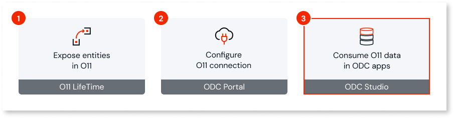
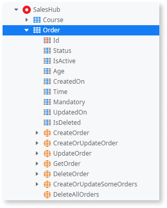

# Consume O11 entities in ODC apps

After the [O11 connection is configured](configure-connection.md) and the [O11 entities imported](configure-connection.md#import-exposed), they become available in ODC Studio as external entities. Developers can use them in their apps just like any other entity from an external data source: adding an O11 entity as a dependency to use in aggregates or SQL queries, and using the available entity actions in the app logic.

The way [how the O11 entity is exposed](expose-entities.md#control-data) determines how you can use it in ODC:

* Only entities with the **Public** property set to **Yes** can be exposed to ODC.

* **Exposed Read Only** property set to **Yes** - The entity is read-only in ODC. The only entity action available is `Get<Entity>`.

* **Exposed Read Only** property set to **No** - The entity is read-write in ODC with the following entity actions available:
    * `Create<Entity>`
    * `CreateOrUpdate<Entity>`
    * `Update<Entity>`
    * `Get<Entity>`
    * `Delete<Entity>`
    * `CreateOrUpdateSome<Entity>`
    * `DeleteAll<Entity>`

    

When consuming O11 entities in your ODC apps, make sure you follow the [best practices](consume-entities-best-practices.md) and you understand how to [handle O11 data model changes](handle-o11-data-model-changes.md).
