# Expose O11 entities to ODC

See the [limitations](intro.md#limitations) for exposing O11 entities to ODC.

The first step to [reuse O11 entities in your ODC apps](intro.md) is exposing those entities using the O11 LifeTime console.

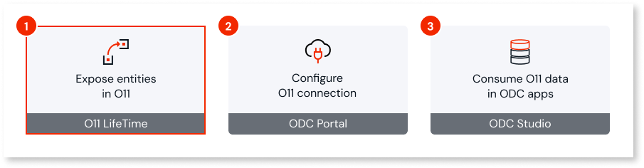

Exposing O11 entities in the LifeTime console comprises:

* [Validating](#control-data) which O11 application entities can be exposed and how its data is exposed.

* Selecting the set of O11 entities that you want to expose to ODC in a [baseline environment](#configure-baseline) - typically the first environment in your infrastructure pipeline used for application development. You configure the baseline environment the first time you expose entities.  

* [Propagating the exposed entities](#propagate) to other environments in your O11 infrastructure pipeline.

To reduce clutter and follow the least privilege principle, expose only the O11 entities required by your ODC apps.

After exposing your O11 entities, you can then [configure the connection](configure-connection.md) from your ODC tenant to the O11 infrastructure so developers can reuse the exposed O11 entities in their ODC apps using ODC Studio.

While evolving and maintaining your applications, you can [update the definition of the exposed entities](#update-exposed) in the baseline environment and propagate it again to the other environments in the pipeline.

## Prerequisites

To expose O11 entities to ODC, make sure the following requirements are met:

* Your O11 infrastructure follows the [prerequisites for data interoperability](intro.md#prerequisites).

* The IT users exposing O11 entities must have **Change and Deploy Applications** [permission](https://success.outsystems.com/documentation/11/managing_outsystems_platform_and_application_lifecycle/manage_it_users/understand_the_permission_model_for_it_users/#env-permission-levels) for the entities' application.

* If you have an O11 self-managed infrastructure, make sure the [database operations for the initial setup](data-interop-self-managed.md#setup) were performed by a database administrator.

## Control how O11 data is exposed {#control-data}

You control at design-time how your [O11 data can be consumed](consume-entities.md) in ODC apps.

In Service Studio, use the following properties to define how the O11 entity is exposed:

* **Public** - Only public entities can be exposed to ODC. Make sure this property is set to **Yes** if you want to expose an O11 entity to ODC.

* **Expose Read Only**:

    * Set to **Yes** - ODC apps can only query the O11 data. This is the default and recommended setting to ensure O11 data integrity and clear ownership.

    * Set to **No** - ODC apps can create, update, and delete O11 data. Use this option with caution, as it allows ODC logic to bypass O11 business rules defined in Service Studio actions.

    

    Currently, the writing capability isn't yet supported for Oracle databases. See the [data interoperability limitations](intro.md#limitations) for further details.

    

When you change any of these properties for an O11 entity:

* Publish the app to reflect those changes in the environment.

* If you change these properties for an O11 entity that is already exposed, make sure you [update the exposed entity definition](#update-exposed) accordingly.

## Configure the baseline environment {#configure-baseline}

This step requires the **Access** [permission](https://success.outsystems.com/documentation/11/managing_outsystems_platform_and_application_lifecycle/manage_it_users/understand_the_permission_model_for_it_users/#env-permission-levels) for the O11 environments.

Before you start exposing your O11 entities to ODC, you first need to configure the **baseline environment**. This will be the single source where you define the set of entities that you want to expose. From this baseline environment, you will then propagate that definition to other environments in your pipeline, similarly to your app development lifecycle.

To ensure the configuration reaches all subsequent environments, you must start from the first environment in the pipeline. For example, if your O11 infrastructure comprises **Development > Quality > Production** environments, set the **Development environment** as the baseline environment.

Follow these steps to configure the baseline environment:

1. Log in to your O11 LifeTime console (`https://<lifetime_environment>/lifetime`) using your IT user credentials.

1. Go to **Applications > Expose Entities**.

    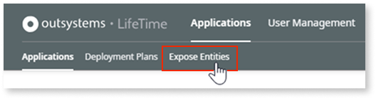

    To start exposing entities, you are required to configure the baseline environment.

    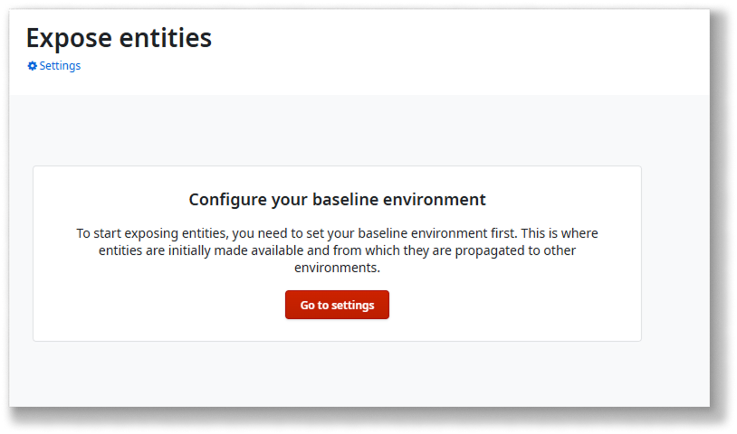

1. Click **Go to settings**.

1. Select the environment you want to set as the **Baseline environment**.

1. Click **Save**.

The baseline environment is now set, and you can start exposing your O11 entities.

## Select and expose O11 entities {#expose}

The **Applications > Expose Entities** screen in your LifeTime console shows the O11 entities of your applications that are exposed to ODC across your infrastructure. [Only public entities can be exposed](#control-data) to ODC.

Follow these steps to expose O11 entities in your baseline environment:

1. Click **Manage access**.

    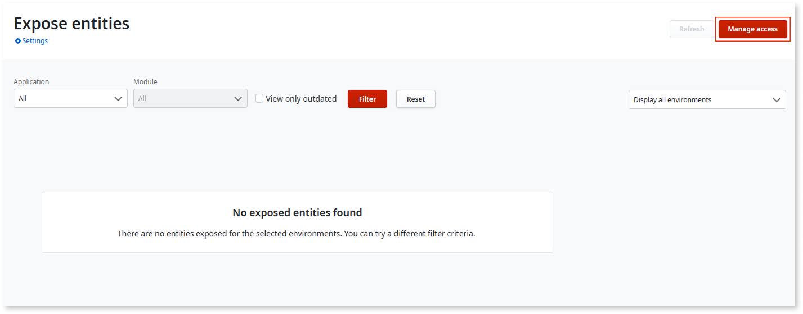

1. In the **Available entities** area, use the **Application** and **Module** dropdowns to find the entities you want to expose. Only public entities are listed.

    The listed applications and modules are those published in the baseline environment that you have **Change and Deploy Applications** permission for.

   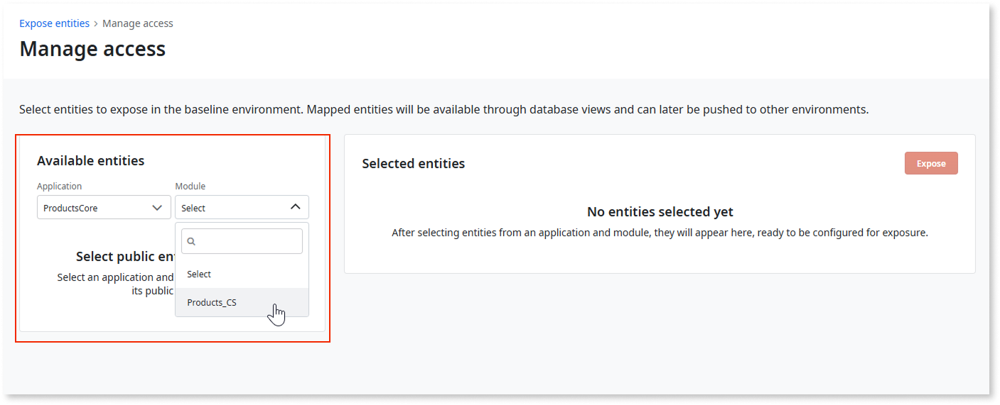

1. Select an entity individually by clicking the **>** icon in its row, or click **Select all entities** to add all filtered entities to the **Selected entities** list.

    For each selected entity, you can remove it from the mapping or edit its details using the corresponding option in the entity row.

    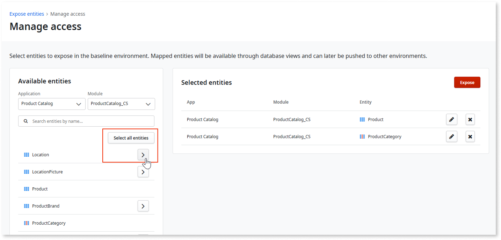

    

    If needed, you can rename the database view that OutSystems creates for each exposed entity. Consider the following limitations for the **View name**:

    * The prefix **OSUSR_VIEW_** is mandatory.
    * Use only uppercase letters, numbers, and underscores (A-Z, 0-9, _).
    * Maximum length is 50 characters, including the prefix.

    

1. After selecting all the entities you want to expose, click **Expose**.

1. Click **Continue** to confirm and proceed with the operation.

The results screen lists the successfully exposed entities and any errors that might occur. From here, you can export the exposing results and details to an Excel file using the **Export to excel** button.

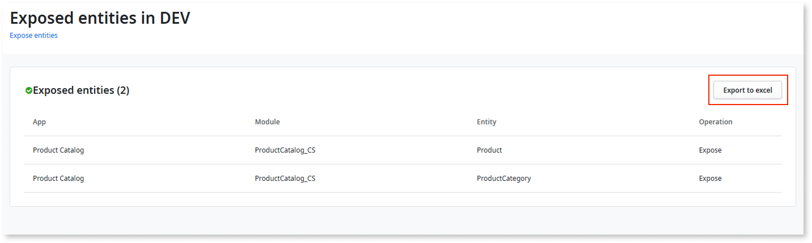

Go back to the **Expose entities** main screen. You see the entities marked as **Exposed** in the baseline environment.

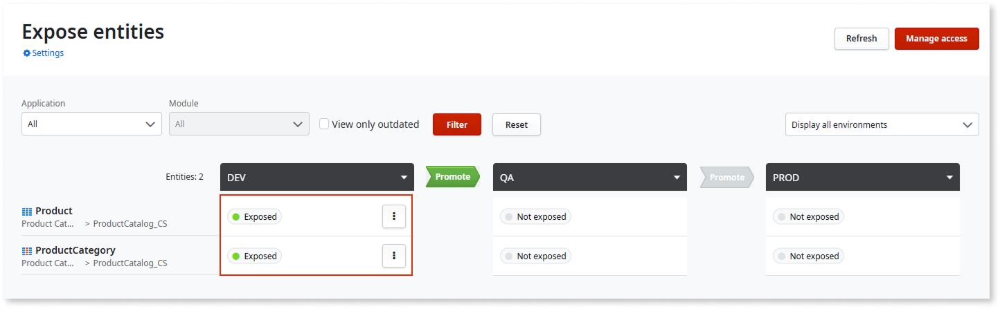

If you have an O11 self-managed infrastructure, make sure the required [database operations after exposing O11 entities](data-interop-self-managed.md#on-expose) are performed by a database administrator in the baseline environment.

After exposing in the baseline environment, you can now [propagate your exposed O11 entities to the next O11 environment](#propagate).

## Propagate exposed O11 entities to other environments {#propagate}

When you need the exposed O11 entities available in the next ODC stage, propagate the exposed entities to the [corresponding O11 environment](intro.md#mapping).

The propagation process creates or updates database views in the target O11 environment. For critical O11 systems, it's a good practice to run large-scale propagations during off-peak hours.

Follow these steps to propagate the exposed O11 entities from the baseline environment to the next environment in the pipeline:

1. In the **Expose entities** home screen, use the **Application** and **Module** filter to list the exposed entities you want to propagate.

    The screen shows the status of the O11 entities in the baseline environment (**Exposed**) and the next environment (**Not exposed**).

    

1. Click **Promote** to begin the propagation.

    

    To propagate exposed entities to the next environment, the O11 application must have been deployed to that environment.  

    

1. Make sure all the exposed entities that you want to propagate to the next environment are set with the **Promote** option.

    If there are exposed entities in the baseline environment that you don't want to propagate to the next environment yet, select the **Do nothing** option for those entities.

    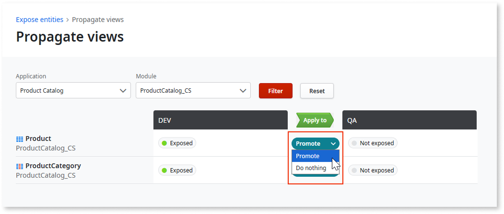

1. Click **Apply to**.

1. Click **Continue** to confirm and proceed with the operation.

The results screen lists the successfully exposed entities and any errors that might occur. From here, you can export the exposing results and details to an Excel file using the **Export to excel** button.

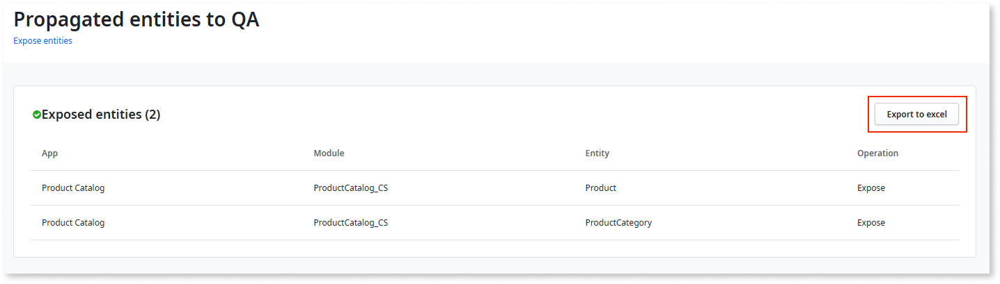

Back to the **Expose entities**, you can now see the status of the exposed O11 entities that you propagated as **Exposed** in the next environment. The entities you didn't propagate will be kept as **Not exposed**.

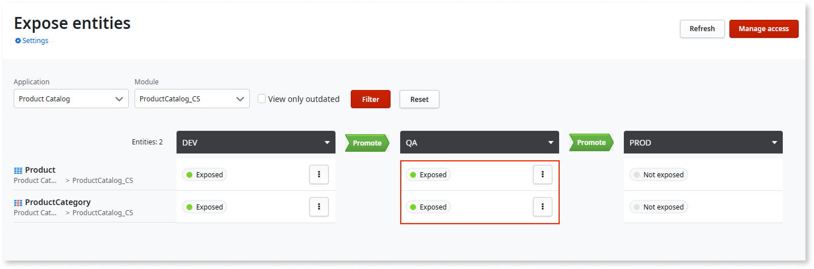

Repeat the same steps described above to propagate the exposed O11 entities to the following environment.

If you have an O11 self-managed infrastructure, make sure a database administrator run the [required database operations](data-interop-self-managed.md#on-expose) in the environment to which the entities were propagated to.

## Update exposed entities definition {#update-exposed}

During the development of the ODC apps integrating with O11 data source, you might need to update or adjust the set of exposed O11 entities. For example, stop exposing an entity, or exposing a new entity.

You must do all the changes in the baseline environment, which is the single source where you define the set of exposed entities, and then [propagate them to other environments](#propagate).

To update the definition of the current exposed entities in the baseline environment, follow these steps:

1. Make sure the updates of the O11 entities were published in the environment.

1. In the **Expose entities** home screen, use the **Application** and **Module** filter to find the exposed entities you want to update.

1. Click the options menu for the entity you want to update, and select the operation you want to apply to the current exposing definition:

   * **Rename**, to change the database view name  
   * **Remove**, to stop exposing the entity  
   * **Update view**, to reflect any O11 entity change to the database view

    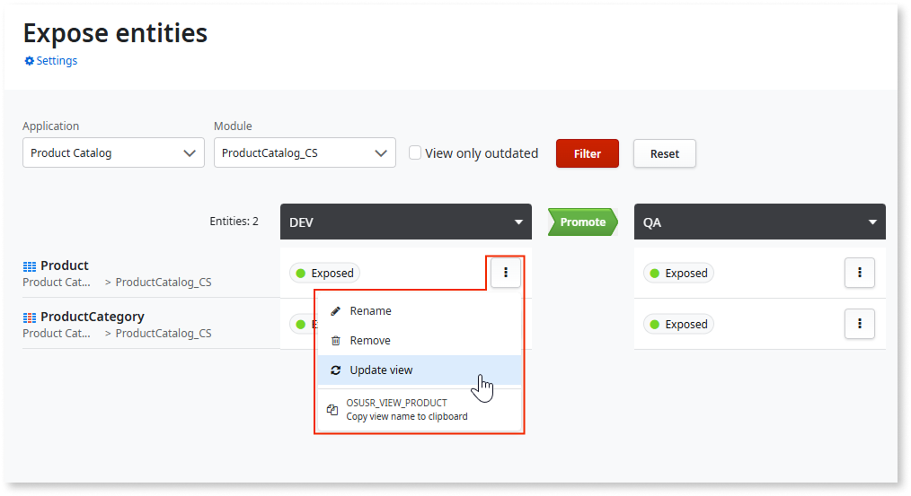

The changes are immediately reflected in the database views of the baseline environment, and you can then [propagate them to other environments](#propagate).

To reflect the changes in the ODC connection, [refresh the exposed entities](configure-connection.md#refresh-exposed) in the ODC Portal.

For further details, see how to [handle O11 data model changes in ODC apps](handle-o11-data-model-changes.md).
