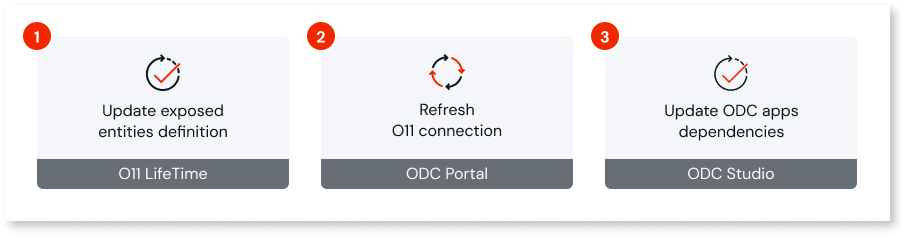
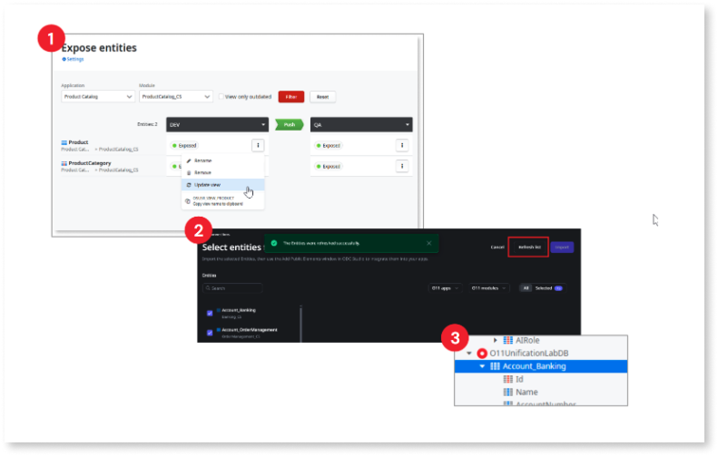

# Handle O11 data model changes in ODC apps

Whether evolving your O11 apps - for example, adding new O11 entities, or changing attributes - or simply adjusting [how O11 data is exposed](expose-entities.md#control-data) to ODC, you need to handle O11 data model changes in your ODC apps.

Thus, when the O11 data model changes, the following actions are required to reflect those changes in your ODC apps:

1. [Update the exposed entities definition](expose-entities.md#update-exposed) - In the O11 LifeTime console, update the exposed O11 entities in the baseline environment and [propagate the changes](expose-entities.md#propagate) to other environments in your pipeline.

1. [Refresh the O11 connection](configure-connection.md#refresh-exposed) - In the ODC Portal, refresh the O11 connection to fetch the new data model.

1. Update the dependencies in the ODC apps - Open your app in ODC Studio and update the dependencies to reflect the updated data model.

However, to ensure your ODC app works correctly across all stages - development, QA, and production - you must propagate the O11 data model changes to ODC apps following the development lifecycle. Here's the recommend order:

1. **[O11]** Update the exposed O11 entities in the [baseline environment](expose-entities.md#configure-baseline) - let's consider the O11 development environment - using the LifeTime console.

1. **[ODC]** Refresh the O11 connection in the ODC Portal.

1. **[ODC]** In the ODC development stage:

    1. Open your app in the ODC Studio.
    1. Update the dependencies.
    1. Adjust the logic if necessary.
    1. Publish the changes.

1. **[O11]** Propagate the exposed O11 entities that changed from O11 development to QA environment.

1. **[ODC]** Deploy the ODC app from development to QA stage.

1. **[O11]** Propagate the exposed O11 entities that changed from QA to production environment.

1. **[ODC]** Deploy the ODC app from QA to production stage.

If you deploy the ODC app to a stage before propagating the O11 exposed entities to the mapped O11 environment, the app may fail at runtime because it will be looking for database columns or views that do not yet exist in the target O11 database.

## Dealing with breaking changes from O11 data model

Certain changes in the O11 data model can break your ODC application. Follows some examples and how to minimize the impact:

* When an **exposed O11 entity is removed**, remove the entity usage in the ODC app and deploy it before updating the exposed O11 entities and refreshing the O11 connection in the ODC Portal.

* When a **mandatory attribute is added** to an exposed O11 entity, update the exposed O11 entities, refresh the O11 connection in the ODC Portal and adjust the logic of your ODC app.

* When an **O11 entity attribute being used in an ODC app is removed**, adjust the ODC app to remove the attribute's usage, and deploy it before updating the exposed O11 entities and refreshing the O11 connection in the ODC Portal.

The following changes to the O11 data model don't cause a breaking change in ODC apps:

* Exposing a new O11 entity

* Changing the name of an exposed O11 entity

* Adding a non mandatory attribute to an exposed O11 entity

* Removing an O11 entity attribute that is not being used by any ODC app
