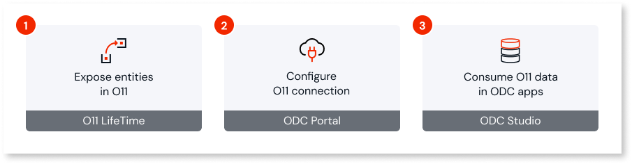
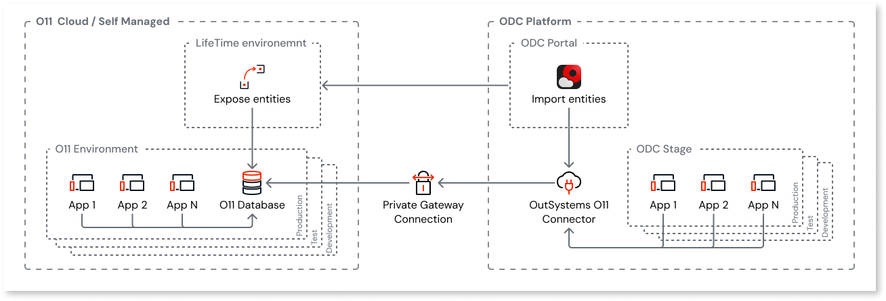

# Data interoperability

OutSystems enables you to build ODC applications that can directly consume entities residing in O11 databases via [Data Fabric](https://www.outsystems.com/tk/redirect?g=67608c14-0b83-4e69-bf46-ba023ed730f4). This allows for secure access to your O11 trusted data - such as Customers, Orders, or Employees - without the need of data migration.

This page provides a conceptual overview of data interoperability between ODC and O11, its architecture and development lifecycle.

## Reuse O11 Data in ODC

Reusing your O11 data in ODC apps involves three key steps:

1. [Expose entities in O11](expose-entities.md)

    In the LifeTime console, you select which app entities to expose. For each entity you expose, OutSystems creates a corresponding database view in your O11 database.

1. [Configure O11 connection](configure-connection.md)

    In the ODC Portal, you connect to your O11 environments and import the exposed O11 entities as external entities.

1. [Consume O11 data in ODC apps](consume-entities.md)

    Once the connection is configured, you can use the ODC Studio to add the exposed O11 entities to your ODC apps as dependencies, just like any other ODC entity.

### Mapping O11 environments to ODC stages {#mapping}

As part of the data interoperability setup, you map each ODC stage (Development, Test, and Production) to its corresponding O11 environment.

If your O11 infrastructure has more than the standard three environments, choose the three O11 environments that match your ODC stages in your development lifecycle.

The following mapping rules apply:

* Your ODC production stage can only connect to an O11 production environment. This prevents your live apps from depending on non-production data, which might be unstable or incomplete.

* Your ODC development and testing stages can connect to any of your non-production O11 environments. This prevents non-production apps from accessing sensitive production data.

### Security

The connection between ODC and your O11 infrastructure is designed with security as a priority.

Application runtime communication depends on your [O11 infrastructure setup](https://www.outsystems.com/tk/redirect?g=079418c8-7a3d-4b5e-9c13-c1ae7a1f122e):

* For **OutSystems Cloud**:

    * The integration uses the private gateway to establish a **secure private connection** from each ODC stage to the mapped O11 environment, which avoids exposing your database to the public internet. This process is automated and doesn't imply additional licensing costs.

    * For each connection, ODC automatically creates a dedicated least-privileged database user and manages the authentication tokens, so you don't need to handle credentials directly.

* For **OutSystems self-managed**, customers are responsible for:

    * Enabling the network communication from the ODC stage to their O11 infrastructure. To ensure a secure connection, OutSystems recommends that customers [configure an ODC Private Gateway](https://www.outsystems.com/tk/redirect?g=9a023d82-da5b-4164-8f3f-9d6c35444b50).

    * Creating a dedicated read-only database user for each O11 environment, and managing the database permissions required for the integration. See [Data interoperability for O11 self-managed infrastructures](data-interop-self-managed.md) for further details.

Platform communication from the ODC Portal to O11 LifeTime is established via REST APIs, secured by token authentication and restricted to HTTPS via IP allowlisting.

### Data access governance

You [control how O11 entities are exposed to ODC](expose-entities.md#control-data) at design-time:

* Only public entities can be exposed to ODC.  

* ODC apps can't change data (create, update, or delete records) of O11 entities exposed as read-only.

    

    Currently, the writing capability isn't yet supported for Oracle databases. See the [data interoperability limitations](#limitations) for further details.

    

Additionally, only IT users with the [required permissions](expose-entities.md#prerequisites) can expose O11 entities to ODC.

### Performance

ODC directly accesses the O11 database through automatically generated database views, ensuring high-performance access without intermediate service layers.

However, to ensure your O11 applications continue to run smoothly alongside ODC apps and AI Agents, follow the standard high-load application best practices - writing efficient queries in ODC, monitoring your apps, or conducting performance tests.

## Exposing O11 entities lifecycle

The integration uses a specific lifecycle model to ensure consistency and safety from development through to production:

* **Expose O11 entities a the baseline environment**

    You manage the definition of all exposed entities in a O11 [**baseline environment**](expose-entities.md#configure-baseline) that is the single source where you define the set of entities that you want to expose. This is typically your O11 Development environment.

* **Propagate exposed entities to other environments**

    From the baseline environment, you then [propagate the exposed entities](expose-entities.md#propagate) definition to other O11 environments in your pipeline. The propagation process is sequential and follows the pipeline order defined in LifeTime.

    The propagation process copies the exposed entity definitions (the database views) to the target environment. This ensures that when you deploy your ODC app to its next stage, it connects to the corresponding O11 environment and finds the exact data structures it expects.

* **Always update exposed entities definition in the baseline environment**

    Because your ODC apps have a runtime dependency on the exposed entities, it's critical to manage ongoing changes carefully. Thus, you must first [update the exposed entities definition](expose-entities.md#update-exposed) in the baseline environment, and then propagate the changes to other environments.

This approach aligns with the best practice of managing and testing all changes in a non-production environment first.

## Limitations

The following entities **can't be exposed** to ODC:

* System entities (you can only expose application entities)
* Static entities defined in libraries
* Local storage entities of mobile apps

### Temporary limitations

OutSystems is working to improve the data interoperability capability. Meanwhile, consider these additional limitations:

* The writing capability isn't yet supported for Oracle databases - O11 entities are available in ODC as read-only entities.

* O11 static entities (except those defined in libraries, which can't be exposed) are available in ODC as regular read-only entities. See [how to work with O11 static entities](consume-entities.md#o11-static-entities).

* O11 multi-tenant entities are available in ODC as read-only entities.

* An ODC tenant can only connect to one O11 infrastructure.

* Data interoperability isn't yet supported for hybrid O11 infrastructures and O11 infrastructures with additional pipelines.

## Prerequisites

Before you start, make sure the following requirements are met:

* You have an enterprise [cloud or self-managed O11 infrastructure](https://www.outsystems.com/tk/redirect?g=079418c8-7a3d-4b5e-9c13-c1ae7a1f122e).

    * Data interoperability isn't supported for O11 Personal Environment.

    * Take into account the [current limitations](#temporary-limitations) for the O11 infrastructure setup.

* The **Platform Server** version of your O11 environments is **11.40.0 or later**.

* The **LifeTime** version of your O11 infrastructure is **11.28.0 or later**.

* If you have an **O11 self-managed infrastructure**, ensure the following:

    * The O11 LifeTime environment is accessible over HTTPS (TCP on port 443). You can restrict access using [IP allowlisting](https://success.outsystems.com/documentation/outsystems_developer_cloud/managing_outsystems_platform_and_apps/allowlisting_odc_public_ip_addresses/#platform-unification).

    * The databases of the [mapped O11 environments](#mapping) are accessible from your ODC tenant. The recommended approach is to [configure an ODC private gateway](https://www.outsystems.com/tk/redirect?g=9a023d82-da5b-4164-8f3f-9d6c35444b50). In alternative, you can allowlist the [ODC public IP addresses](https://www.outsystems.com/tk/redirect?g=2356ff87-f2e9-4ab2-81bf-34ebcffe68c2) in your firewalls or access policies.

    * Database administrator access to the databases of the mapped O11 environments to perform [the required database operations](data-interop-self-managed.md) at specific moments.

## Next steps

Now that you understand the concepts, you can proceed with the setup:

* [For O11 self-managed infrastructures only] [Initial set up for data interoperability](data-interop-self-managed.md#setup)

* [Expose O11 entities to ODC](expose-entities.md)

* [Configure the O11 connection in the ODC Portal](configure-connection.md)
