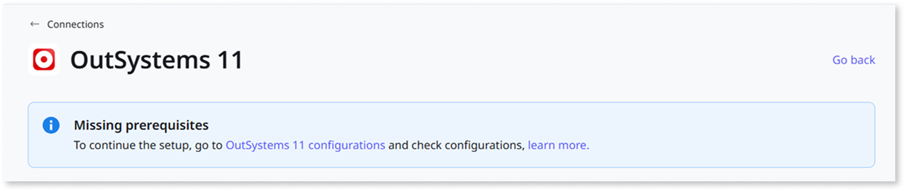
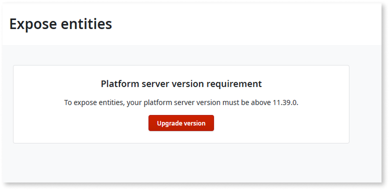
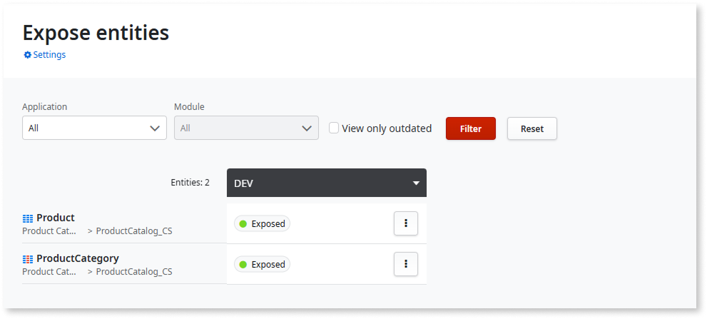

# Troubleshooting data interoperability issues

This page describes some common issues you may encounter when using data interoperability between ODC and O11, and how to solve them.

## Missing prerequisites in OutSystems 11 database connection {#missing-prerequisites}

You get the error **Missing prerequisites** when opening the details of an OutSystems 11 connection in **ODC Portal > INTEGRATE > Connections**.

This can happen in the following situations:

* The setup of your OutSystems 11 infrastructure is not supported for data interoperability.

* The version of LifeTime or Platform Server in your O11 environments is not supported for data interoperability.

* The connection from ODC to your O11 infrastructure is not correctly configured.

### Recommended action

Make sure:

* Your O11 infrastructure follow the [prerequisites for data interoperability](intro.md#prerequisites).

* The connection from your ODC tenant to the O11 infrastructure is correctly configured. See [Connect ODC to your O11 infrastructure](configure-connection.md#connect-o11-infrastructure) for further details.

## Error exposing entities in LifeTime

You get the error **Platform server version requirement** when accessing **Applications > Expose Entities** in the O11 LifeTime console.

This happens because the Platform Server version of your O11 environments is not supported for data interoperability.

### Recommended action

To start [exposing your O11 entities to ODC](expose-entities.md), make sure the Platform Server version of your O11 environments is **11.40.0 or later**. See the [prerequisites for data interoperability](intro.md#prerequisites) for further details.

## Expose entities screen showing only the baseline environment

When accessing **Applications > Expose Entities** in the O11 LifeTime console, you see the [baseline environment](expose-entities.md#configure-baseline) but the remaining environments of the pipeline are missing.

This happens because the Platform Server version of the remaining O11 environments in your pipeline is not supported for data interoperability.

### Recommended action

Make sure the Platform Server version of all your O11 environments is **11.40.0 or later**. See the [prerequisites for data interoperability](intro.md#prerequisites) for further details.
