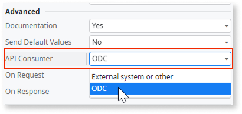
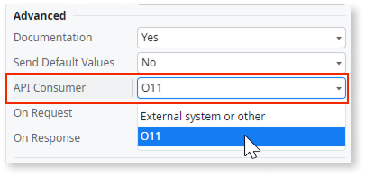
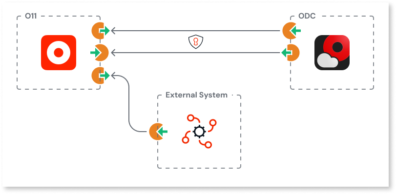

# Logic interoperability

OutSystems enables you to keep mission-critical core logic in O11 while [leveraging ODC modern capabilities](https://www.outsystems.com/low-code-platform/developer-cloud/) through REST integrations without affecting your [license consumption](#licensing).

Logic interoperability between O11 and ODC is bidirectional. You can:

* **Consume O11 logic in ODC**, for example, to trigger existing O11 business processes, validations, or integrations from an ODC app or agent.

* **Consume ODC logic in O11** to extend your O11 apps with ODC cloud-native capabilities, such as AI agents, or a conversational agent embedded experience.

This page provides an overview of logic interoperability between ODC and O11.

## Reuse logic between O11 and ODC {#reuse-logic}

Logic interoperability requires that you expose and consume your business logic through REST exclusively between your OutSystems O11 and ODC platform instances.

Reusing your O11 logic in ODC apps for interoperability purposes involves two key steps:

1. [Expose your O11 logic through a REST API](../../integration-with-systems/rest/expose-rest-apis/intro.md) to be exclusively consumed in ODC.

    In Service Studio, you define the intent of the integration by setting the REST API property **API Consumer** to **ODC**.

    

1. [Consume the exposed O11 REST API in ODC](https://www.outsystems.com/tk/redirect?g=b7e2daa5-b34c-4907-885b-56574bf14295).

    In ODC Studio, you define the intent of the integration by setting the REST API property **API Producer** to **O11**.

    

Similarly, reusing your ODC logic in O11 apps involves the following steps:

1. [Expose your ODC logic through a REST API](https://www.outsystems.com/tk/redirect?g=79ddbf86-371c-41cf-b9c9-45545b74957f) to be exclusively consumed in O11.

    In ODC Studio, you define the intent of the integration by setting the REST API property **API Consumer** to **O11**.

    

1. [Consume the exposed ODC REST API in O11](../../integration-with-systems/rest/consume-rest-apis/intro.md).

    In Service Studio, you define the intent of the integration by setting the REST API property **API Producer** to **ODC**.

    

Make sure you follow the [best practices for reusing logic between O11 and ODC](logic-interop-best-practices.md).

### Security

When reusing your business logic between O11 and ODC through REST, your REST APIs are accessible by the internet as any other REST integration. Thus, you should protect your endpoints from unauthorized access.

For logic interoperability, OutSystems recommendation is using [token-based authentication](logic-interop-best-practices.md#authentication).

### Performance

When reusing business logic between O11 and ODC through REST APIs, app performance depends on the network latency between your O11 and ODC environments. This should be considered in your application design.

### Licensing

REST integrations between O11 and ODC for interoperability purposes don't affect your license consumption, as they don't contribute to the [Application Object](https://www.outsystems.com/tk/redirect?g=cd994c70-9dcc-46ed-b423-84099beac39a) count. See how to [set up your REST integration for interoperability purposes](#reuse-logic).

REST integrations with any other external system follow the regular license consumption, contributing to the [Application Object](https://www.outsystems.com/tk/redirect?g=cd994c70-9dcc-46ed-b423-84099beac39a) count.

## Prerequisites {#prerequisites}

Before you start, make sure the following requirements are met:

* You have an O11 infrastructure and an ODC tenant.

* Your O11 environments and development tools meet the required **Platform Server** and IDE versions.
  Refer to [interoperability version requirements](../version-requirements.md#logic-interop) for the full list.
