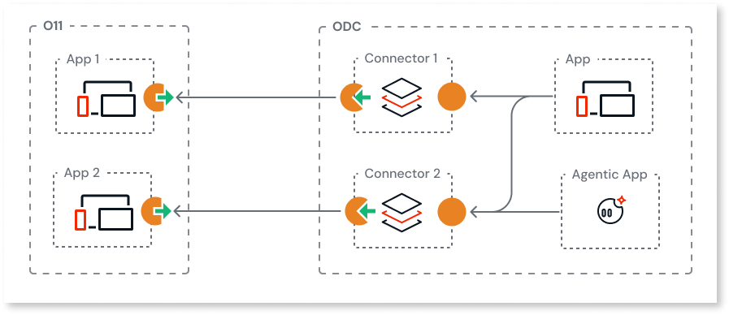
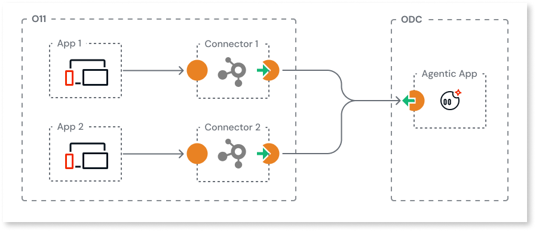

# Best practices for reusing logic between O11 and ODC

This page describes development best practices to consider when [reusing logic between O11 and ODC apps](intro.md).

## Encapsulate REST integrations into server actions

To reuse business logic between O11 and ODC, encapsulate REST integrations for consumption by several apps. For example:

* When consuming the O11 exposed logic in ODC, encapsulate the REST integration within ODC libraries abstracting the API methods into server actions for consumption by web, mobile or agentic apps.

    

* When consuming ODC exposed app or agent logic in O11, encapsulate the REST integration within O11 integration service modules abstracting the API methods into server actions for consumption by web or mobile apps.

    

## Secure your REST APIs with token-based authentication {#authentication}

To maintain the integrity and confidentiality of your sensitive data, protect your endpoints against unauthorized access. Token-based authentication with [JSON Web Tokens (JWT)](https://en.wikipedia.org/wiki/JSON_Web_Token) provides a flexible way to authenticate callers and enforce authorization on every request.

See the following development patterns for guidance:

* Exposing O11 logic to ODC:

    * [Securing exposed REST APIs in O11 with JWT-based tokens](../../integration-with-systems/rest/expose-rest-apis/token-based-auth-expose-dev-pattern.md)
    * [Securing consumed REST APIs in ODC with JWT-based tokens](https://www.outsystems.com/tk/redirect?g=9f31b7c4-6a7a-4a43-8b45-3b0f0b7d7f22)

* Exposing ODC logic to O11:
    * [Securing exposed REST APIs in ODC with JWT-based tokens](https://www.outsystems.com/tk/redirect?g=941955cc-75d6-46d7-ba71-5fe9f89da4de)
    * [Securing consumed REST APIs in O11 with JWT-based tokens](../../integration-with-systems/rest/consume-rest-apis/token-based-auth-consume-dev-pattern.md)

## Minimize impacts of changes in exposed APIs

When reusing business logic between O11 and ODC, there are some scenarios where changing your exposed REST APIs can break the consumer logic. When this happens, minimize the breaking changes by creating a new API version and providing a transition period for consumers to migrate to the new version.

Follows some examples of exposed API changes that impact consumers and how to minimize them:

* To **change the endpoint path or authentication**, create a **new API version with the same methods**.

* To **change the name of a method**, create a **new API version with the new method name**.

* To **remove or add a mandatory parameter or structure field**, create a **new API version**.

* To **change the data type of a mandatory field**, create a **new API version**.
