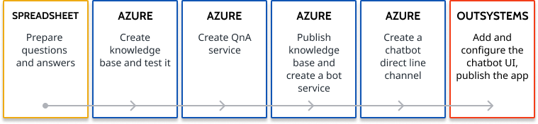

# Get started: create an FAQ chatbot for your app

An FAQ chatbot is useful when you have information that doesn't change a lot. This can range from product manuals to information about your working hours or address. To create a chatbot you need to prepare your knowledge base on the Azure side and create some resources. On the OutSystems side you add a chatbot block with the UI and logic and set the block to communicate with Azure.

This guide is for the [Reactive Web App version of the component](https://www.outsystems.com/forge/component-overview/7315/outsystems-ai-chatbot-reactive). The version for Traditional Web app is similar, with more focus on the server-side logic.

To create a chatbot with the OutSystems.AI Chatbot component, you need:

* A Microsoft Azure account with a valid subscription
* Permissions to install Forge components in your environment

To accelerate the development of your chatbot, we created the OutSystems.AI Chatbot component that works with Microsoft Azure. Here is an overview of what you should do to create a FAQ chatbot:

## With the configuration wizard

The chatbot configuration wizard can guide you through the process of creating a chatbot. It's an app running in your environment where you installed the chatbot component. See [chatbot configuration wizard](configuration-wizard.md) for instructions.

## With step by step guide

This section is for you if you prefer following documentation. You can also use the [chatbot configuration wizard](configuration-wizard.md) to speed up the setup of your FAQ chatbot.

1. Prepare your questions and answers. You first need to put your questions and answers in a spreadsheet. See: [Prepare data for knowledge base](guide-azure-kb.md#prepare-data-kb)

1. Create a knowledge base and test it. Once you have your questions and answers, you submit them to QnA Maker. QnA Maker uses natural language processing to expand possible questions and answers, which means more conversational variety for your users. See how to [create a knowledge base](guide-azure-kb.md#create-kb).

1. Create QnA Maker Service. This service is responsible for running the app and making your knowledge base available to the chatbot service. See how to [create a QnA Maker service](guide-azure-services.md#create-qna-service).

1. Publish your knowledge base and create a bot service. With the knowledge base ready and a service to manage the requests, you now publish the knowledge base and create a chatbot service that listens for the requests from other apps. See how to [publish your knowledge base and create a chatbot service](guide-azure-kb.md#publish-kb).

1. Create a chatbot direct line channel. Direct line channel is used by the OutSystems app to communicate with the chatbot service running your knowledge base. See how to [add a direct line channel for a bot service](guide-azure-services.md#create-direct-line-channel). Keep one of the secret keys at hand as you need it in the next step.

1. Add and configure the chatbot UI. With the Azure back end ready, install the OutSystems.AI Chatbot component in your environment, add the Chatbot Block to your app and configure it. See how to [add a chatbot user interface to your OutSystems app](guide-outsystems-add-chatbot.md). Finally, publish the app.