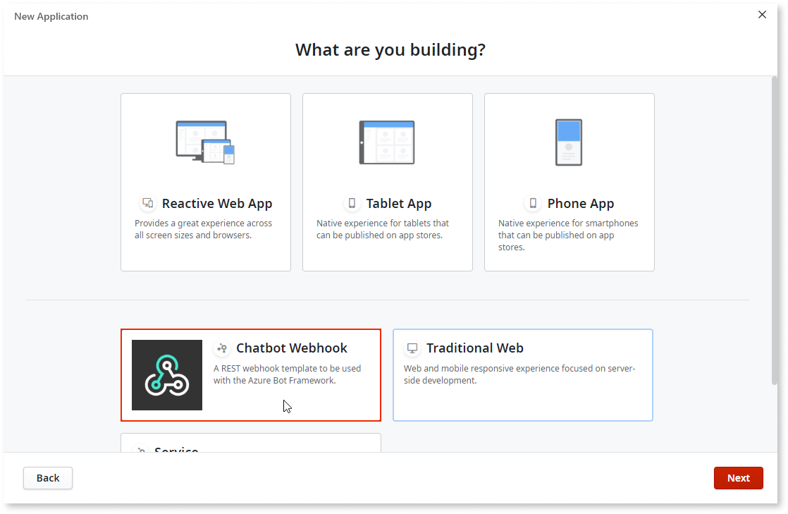
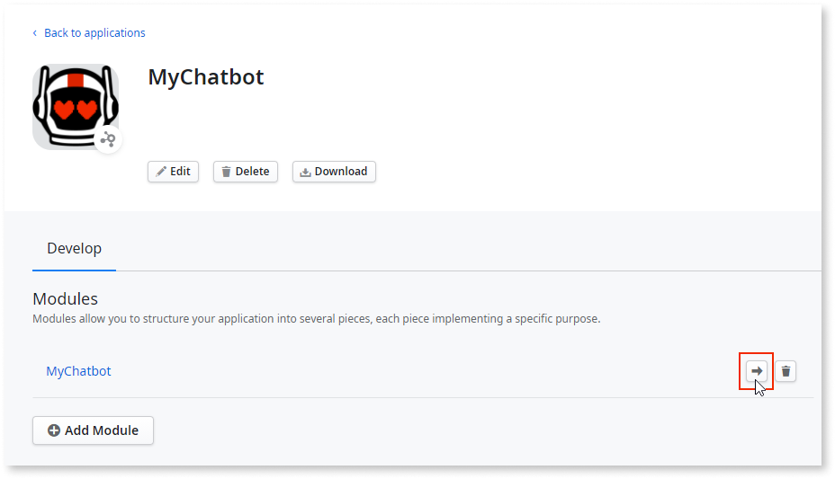
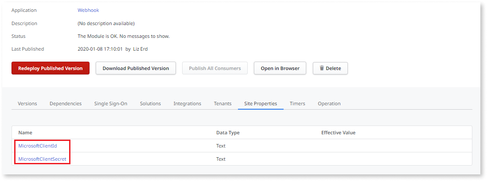
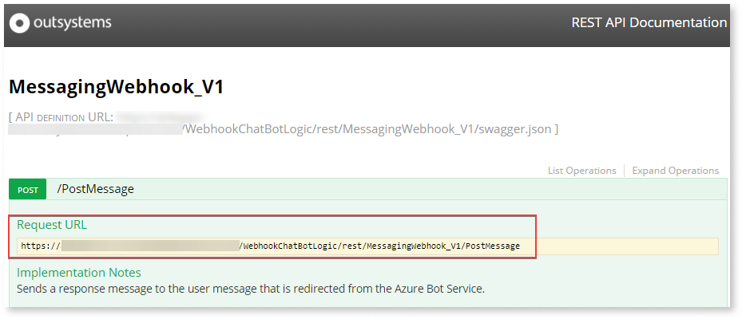
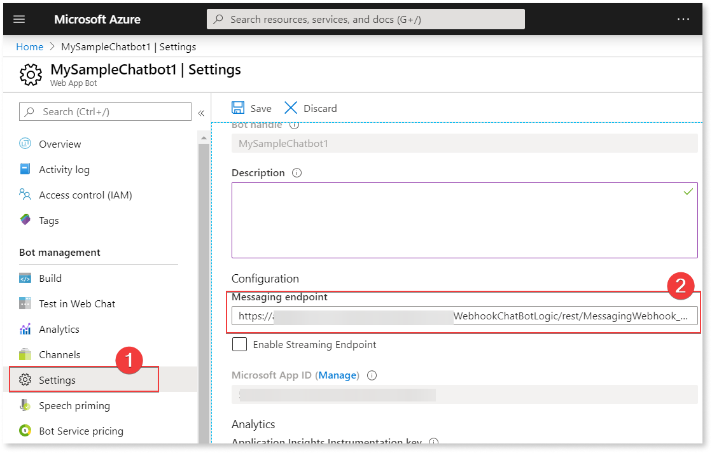

# Create and configure the chatbot webhook module

The chatbot webhook module is part of the OutSystems.AI Chatbot component. Use the chatbot webhook to:

* Create logic that handles responses from several Azure services and combines them with the elements exposed in the OutSystems app.
* Add richer UI in responses, such as cards with links and images.

These are the steps to create advanced logic for the bot responses:

1. Create a bot service running in Azure. See [Create a bot service in Azure](guide-azure-services.md#create-bot-service) for instructions.  
2. Create an app based on the Chatbot Webhook app template.
3. Configure the webhook module to access the Azure App Service and configure the Azure App Service to send responses to the webhook module.
4. Create logic for the chatbot in the webhook.

This guide is for the [Reactive Web App version of the component](https://www.outsystems.com/forge/component-overview/7315/outsystems-ai-chatbot-reactive). The version for Traditional Web app is similar, with more focus on the server-side logic.

## Create a new webhook module

Follow the instructions to create a webhook module that lets you design advanced chatbot logic. 

1. Create a new app in Service Studio. Choose the **Chatbot Webhook** template and add the default module to it.

    

2. Publish the module.

3. Optionally, move the module to the app to which you're adding the chatbot. This is a good practice.
   
   

## Configure the webhook module

These are the instructions you should follow to configure the webhook module and the Azure App Service. To configure the module, you need access to Service Center and the bot app in Azure.

1. Go to **Service Center** > **Factory** > **Modules** and search for the webhook module. Select the module name in the search results. The module properties open.

2. In the module properties, go to the **Site Properties** tab. Edit the values for **MicrosoftClientId** and **MicrosoftClientSecret**.

    

    

    The **MicrosoftClientId** and **MicrosoftClientSecret** values are from the Azure App Service Settings. See [how to get MicrosoftClientId and MicrosoftClientSecret](guide-azure-services.md#get-id-pass).

    

3. Open the module in Service Studio. Go to **Logic** tab > **Integrations** > **REST** > right-click **MessagingWebhook_V1** and select **Open Documentation**. A new tab opens in your browser.

4. Select the POST operation to expand the section. Copy the **Request URL** of the service from the tab in the browser. In our example the endpoint is **PostMessage**. 

    

5. Go to the Azure home page. Go to **Azure Home** > **Your Web App Bot** > **Settings** > enter the **Request URL** in the **Messaging endpoint** field. This updates the messaging endpoint in the bot service with the endpoint URL. Save the settings.

    