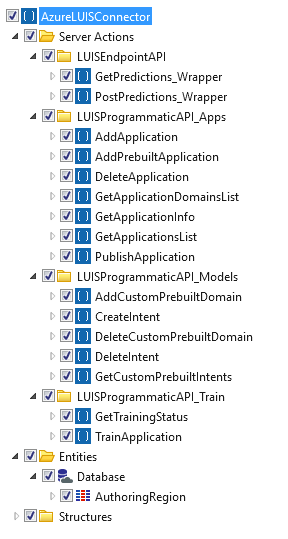
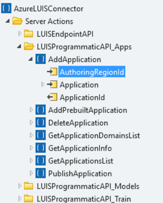

# Use the Azure LUIS Connector in your OutSystems applications

Use the [Azure LUIS connector](https://www.outsystems.com/forge/component-overview/5737/azure-luis-connector) to provide your apps with capabilities for extracting information from text. The connector communicates with [Microsoft Language Understanding Intelligent Services (LUIS)](<https://docs.microsoft.com/en-us/azure/cognitive-services/luis/what-is-luis>), described by Microsoft as "a cloud-based API service that applies custom machine-learning intelligence to a user's conversational, natural language text to predict overall meaning, and pull out relevant, detailed information."

## Prerequisites

1. Create a LUIS account and [a LUIS application](https://docs.microsoft.com/en-us/azure/cognitive-services/luis/get-started-portal-build-app#create-app). 
1. [Create a Cognitive Service or Language Understanding resource](https://docs.microsoft.com/en-us/azure/cognitive-services/cognitive-services-apis-create-account#create-and-subscribe-to-an-azure-cognitive-services-resource) in Azure Portal.
1. [Associate the above resource](https://docs.microsoft.com/en-us/azure/cognitive-services/luis/get-started-portal-deploy-app#assign-the-resource-key-to-the-luis-app-in-the-luis-portal) to your LUIS application.
1. [Train and publish](https://docs.microsoft.com/en-us/azure/cognitive-services/luis/get-started-portal-deploy-app#train-and-publish-the-app) your LUIS application.

## List of APIs present in the Azure LUIS Connector

The Azure LUIS Connector provides Server Actions for two different APIs:

* **LUIS Endpoint API** – Obtains predictions regarding the intent of a given text
* **LUIS Programmatic API** – Manages the LUIS applications and models programmatically

### LUIS Endpoint API

To use the LUIS Endpoint API, do the following:

1. Go to your LUIS account and check the region from the resource you have associated with the application. If the region is "westus" you can test and start using the Endpoint API without any further configurations. If the region is different from "westus," go to step 2.

1. [Go to Service Center](<https://success.outsystems.com/Support/Enterprise_Customers/Licensing/Overview/How_to_access_your_OutSystems_Platform#What_is_Service_Center.3F>) and in the Applications tab under Factory, select Azure LUIS Connector.

1. Select the module **AzureLUISConnector** and go to the Integrations tab.

1. In the Integrations tab, click on **LUISEndpointAPI**.

    

1. In the LUIS Portal, copy the Endpoint from the associated resource and obtain the Base URL from it. For example, for an Endpoint like `https://westus.api.cognitive.microsoft.com/luis/v2.0/apps/XXXXXXXX?verbose=true&timezoneOffset=-360&subscription-key=XXXXXXXX&q=`, the Base URL is `https://westus.api.cognitive.microsoft.com/luis/v2.0/apps`.

    

1. Put the Base URL in the **Effective URL** textbox and click Apply.

    

You can test the Endpoint API as follows:

1. Use the Server Action **GetPredictions_Wrapper** in a logic flow.

1. From the Application Information page under the Manage tab of the LUIS Portal, copy the Application ID and add it in the **ApplicationId** input parameter of **GetPredictions_Wrapper**.

    

1. From the Keys and Endpoints page under the Manage tab of the LUIS Portal, copy the Resource Key and add it in the **EndpointKey** input parameter of **GetPredictions_Wrapper**. Don’t use the key from the Starter_Key resource. The key from the Starter_Key resource is the same as the Authoring Key.

    

1. Add any text in the **QueryToPredict** input parameter.

1. Publish and test to confirm if the Server Action returns a prediction object.

You can now use all the Server Actions found in the folder LUISEndpointAPI. The descriptions of each input and output parameter provide more information about their usage.

You can also find more information on the [LUIS Endpoint API in the official Azure API documentation.](<https://westus.dev.cognitive.microsoft.com/docs/services/5819c76f40a6350ce09de1ac/operations/5819c77140a63516d81aee78>).

### LUIS Programmatic API

To use the LUIS Programmatic API, do the following:

1. After installing the connector in your environment, go to your LUIS account and copy the **Authoring Key**.

    

1. [Go to Service Center](<https://success.outsystems.com/Support/Enterprise_Customers/Licensing/Overview/How_to_access_your_OutSystems_Platform#What_is_Service_Center.3F>) and in the Applications tab under Factory, select Azure LUIS Connector.

1. Select the module **AzureLUISConnector** and go to the Site Properties tab.

    

1. In the Site Properties tab, click **AuthoringKey**. Edit the **AuthoringKey** value and paste the key you’ve copied from the LUIS portal.

After configuring the connector, test the Programmatic API as follows:

1. Use the Server Action **GetApplicationDomainsList** in a logic flow.
1. Enter your **AuthoringRegionId**. The value of the **AuthoringRegionId** must match the Authoring Region of your LUIS account.
1. Publish and test to confirm that the Server Action returns a list of domains available on LUIS.

You can now use all the Server Actions found in the folder **LUISProgrammaticAPI**. The descriptions of each input and output parameter provide more information about their usage.

**Note**: When using the connector in your applications, the input parameter **AuthoringRegionId** of the Server Actions in this API must match the Authoring Region of your LUIS account. You can find this region in your LUIS account settings. Choose one of the 3 options provided by the static entity **AuthoringRegion** (also available in the connector).

 

You can find more information in the [official Azure API documentation on LUIS Programmatic API](<https://westus.dev.cognitive.microsoft.com/docs/services/5890b47c39e2bb17b84a55ff/operations/5890b47c39e2bb052c5b9c2f>).
