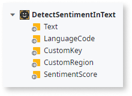

# Use the AI Language Analysis component in your OutSystems apps

Use the OutSystems.AI Language Analysis component to detect key phrases, calculate sentiment analysis, translate, transcribe from audio, spell check a text.

OutSystems.AI Language Analysis consists of Blocks and Server Actions that are independent of each other. You can use the default UI form the Blocks, or create a custom UI with the Server Actions.

## Prerequisites

These are the requirements you need to meet to use the Language Analysis component.

* You have a Microsoft Azure account.
  
* You created the Azure resources for the following services in the same **Resource Group**:

    * **Text Analytics**
    * **Bing Spell Check**
    * **Speech to Text**
    
    See [Create resources](https://docs.microsoft.com/en-us/azure/cognitive-services/cognitive-services-apis-create-account#create-a-new-azure-cognitive-services-resource) by Microsoft for guidance.

* You installed [OutSystems.AI Language Analysis for Reactive Web App](https://www.outsystems.com/forge/component-overview/7316/outsystems-ai-language-analysis-reactive) in your environment.

* You configured the component, as instructed in [Configure the Language Analysis](#configure-the-language-analysis-component).

## Get the settings from Azure

To configure your component you need settings from Azure for each component. Here are the instructions.

1. Open each of the services in Azure and go to **Keys and Endpoint**.
1. Copy a key value. You can use any of the keys, **KEY** 1 or **KEY2**.
1. Take note of the **ENDPOINT**.
1. Take note of the **LOCATION**.

## Configure the Language Analysis component

Configure the module in Service Center with the settings from your Azure resources.

1. In Service Center, go to **Factory** > **Modules**.

1. In the Name field enter **AzureCognitiveServicesConnector** and click **Filter**. The connector name shows in the results.

1. Click **AzureCognitiveServicesConnector** in the results to open the module configuration screen.

1. Go to the **Site Properties** tab. Click the properties that begin with **OcpApimSubscription** to open the settings, then paste the Azure key value for the corresponding service in the **Effective Value**. For example, if you're setting up the component to use Text Analytics API, then edit **OcpApimSubscriptionKey_TextAnalyticsAPI**.

    

1. Skip this step if you're using **westus** location in Azure. If you're using another Azure location, you need to edit the URL of the API.

    * Continue by clicking the **Integrations** tab. Scroll to the **Consumed REST APIs** section and click the property name corresponding to the Azure service to enter a new **Effective URL** value. 
    
    * In the **Effective URL** fields of **TextAnalyticsAPI**, **SpellCheckAPI**, and **SpeechAPI**, enter the respective values of **ENDPOINT** from Azure. Before saving, delete the version number of the **ENDPOINT** value, for example `/v2.1`.

## Language Analysis features

Here's what you can do with the Language Analysis component.

### Key phrase detection

Drag the **KeyPhrasesHighlight** Block to your screen and enter the two mandatory input parameters:

* **Text** – The text in which to detect key phrases.
* **Language** – A two-letter code representing the language that follows the ISO 639-1 standard of [language codes](https://docs.microsoft.com/en-us/azure/cognitive-services/text-analytics/language-support#language-list-and-status).

 

The **GetKeyPhrasesInText** action analyzes the text using the Text Analytics API KeyPhrases action from the Azure Cognitive Services Connector. The results of the detection show bold with a yellow background color. 

To use the Server Action, drag the **GetKeyPhrasesInText** action to your flow and enter the input parameters.

### Sentiment analysis

Drag the **SentimentDetection** Block to your screen. The Block has three placeholders and the action that performs the sentiment detection (DetectSentimentInText Server Action).

 

Then, customize these placeholders to show the result of the sentiment detection of a text depending on the score. The placeholders match an interval of a scale that ranges from 0% to 100% where:

* **Negative**: 0% – 39% 
* **Neutral**: 40% – 69% 
* **Positive**: 70% – 100%

The percentage is the indicator of the sentiment of the text in each scale interval. By default, the following emojis are indicators of the text sentiment.

The **DetectSentimentInText** Server Action requires the same input parameters as the Block. It returns a decimal value representing the sentiment score. You can change the intervals of the scale according to your use case.

### Language detection

The **GetLanguageFromText** Server Action receives an input parameter, Text, and retrieves the language code detected in the text. The returned code is the [two letter code that follows the ISO 639-1 standard](https://docs.microsoft.com/en-us/azure/cognitive-services/text-analytics/language-support#language-list-and-status).

### Spell-check

Spell-checking is currently not available in Reactive Apps. The team is working on it!

The spell-check feature has a Block and a Server Action.

1. Drag the **SpellCheck** Block to a screen in the application. 
2. In the **TextArea** placeholder, drag an Input widget and bind it to a variable. 

The **SpellCheck** Block has server-side logic to analyze text and retrieve suggestions for the detected errors. It also has client-side logic that highlights and enables end users to choose what they want to do with the error. 

The user can either select a suggestion or ignore it. Once ignored, the suggestion no longer shows.

Additionally, you can use the just **RunSpellChecker** Server Action, without the Block. Drag the Server Action to the logic flow and enter the input parameters. Add logic to the flow after receiving the output structure.

### Speech to text conversion

The speech to text feature accepts audio files and outputs a transcription. The feature uses the **SpeechToText** Server Action that receives the following input parameters:

* **Audio File** – The input file for transcription. It can either be a URL or a binary file. The content within the file must be short utterances The duration of the entire audio file has to be less than 15 seconds with only 10 seconds of actual, recorded audio content.

* **Audio Format** – The format of the input audio file. Mandatory for binary files. The supported audio formats are WAV and OGG. For more information abut the formats see [Speech-to-text REST API](https://docs.microsoft.com/en-us/azure/cognitive-services/speech-service/rest-speech-to-text#audio-formats) by Microsoft.

* **Language Code** – The language that the audio file is in. You can check the [list of supported language codes](https://docs.microsoft.com/en-US/azure/cognitive-services/speech-service/language-support#speech-to-text).

* **Profanity** – The condition specifying how to handle profanity in the results. Accepted values are **masked** (default), which replaces profanity with asterisks, **removed**, which removes all profanity from the result, or **raw**, which includes the profanity in the result.

The output parameter of the **SpeechToText** Server Action is a transcription of the conversion result that has the highest confidence score.

### Translation

Use **GetTextTranslation** and **GetAlternativeTranslations** Server Actions from OutSystems.AI Language Analysis to translate text and words.

#### Translate text

Use **GetTextTranslation** Server Action to translate text. The Action has the following input parameters:

* **Text** – The source text that you want to translate.
* **FromLanguageCode** – ISO 639-1 code of the source language.
* **ToLanguageCode** – ISO 639-1 code of the target language.

The output parameters are:

* **TranslatedText** – Translation of the source text.
* **LanguageCode** – ISO 639-1 code of the source language.
* **Confidence** – The percentage of confidence in the identified language. If you don't supply **FromLanguageCode**, the component identifies the language automatically.  

#### Translate words

Use the **GetAlternativeTranslations** Server Action to translate words. The Action has the following input parameters:

* **Text** – The source word for translation.
* **FromLanguageCode** – ISO 639-1 code of the source language.
* **ToLanguageCode** – ISO 639-1 code of the target language.

The output parameter is:

* **AlternativeTranslations** – A list with parts of speech, back-translation, and alternative translations for the target language. It also contains some idiomatic phrases.

### Entity detection

Drop the **EntitiesHighlight** Block to your Screen and enter the two mandatory input parameters:

* **Text** – The text in which you want to detect key phrases.
* **LanguageCode** – A two-letter code representing the language that follows the ISO 639-1 standard of language codes.

The detected segments show as underlined text. The color of the underline corresponds to the type of entity extracted from the text. Hover over the entity to reveal its type.

To use the Server Action, drag the GetEntitiesInText action to your flow and enter the input parameters.

The GetEntitiesInText action analyzes the text using the Text Analytics API Entities action from the Azure Cognitive Services Connector.

## Exception handling

Exceptions in the actions of the UI Blocks result in a feedback message. You need to handle any exceptions raised inside the Server Actions within the component.

## Reference

To find the Language Analysis Blocks and Actions in Service Studio, look for:

* Actions: **Logic\Server Actions\LanguageAnalysisReactive**
* Blocks: **Interface\UI Flows\LanguageAnalysisReactive**

This is the overview of what you can do with the component, as well and the Azure APIs they're based on. 

| Feature | Action | Block | Azure API type |
| ---- | ---- | --- | ---- | 
| Key phrases detection | GetKeyPhrasesInText | TextAnalysis\KeyPhrasesHighlight | Text Analytics | 
| Sentiment detection | DetectSentimentInText | TextAnalysis\SentimentDetection | Text Analytics |
| Entities detection | EntitiesHighlight |  TextAnalysis\GetEntitiesInText | Text Analytics |
| Spellchecking | RunSpellChecker | NA | Bing Spell Check |
| Translation | GetTextTranslation | NA | Translator | 

## Language Analysis for Traditional Web App

[OutSystems.AI Language Analysis for Traditional Web App](https://www.outsystems.com/forge/component-overview/5877/text-analysis) is available from Forge.
