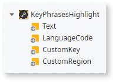
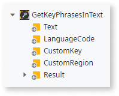
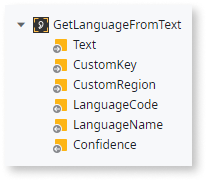

# Use the OutSystems.AI Language Analysis component in your OutSystems applications

Use the OutSystems.AI Language Analysis component to carry out different text analysis operations such as key phrase detection, sentiment analysis and, so on.

This component has Blocks and Server Actions independent of each other. You can use the default UI present within the Block for the available features. Alternatively, you can use the Server Actions in your logic with your specific UI.

OutSystems.AI Language Analysis exists in two versions:

* [OutSystems.AI Language Analysis for Reactive Web App](https://www.outsystems.com/forge/component-overview/7316/outsystems-ai-language-analysis-reactive)
* [OutSystems.AI Language Analysis for Traditional Web App](https://www.outsystems.com/forge/component-overview/5877/text-analysis)

## Prerequisites

1. Create a Microsoft Azure account.

2. [Create resources](https://docs.microsoft.com/en-us/azure/cognitive-services/cognitive-services-apis-create-account#create-a-new-azure-cognitive-services-resource) for the **Text Analytics** service, the **Bing Spell Check** and the **Speech to Text**, and be sure to group them all under the same **Resource Group** – either an existing one or a new one – when creating each resource under the respective field.

3. Download the **OutSystems.AI Language Analysis** and its dependencies from the Forge and publish them to your Environment.

4. In **Service Center**, go to the component dependencies and click on **AzureCognitiveServicesConnector** to access its **Site Properties** tab and fill in the subscription key for **OcpApimSubscriptionKey_TextAnalyticsAPI**, **OcpApimSubscriptionKey_SpellCheckAPI** and **OcpApimSubscriptionKey_SpeechAPI** that you can find in the Keys tab at Azure Portal for each respective resource created in step 2. You can use any of the two keys presented in that tab for each resource.

5. Still in the **AzureCognitiveServicesConnector** properties in **Service Center**, switch to the Integrations tab and for **TextAnalyticsAPI**, **SpellCheckAPI** and **SpeechAPI** fill in the respective **Effective URL** field with the **Endpoint** information that you can find on the Overview tab of Azure Portal for each resource that you've created in step 2. Before saving, delete the version number of the pasted Endpoint (for instance, /v2.1).

## Key phrase detection

Drag and drop the **KeyPhrasesHighlight** Block to your screen and fill the two mandatory input parameters:

* Text – The text to be analyzed for detecting key phrases.
* Language – A two letter code representing the language that follows the ISO 639-1 standard of [language codes](https://docs.microsoft.com/en-us/azure/cognitive-services/text-analytics/language-support#language-list-and-status).

 

The results of the detection will be shown by changing the style of the detected key phrases to bold with a yellow background color. The **GetKeyPhrasesInText** action analyzes the text using the Text Analytics API KeyPhrases action from the Azure Cognitive Services Connector.

To use the Server Action, drag the **GetKeyPhrasesInText** action to your flow and fill the input parameters.

## Sentiment analysis

1. Drag and drop the **SentimentDetection** Block to your screen. The Block has three placeholders and the action that performs the sentiment detection (DetectSentimentInText Server Action).

     

2. Customize these placeholders (using icons, images and so on) to show the result of the sentiment detection of a text.

Each placeholder is related to an interval of a scale that ranges from 0% to 100% where:

* **Negative**: 0% – 39% 
* **Neutral**: 40% – 69% 
* **Positive**: 70% – 100%

The percentage shows the score of the detected sentiment and is an indicator of how the sentiment of the text is positioned in each scale interval. By default, the following emojis are indicators of the text sentiment.

The **DetectSentimentInText** Server Action requires the same input parameters as the Block. It will then return a decimal value representing the score for the sentiment detected in the text. You can change the intervals of the scale according to your use case.

## Language detection

The **GetLanguageFromText** Server Action receives an input parameter, Text, and retrieves the language code detected in the text. The returned code is the [two letter code that follows the ISO 639-1 standard](https://docs.microsoft.com/en-us/azure/cognitive-services/text-analytics/language-support#language-list-and-status).

## Spell Check

Spellchecking is currently not available in Reactive App. We're working on it!

The Spell Check feature has a Block and a Server Action.

1. Drag the **SpellCheck** Block to a screen in the application. 
2. In the **TextArea** placeholder, drag an Input widget and bind it to a variable. 

The **SpellCheck** Block has server-side logic to analyze text and retrieve suggestions for the detected errors. It also has client-side logic that highlights and enables end users to choose what they want to do with the error. 

The end user can either select a suggestion or ignore the given suggestions. In case of a repeated error, if the end user ignores the suggestion, the word will no longer be highlighted.

Additionally, you can use the **RunSpellChecker** Server Action on its own without using the Block. Drag the Server Action to the logic flow and fill in the required input parameters. You can add additional logic to the flow after receiving the output structure.

## Speech to Text conversion

The Speech to Text feature accepts audio files and outputs a transcription of the input. The feature has a **SpeechToText** Server Action that receives the following input parameters:

* **Audio File** - the file that is to be transcribed. It can either be a URL or a binary file. The content within the file must be short utterances (that is, the duration of the entire audio file has to be less than 15 seconds with only 10 seconds of actual, recorded audio content).

* **Audio Format** - the format of the file being sent. This input parameter is mandatory for binary files. The supported audio formats are WAV and OGG.

* **Language Code** - the language that the audio file is in. You can check the [list of supported language codes](https://docs.microsoft.com/en-US/azure/cognitive-services/speech-service/language-support#speech-to-text).

* **Profanity** - the condition specifying how to handle profanity in the results. Accepted values are either **masked**, which replaces profanity with asterisks, **removed**, which removes all profanity from the result, or **raw**, which includes the profanity in the result. The default setting is masked.

The output parameter of the **SpeechToText** Server Action is a transcription of the conversion result that has the highest confidence score.

## Exception handling

The possible exceptions that can happen in the actions of the UI Blocks are handled directly by showing a Feedback Message when an exception occurs. You need to handle any exceptions raised inside the Server Actions within the component.