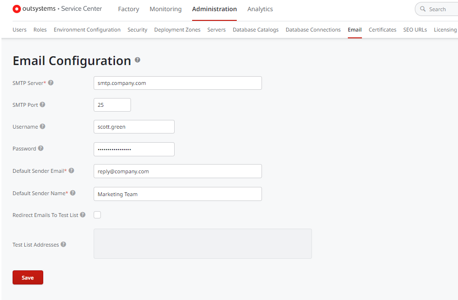
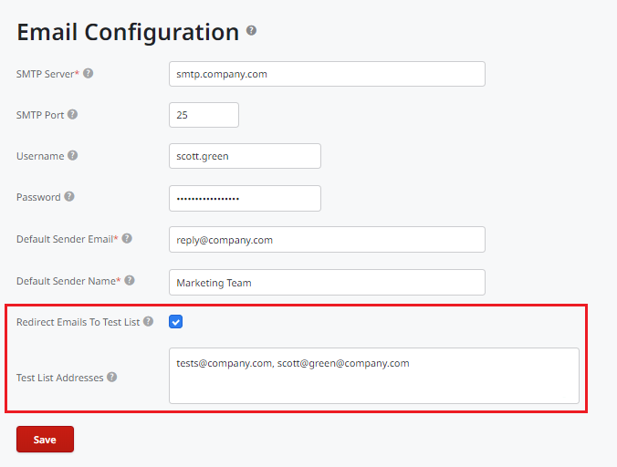

# Configure OutSystems to Send Emails

OutSystems lets you send emails from your apps via the Simple Mail Transference Protocol (SMTP). Configuring SMTP is an environment-wide configuration, so you can choose a different email provider for each environment.

## Configuring the SMTP server

To configure SMTP in the environment, follow these steps in **Service Center**:

1. Go to **Administration** > **Email**.
1. Enter the information about the SMTP server.
1. Click **Save**.

To check if the SMTP is properly configured, try sending an email from an existing application.

Not sure how to access Service Center? If your environment URL is `outsystems.example.com`, try visiting `outsystems.example.com/ServiceCenter` and entering you sign in information from the Service Studio IDE.

## Redirecting emails when testing

When developing and testing, you need to ensure that no email gets sent to your customers by accident.

To redirect all emails to a list of test users, check the **Redirect Emails to Test List**. Add the email addresses to redirect the emails to, in the **Test List Addresses** field.

In this example, all emails sent from this environment are redirected to an internal mailing list, instead of their original address.
Note that all emails are redirected, including emails addressed using the CC and BCC fields.

## Configure the Environment Hostname

To ensure the links in your emails point to the right environment, be sure to set the environment hostname.

Navigate to the **Administration** tab and click **Environment Configuration**. Set the **Hostname** field with the domain name you want your users to navigate to.

