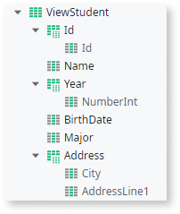
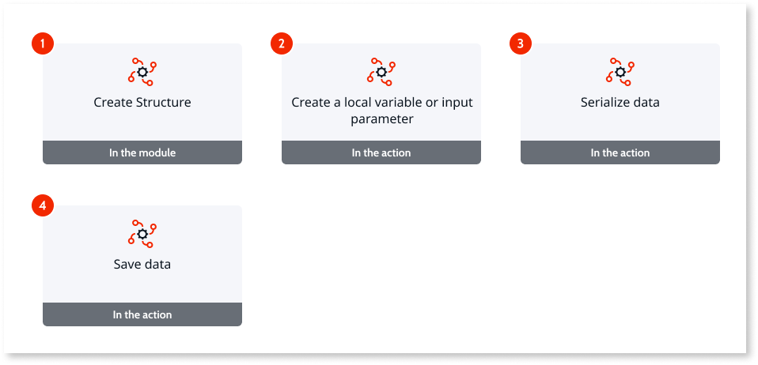
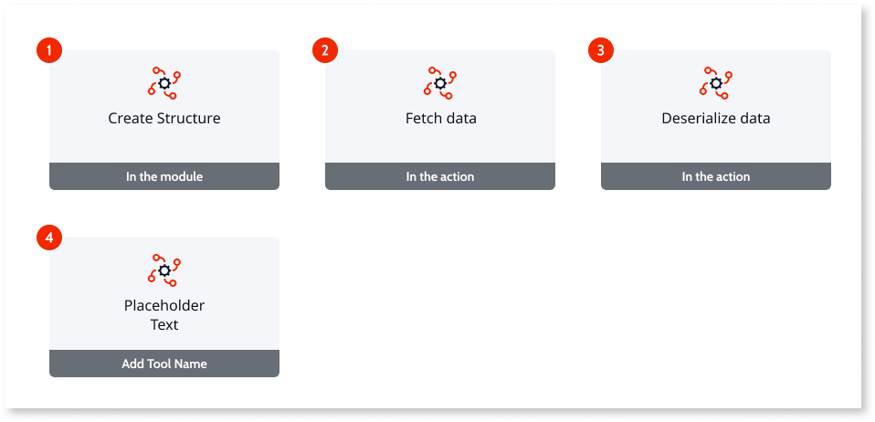
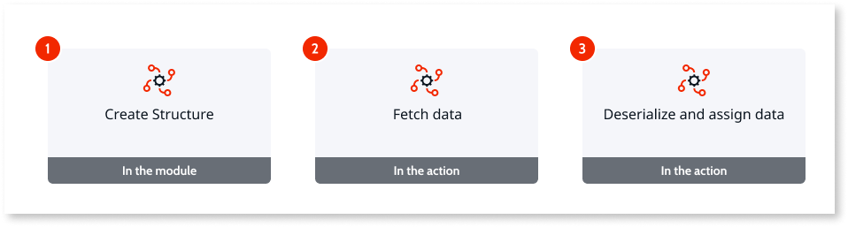

# Using MongoDB integration

After [publishing a MongoDB integration](integrate-external-db-ib.md#review) and [referencing it in an app](integrate-external-db-ib.md#use), you can start using the integration to interact with the MongoDB database.

## Modules in MongoDB integrations { #structure }

Integrations with MongoDB include one app with the following modules:

* A **library module** that exposes Server Actions with logic to interact with MongoDB data. By default, the module name has a "_DRV" suffix, meaning "driver".

* A **service module** that provides an abstraction layer on top of the Server Actions from the library module. Your apps should reference this module when interacting with MongoDB. The Server Actions exposed in this module use the credentials stored in connections to authenticate requests, and you don't need to provide authentication data in each Server Action call. By default, the module name has a "_IS" suffix, meaning "integration service". with suffixes DRV and IS in their names.

### Actions in the service module { #actions }

Use the server actions in the service module to interact with the MongoDB database.

The service module includes the following server actions:

* **Search&lt;collection-name&gt;Documents** - Searches for documents in the MongoDB collection that match the given filters. You can use the **Projection** input to limit the amount of data that MongoDB sends:

     Projection
    :   Include a projection document to specify or restrict fetched fields. Check [MongoDB documentation](https://docs.mongodb.com/manual/reference/glossary/#std-term-projection) for more details.
    The **Projection** input includes two attributes:

    * **IsExclude** - When set to `True`, the fields in **Field List** are excluded from the response. When set to `False`, only the fields in **Field List** and the _id are included in the response.
    * **Fields list** - The fields to use with the projection.

* **Get&lt;collection-name&gt;Document** - Gets a document from the MongoDB collection by its id.
    This action includes two inputs:

    DocumentId
    :    The **DocumentId** input is the identifier of the document you want to fetch and you must ensure it uses the correct data type in a supported format.
        For example, if the data type of the structure identifier,**_id**, is ObjectId, then DocumentId must have one the following formats:
        * `"ObjectId(<hexadecimal>)"` (Shell format)
        * `"{ $oid: ""<hexadecimal>"" }"` (both for Canonical and Relaxed Extended JSON Format)

    Projection
    :   Use this input to limit the amount of data that MongoDB sends, by including a projection document to specify or restrict fetched fields. Check [MongoDB documentation](https://docs.mongodb.com/manual/reference/glossary/#std-term-projection) for more details.
        The **Projection** input includes two attributes:
        * **IsExclude** - When set to `True`, the fields in **Field List** are excluded from the response. When set to `False`, only the fields in **Field List** and the _id are included in the response.
        * **Fields list** - The fields to use with the projection.

* **Count&lt;collection-name&gt;Documents** - Counts the documents in the MongoDB collection that match the given filters.

* **Create&lt;collection-name&gt;Document** - Inserts a document in the MongoDB collection.

* **Replace&lt;collection-name&gt;Document** - Finds the document in the MongoDB collection with the given DocumentId and replaces it.

* **Delete&lt;collection-name&gt;Documents** - Deletes the documents in the MongoDB collection that match the given filters.

### Converting data to and from JSON { #convert }

For collections with **Format** set as **JSON**, the server actions retrieve and receive MongoDB data as JSON, so you need to create Structures to represent the JSON structure in your apps.

You can create the Structures manually, or use **Add structure from JSON...** to automatically convert the JSON to a Structure. **Add structure from JSON...** is available in the context menu fro the **Structures** folder in the **Data** tab.

Use canonical JSON format.

If the JSON includes nested objects, create separate Structures for those objects. Then, in the main Structure set the data type of the attributes that represent the nested objects to the separate Structures.

Furthermore, you need to convert to or from JSON when your app interacts with MongoDB data:

* The server actions used to fetch data retrieve data as JSON, so you need to deserialize the data before handling it or showing it in your apps.

* The server actions used to create or update data receive data as JSON, so you need to serialized your data as JSON before changing the data in the MongoDB database.

## Site Property

The Integration Manager MongoDB Plugin, a dependency of Integration Builder, contains one API to list and create MongoDB database connections in environments. This API only needs to be enabled in the development environment.
To reduce potential attack vectors in your production environments, in the same plugin you can find a site property to disable the API. Disable this site property in all environments except the development environment.
**Enable_MongoDB_IntegrationBuilder_API** site property can be found in the **IM_MongoDB_API** module under the Integration Manager MongoDB Plugin application. The default value is **True** (enabled).

## Prerequisites

Before you start, ensure you created an app with a module and [added the integration as a dependency to your module in Service Studio](integrate-external-db-ib.md#use).

## Collection with Structure Format { #structure-format }

Check the following sections if the collection uses a Structure Format.

### Add a record to a collection with Structure Format

To add a record, known as a document in MongoDB, to a collection with Structure Format, use the **Create&lt;collection-name&gt;Document** action.

### Fetch a record from a collection with Structure Format

To fetch a record, known as a document in MongoDB, to a collection with Structure Format follow the steps in [Fetch a single record](../../develop/data/query/fetch-data-ib.md#fetch-record).

### Fetch a list of records from a collection with Structure Format

To fetch a list of records, known as a document in MongoDB, to a collection with Structure Format follow the steps in [Fetch a single record](../../develop/data/query/fetch-data-ib.md#fetch-list).

## Collection with JSON Format { #json-format }

Check the following sections if the collection uses a JSON Format.

### Add a record to a collection with JSON Format

Adding a record, known as a document in MongoDB, to a collection with JSON Format includes the following key steps:

1. [Create a Structure to represent a MongoDB document](#structure-record).

1. [In an action, create a local variable or input parameter to hold data](#fetch-record).

1. [Serialize the data](#deserialize-record).

1. [Save the data in MongoDB using the **Create&lt;collection-name&gt;Document** action](#fetch-record).

#### Create structure

Start by creating a Structure that represents the JSON structure of the document you want your app to interact with.

Don’t include the document identifier if you want Integration Builder to generate new identifiers while creating documents.

Check the [converting data to and from JSON](#convert) to learn more about creating the Structure.

#### Create a local variable or input parameter

Now in the action where you want to add data, create a Local Variable or input parameter to hold the data before sending it to the MongoDB database. Do the following:

1. Add a **Local Variable** to the screen. If you are creating an action that isn't in a screen, create an **Input Parameter** in the action itself.

1. Set the **Data Type** of the Local Variable or Input Parameter as the structure you created previously.

1. If you are creating an action in a screen, ensure that the **Variable** of each input UI element uses the correct attributes of **Local Variable**.

#### Serialize data

Now in the action where you want to add data, do the following:

1. In the action flow, add a **Serialize JSON**.

1. In the properties of **Serialize JSON**, set **Data** as the **Local Variable** or **Input Parameter** you created previously.

#### Save data

Save the serialized JSON data to your MongoDB database, by doing the following:

1. After **Serialize JSON**, add the **Create&lt;collection-name&gt;Document** action.

1. In the properties of **Create&lt;collection-name&gt;Document**, set **Documentjson** as the JSON output of the Serialize JSON action

### Fetch a record from a collection with JSON Format

Fetching a record, known as a document in MongoDB, from a collection with JSON Format includes the following key steps:

1. [Create a Structure to represent a MongoDB document](#structure-record).

1. [In an action, fetch data using the **Get&lt;collection-name&gt;Document** action](#fetch-record).

1. [Deserialize the data received](#deserialize-record).

1. [Assign the data to the output of the action](#assign-record)

#### Create structure { #structure-record }

Start by creating a Structure that represents the JSON structure of the document you want your app to interact with.

Check the [converting data to and from JSON](#convert) to learn more about creating the Structure.

#### Fetch data { #fetch-record }

Now in the action where you want to fetch data, do the following:

1. In the action flow, add the **Get&lt;collection-name&gt;Document** action.

1. Set the inputs of **Get&lt;collection-name&gt;Document**.

Check the [section with the list of actions in the service module](#actions) to learn about the inputs of this action.

#### Deserialize data { #deserialize-record }

Deserialize the record and assign it to the output parameter by doing the following:

1. In the action flow after **Get&lt;collection-name&gt;Document**, add a **Deserialize JSON**.

1. Set the following **Deserialize JSON** properties:

    * Set **JSON String** as the output of the **Get&lt;collection-name&gt;Document** action, `Get<collection-name>Document.DocumentJson`.
    * Set **Data Type** as the structure you previously created.

#### Assign data to output parameter { #assign-record }

Assign the deserialize data to the output parameter by doing the following:

1. Set the **Data Type** of the **Output Parameter** as the structure you previously created.

1. After the **Deserialize JSON**, add an **Assign**.

1. Assign the output of **Deserialize JSON**, JSONDeserialize&lt;structure&gt;.Data, to the **Output Parameter**, &lt;output-parameter&gt;, by adding the following **Assignment**:

    * `<output-parameter>` = `JSONDeserialize<structure>.Data`

If you completed the previous steps in the **Data Action** of a screen, you can [show the record in a screen](../../develop/data/query/fetch-data-ib.md#show-a-single-record--show-record).

### Fetch a list of records from a collection with JSON Format

Fetching a list of records, known as documents in MongoDB, from a collection with JSON Format includes the following key steps:

1. [Create a Structure to represent a MongoDB document](#structure-list).

1. [In an action, fetch data using the **Search&lt;collection-name&gt;Documents** action](#fetch-list).

1. [Deserialize the data received and append it to the output of the action](#deserialize-list).

#### Create structure { #structure-list }

Start by creating a Structure that represents the JSON structure of the document you want your app to interact with.

Check the [converting data to and from JSON](#convert) to learn more about creating the Structure.

#### Fetch data { #fetch-list }

To fetch data, in the flow of an action, add the **Search&lt;collection-name&gt;Documents** action.

To limit the amount of data that MongoDB sends, use the **Projection** input of **Search&lt;collection-name&gt;Documents**.

Check the [section with the list of actions in the service module](#actions) to learn about the **Projection** input of this action.

#### Deserialize and assign data { #deserialize-list }

Now deserialize the list of records and append the records to the output parameter by doing the following:

1. Set the **Data Type** of the **Output Parameter** as a list of the structure you previously created. Do this by selecting **List...** in the **Data Type** dropdown, and then selecting the structure you created.

1. In the action flow after **Search&lt;collection-name&gt;Documents**, add a **For Each**.

1. In the **For Each** properties, set **Record List** as the output of the **Search&lt;collection-name&gt;Documents** action, `Search<collection-name>Documents.Results`.

1. In the action flow, next to the **For Each**, add a **Deserialize JSON**.

1. Connect the **For Each** to **Deserialize JSON**.

1. Set the following **Deserialize JSON** properties:

    * Set **JSON String** as the output of the **Search&lt;collection-name&gt;Documents** action, `Search<collection-name>Documents.Results.Current`.
    * Set **Data Type** as the structure you previously created.

1. After **Deserialize JSON**, add a **ListAppend** action.

1. Connect **Deserialize JSON** to **ListAppend**.

1. In the **ListAppend** properties, set the inputs as follows:

    * Set **List** as the Output Parameter, `<output-parameter>`.
    * Set **Element** as the output of **Deserialize JSON**, `JSONDeserialize<structure>.Data`.

1. Connect **ListAppend** to the **For Each**.

If you completed the previous steps in the **Data Action** of a screen, you can [show the list of records in a screen](../../develop/data/query/fetch-data-ib.md#show-a-list-of-records--show-list).
