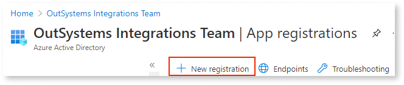
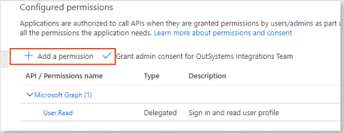
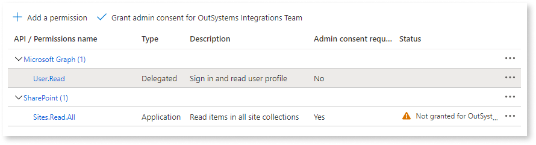
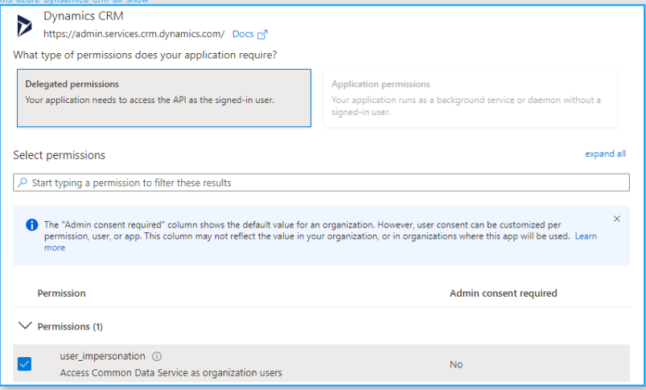
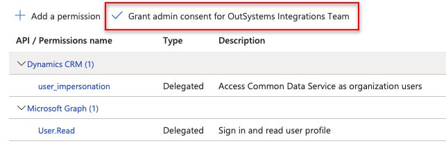

# How to register SharePoint Online, Microsoft Dataverse, or Microsoft Dynamics 360 apps in the Azure Active Directory

OutSystems owns and manages the Azure Active Directory application you are using for authentication and authorization. This provides another level of trust for our customers. Microsoft uses the Azure portal to authenticate and authorize services for your app and users. To use the authentication and authorization services, you must register your app in the Azure AD (Active Directory). Integration Builder can then access your Microsoft SharePoint. Microsoft Dataverse, or Microsoft Dynamics 360 environments through the Azure AD application.

The procedure to register your application includes the following:

* Registering your app
* Adding and requesting API permissions
* Managing certificates and secrets

  If the left menu pane is not open, click the Hamburger icon. These procedures use the left menu pane to access the integration options.

## Registering your app

1. Sign into the [Microsoft Azure Portal](https://portal.azure.com/).

1. From the left menu pane, click **Azure Active Directory**.

1. From the left menu pane, click **App registrations**.

1. From the top menu bar, click **+ New Registration**.

    

1. In the name field, **copy and paste** one of the following:  

    * For **SharePoint Online**: `OutSystems SharePoint`
    * For **Microsoft Dataverse**:  `OutSystems Dataverse`
    * For **Microsoft Dynamics 360**: `OutSystems Dynamics 360`

1. In the Supported account types section, select **Accounts in this organizational directory only (\<organization name\> only - Single tenant)**.

    

    Leave the **Redirect URL (optional)** section blank.

    

1. Click **Register**.

## Adding and requesting application permissions

To add and request application permissions for your environment, choose either the SharePoint Online, Microsoft Dataverse / Microsoft Dynamics 360 procedure.

### Adding SharePoint Online permissions

1. From the left menu pane, click **API permissions**.

1. Below Configured permissions, click **Add a permission** to open the Request API permissions window.

    

1. Click **SharePoint**.

1. Select **Application Permissions**.

1. From the list of permissions, continue to scroll, click **Sites** and select **Sites.Read.All (Read items in all site collections**). Click **Add permissions**.

    

    A warning message may display in the Add a Permissions list, indicating the permission was not granted for OutSystems Integration team.

    

    

1. Optionally, to grant permission, click the **Grant admin consent for OutSystems Integrations Team** link.

### Adding Microsoft Dataverse or Microsoft Dynamics 360 permissions

1. From the left menu pane, click **API permissions**.

1. Below Configured permissions, click **Add a permission** to open the Request API permissions window.

 

1. Under Request API permission, click in the **Dynamics CRM** box.

   

1. Under Permissions, select **user-impersonations**.

1. Scroll to the bottom of the list and click the **Add permissions** button again.

    

    A warning message may display in the Add a Permissions list, indicating the permission was not granted for OutSystems Integration team.

    

1. Optionally, to grant permission, click the **Grant admin consent for OutSystems Integrations Team** link.

    

## Managing certificates and secrets

Before beginning this procedure, make sure to download the OutSystems certificate that Integration Builder emailed to you. (If you prefer you can use your own certificate.)

1. From the left menu pane, click **Certificates & secrets**.

1. Below Certificates, click **Upload Certificate**.

1. Click the **File** button and navigate to the location in which you placed the certificate.

1. Click **Open** and then click **Add**. The certificate is added to your app.  
