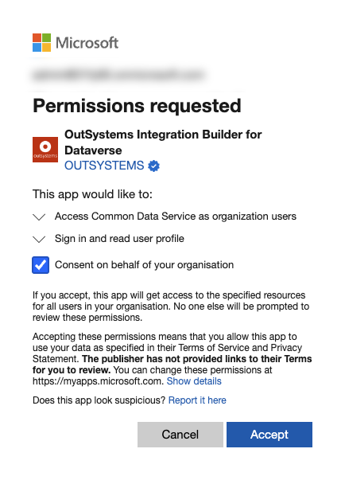
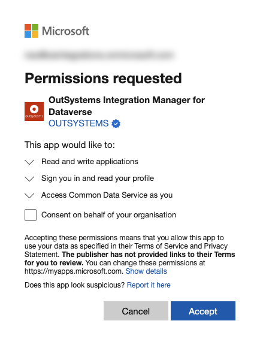

# Microsoft Dynamics 365 integration

The Microsoft Dynamics 365 integration allows you to perform operations on entities available in Microsoft Dynamics 365 from your OutSystems applications.

Tables created as part of Dynamics 365 customer engagement apps, like Product or Opportunity, are only available if you have a Dynamics 365 license. Check Microsoft documentation for a [list ot these tables](https://docs.microsoft.com/en-us/powerapps/maker/data-platform/data-platform-complex-entities#complex-tables-installed-with-dynamics-365-apps).

## Prerequisites

Verify the following:

* You meet the general [Integration Builder prerequisites](../set-up.md#prerequisites).

* The Microsoft Dynamics 365 integration deployed in your OutSystems development environment can make HTTPS outbound requests (port 443) to your Microsoft Dynamics 365 service.

## Authorizing Integration Builder in your Microsoft account

Follow the instructions provided in [Creating and using an integration](../use.md#create-use). You must authorize Integration Builder to access your data in Microsoft Dynamics 365 through your Microsoft account.

Integration Builder uses this authorization to retrieve the metadata from Microsoft Dataverse (environments, tables, and respective columns) and enable you to test a newly created integration in the development environment.

### About environment instances

If you have several Microsoft Dynamics 365 environment instances in your Microsoft account, Integration Builder asks you which environment you want to use when connecting to Microsoft Dynamics 365.

According to Microsoft, an environment instance in Microsoft Dynamics 365 is "a space to store, manage, and share your organization's business data, apps, and flows". When you're creating a Microsoft Dynamics 365 integration, Integration Builder registers an Azure application in the environment you choose.

## Authorizing a Microsoft Dynamics 365 connection { #authorize-integration }

Microsoft Dynamics 365 integrations generated with Integration Builder use a certificate to authenticate requests done at runtime, using the connection you configured.

Request authentication is handled transparently when you call Server Actions exposed by the service module (the module with a "_IS" suffix, by default). The Server Actions obtain the certificate info from the connection that you previously associated with the integration in Integration Manager. Therefore, you don't need to provide any authentication information as input parameters.

### If you have administrator permissions in Azure Active Directory

You can select the `Create automatically` option to have the Integration Manager create the connection on your behalf.
Integration Manager generates a certificate and connects to Integration Builder, which requests the creation of an Azure AD app that uses the certificate for authentication and authorization.

### If you don't have administrator permissions in Azure Active Directory

If you don't have administrator permission in Azure AD or prefer not to grant Integration Builder permission to create apps in Azure AD, then you should select the `Create manually` option.

Creating a connection without administrator credentials requires parameters from the Azure AD platform. The Azure AD account administrator needs to create a new Azure app to obtain these parameters.

Integration Builder can send an email to the administrator requesting the information you need. The email includes a unique authorization certificate, and [instructions on how the administrator proceeds](how-register-ib-ms-sp-dv-d360.md).

Once you receive the information, enter it into Integration Builder, and select **Create connection**.

### Editing a connection in Integration Manager

Each connection to Microsoft Dynamics 365 you create in Integration Manager is tied to an application registered in Azure AD. To edit the connection, you must use a Microsoft account that has access to Azure AD and must authorize Integration Builder to connect on this user's behalf.

This authorization is only valid for a specific user. If another user wants to edit a connection or integration, they also need to authorize Integration Builder.

### Use the integration in Service Studio

For more information, see [how to use the integration in Service Studio](../use.md#use).
