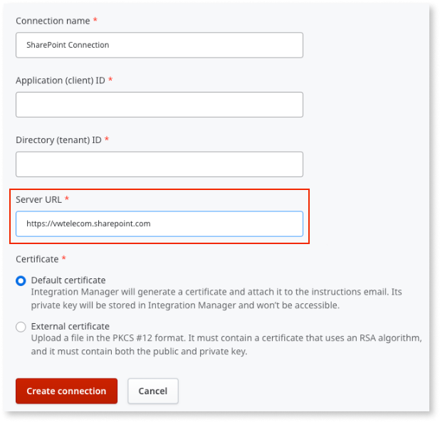

# SharePoint Online integration

The SharePoint Online integration allows you to perform operations on entities available in SharePoint Online from your OutSystems applications.

## Prerequisites

Verify the following:

* You meet the general [Integration Builder prerequisites](../set-up.md#prerequisites).

* The SharePoint Online integration deployed in your OutSystems development environment can make HTTPS outbound requests (port 443) to your SharePoint Online service.

* The number of items or documents in your SharePoint List View don't exceed the 5000 limit. Otherwise, SharePoint displays an error message. To learn more about this error, see [Living Large with Large Lists and Large Libraries](https://docs.microsoft.com/en-us/microsoft-365/community/large-lists-large-libraries-in-sharepoint#what-is-the-list-view-threshold).

* You have a Microsoft account with Administrator role permissions in Microsoft Azure Active Directory (AD). These Administrator role permissions are required to access your Azure AD tenant and to create security roles.

* You have a connection already created in Integration Manager, as shown below:

    

## Authorizing Integration Builder in your Microsoft account

Follow the instructions provided in [Creating and using an integration](../use.md#create-use). You must authorize Integration Builder to access your data in SharePoint Online through your Microsoft account.

Integration Builder uses this authorization to obtain the available objects for building a SharePoint Online integration.

Additionally, when you're creating a connection, Integration Manager connects to Integration Builder, requesting the creation of an Azure app and other related objects. This operation uses the same authorization, since only Integration Builder has the access tokens for this authorization.

## Authorizing a SharePoint Online connection { #authorize-integration }

SharePoint Online integrations generated with Integration Builder use a certificate to authenticate requests done at runtime, using the connection you configured.

Request authentication is handled transparently when you call Server Actions exposed by the service module (the module with a "_IS" suffix, by default). The Server Actions obtain the certificate info from the connection that you previously associated with the integration in Integration Manager. Therefore, you don't need to provide any authentication information as input parameters.

### If you have administrator permissions in Azure Active Directory

Integration Builder registers an app with Azure AD at the request of Integration Manager. When you create a connection, Integration Manager requests Integration Builder to create and associate a certificate with this app, saving the certificate details in an encrypted way as part of the connection information.

### If you don't have administrator permissions in Azure Active Directory

Creating a connection without administrator credentials requires parameters from the Azure AD platform. The Azure AD account administrator needs to create a new Azure app to obtain these parameters.

Integration Builder can send an email to the administrator requesting the information you need. The email includes a unique authorization certificate, and [instructions on how the administrator proceeds](how-register-ib-ms-sp-dv-d360.md).

Once you receive the information, enter it into Integration Builder, and select **Create connection**.

### Editing a connection in Integration Manager

Each connection to SharePoint Online you create in Integration Manager is tied to an application registered in Azure AD. To edit the connection, you must use a Microsoft account that has access to Azure AD and must authorize Integration Builder to connect on this user's behalf.

This authorization is only valid for a specific user. If another user wants to edit a connection or integration, they also need to authorize Integration Builder.

### Use the integration in Service Studio

For more information, see [how to use the integration in Service Studio](../use.md#use).
