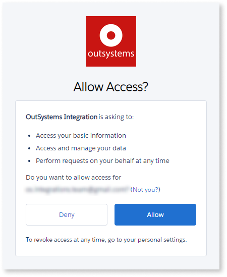

# Salesforce integration

## Prerequisites

* Make sure you meet the general [Integration Builder prerequisites](../set-up.md#prerequisites).
* Your OutSystems development environment can make HTTPS outbound requests to your Salesforce instance, available at `*.my.salesforce.com`.
* You have a Salesforce user with an Administrator role.

## Authorizing Integration Builder in Salesforce

Follow the instructions provided in [Creating and using an integration](../use.md#create-use). You must authorize Integration Builder to access your data (list of objects) through your Salesforce account.

Integration Builder uses this authorization to obtain the available objects for building a Salesforce integration.

Additionally, when you're creating a connection, Integration Manager connects to Integration Builder, requesting the creation of a Salesforce connected app. This operation uses the same authorization, since only Integration Builder has the access tokens for this authorization.

## Authorizing a Salesforce connection { #authorize-integration }

Salesforce integrations generated with Integration Builder use an access token to authenticate requests.

Request authentication is handled transparently when you call Server Actions exposed by the service module (the module with a "_IS" suffix, by default). The Server Actions obtain the token from the connection that you previously associated with the integration in Integration Manager. Therefore, you don't need to provide a token as an input parameter.

You can authorize a Salesforce connection in the following ways.

### If you have administrator permissions in Salesforce

Integration Builder creates a connected app in Salesforce at the request of Integration Manager. Then, Integration Builder returns the obtained access token for this specific app to Integration Manager. Integration Manager saves this access token in an encrypted way as part of the connection information.

### If you don't have administrator permissions in Salesforce

Creating a connection without administrator credentials requires parameters from the Salesforce platform. The Salesforce account administrator needs to create a new connection (Connected App) to obtain these parameters.

Integration Builder can send an email to the administrator requesting the information you need. The email includes a unique authorization certificate, and [instructions on how the administrator proceeds](integration-salesforce-oauth-client.md).

Once you receive the information, enter it into Integration Builder, and select **Create connection**.

## Connection fields

* **Email address of the app administrator** — The email address that Salesforce uses to contact you or your support team.

* **Salesforce username** — The username of the Salesforce account that you want to associate with all requests that Integration Builder sends to the Salesforce API. Salesforce usernames look like email addresses (for example, john@example.com) but don't have to be an actual email address.  
    If you're not sure, search your inbox for the following emails that include your username: "Subject: Welcome to Salesforce: Verify your account", or "Subject: Finish resetting your Salesforce".

### Use the integration in Service Studio

Check out [how to use the integration in Service Studio](../use.md#use).

