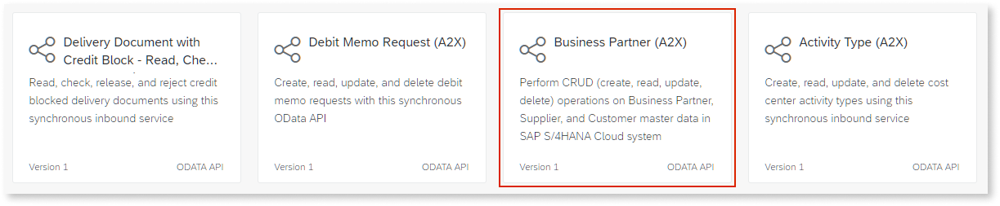
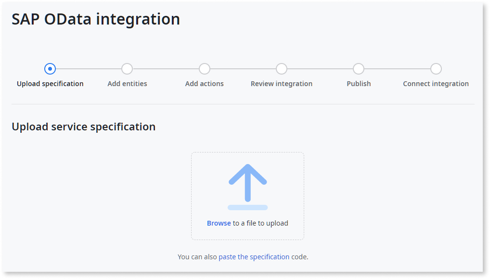
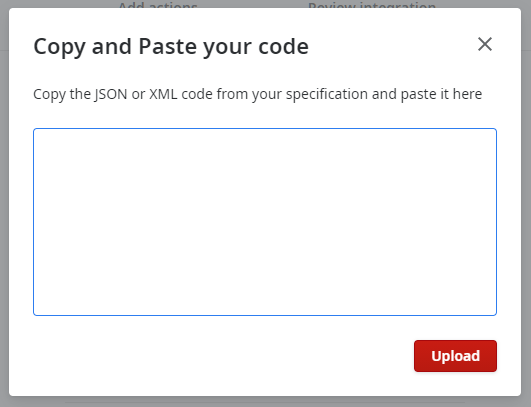

# Obtaining the SAP service specification

The process of obtaining the SAP service specification that you must provide in Integration Builder depends on the type of service:

* **Default SAP Service**: Download the specification from the SAP API Business Hub
* **Custom SAP Service**: Download the specification from a specific service endpoint

## Service specification for a default SAP Service

Do the following:

1. Open the [SAP API Business Hub](https://api.sap.com/) in your browser.

    

1. In the main services list, search for the SAP service you want to integrate with and click the card for that service.

    For example, consider that you wanted to integrate with the "Business Partner (A2X)" OData API, available in SAP S/4HANA Cloud.

    

    **Note:** The Business Hub includes REST, SOAP, and OData APIs. **Make sure the API you select is an OData API.**

1. Open the **Details** tab (1).

    

1. Click **Download API Specification** (2) and select either **JSON** or **EDMX** from the available formats (3).

## Service specification for a custom SAP Service

To get the specification for a custom SAP Service, you must make a request to its `/$metadata` endpoint. For this purpose, you can use an API client like Postman or SAP Gateway Client.

Do the following:

1. Using an API client, make a `GET` request to the `/$metadata` endpoint of the SAP service you want to integrate with.

    Example endpoint:  
    `https://<your_sap_hostname>/sap/opu/odata/sap/API_CUSTOMER_MATERIAL_SRV/$metadata`

1. Copy the service specification code returned as a response.

1. In Integration Builder, click the link in the sentence "You can also **paste the specification** code.", available in the **Upload specification** step.

    

1. Paste the service specification in the pop-up window and press **Upload**.

    
