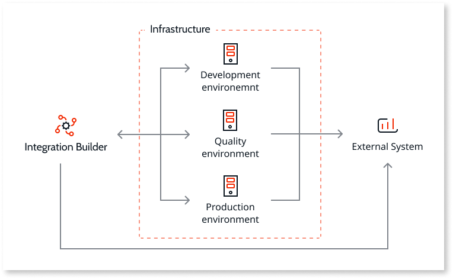
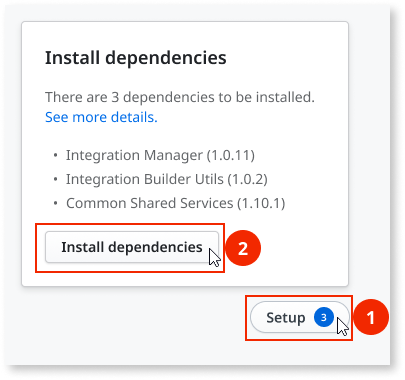
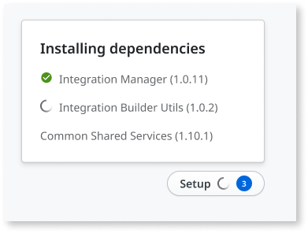

# How to set up Integration Builder

Integration Builder is a Software as a Service (SaaS) that connects to your OutSystems environment to authenticate and validate user connections. Integration Builder works with Integration Manager to keep the status of your integrations current, so it needs to be able to connect with the environments to which you deploy the integrations. In addition, Integration Builder is available in all OutSystems editions.  

## Prerequisites { #prerequisites }

* The [IT user](../../managing-the-applications-lifecycle/manage-it-teams/intro.md) you use to log in to Integration Builder must have the **Change and Deploy Applications** permission level and the **Create Applications** specific permission for the development environment. Check [Understanding the permission model for IT users](../../managing-the-applications-lifecycle/manage-it-teams/about-permission-levels.md) for more information.

* Use the version of any of the following desktop browsers: Edge, Firefox, Google Chrome, or Safari.

* All environments, except for the LifeTime environment, must meet the following:
    
    * Must use [Platform Server 11.7.2](https://success.outsystems.com/Support/Release_Notes/11/Platform_Server#Platform_Server_11.7.2) or later.

    * Must allow inbound and outbound HTTPS communication (port 443) with `https://integrationbuilder.outsystems.com`. Check [Integration Builder network requirements](../../setup/network-requirements.md#integration-builder) for detailed information.

* Each integration may have additional requirements. Check the specific integration documentation for details.

**Note:** Integration Builder currently doesn't support Multiple Database Catalogs (MDC) in OutSystems on-premises installations.

## Registering your infrastructure

Before using Integration Builder, register the infrastructure in Integration Builder by following these steps:

1. Access <https://integrationbuilder.outsystems.com>, enter the development environment address, and click **Next**. OutSystems checks the environment exists.

1. Enter your IT username and password, and then click **Log in**. OutSystems verifies the user has the correct permissions.

1. On the Welcome screen, click **Set up Integration Builder**. The Integration Builder Disclaimer page displays.

1. On the Integration Builder Disclaimer page, review the terms and conditions, and click **Accept and Continue**. OutSystems checks your infrastructure.

1. If your development environment uses **Platform Server 11.7.6 or lower**, enter your **Activation Code** and click **Register and Continue**.

    

    To get your activation code, go to `https://<dev-environment-address>/ServiceCenter`, then click **Administration** > **Licensing**, and copy your Activation Code.

    

After these steps, IT users for the infrastructure can start using Integration Builder.

## Installing dependencies

Integrations created using Integration Builder need other apps to work properly.
After registering your infrastructure, a **Setup** widget at the bottom right prompts you to install some of these dependencies.

To install dependencies, follow these steps:

1. Click the **Setup** widget to expand it.

1. Click **Install dependencies** to start installing the dependencies.

After these steps Integration Builder stars installing the dependencies listed.

## Setting up on-premises environments

When using an on-premises infrastructure with Integration Builder, you need to setup the addresses of the other environments where you'll deploy the integrations after finishing development. For example, for a standard infrastructure, Integration Builder must be able to connect to the development, quality assurance, and production environments but doesn't need to connect to the LifeTime.

After you develop and publish the first integration, the **Setup** widget at the bottom right prompts you to add the environment addresses.

To setup the environments, follow these steps:

1. Click the **Setup** widget to expand it, and the click on **Setup environments**.

1. Click **Add environment**.

1. Enter a name for the environment and its URL, then click **Add environment**. The URL is the environment address.

1. Repeat step 2 and 3 until you have added all your non-LifeTime environments.
