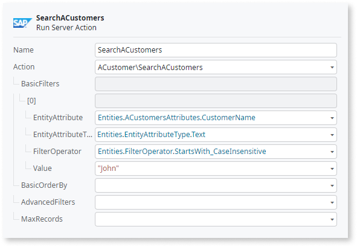
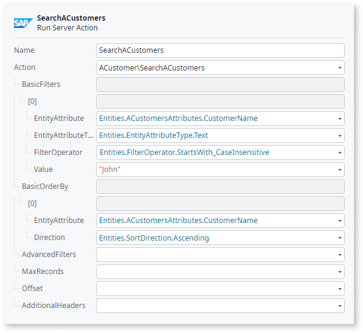

# Structure of generated integrations

Integration Builder generates and publishes integrations, which are OutSystems applications composed of two modules:

* One **library module** that exposes Server Actions with logic to interact with external provider objects. By default, the module name has a "_DRV" suffix, meaning "driver".

* One **service module** that provides an additional abstraction layer on top of the Server Actions in the library module. The Server Actions exposed in this module use the credentials stored in connections to authenticate requests, and you don't need to provide authentication data in each Server Action call. By default, the module name has a "_IS" suffix, meaning "integration service".

    

    Use the elements exposed by the **service module** of the integration to interact with the external system.

    

You can define both the OutSystems application name and the name of the modules when creating the integration in Integration Builder. Check [Create and configure a new integration](use.md#create-configure-integration) for more information.

## Available Server Actions in an integration

Integration Builder creates several Server Actions to support CRUD (create, read, update, delete) operations and other actions in the external system.

For each entity of the external system you get Server Actions in the service module similar to the following, depending on the actions available in the external API:

* `Create<Entity>` — Create an entity record in the external system with the provided data.
* `Get<Entity>` — Get the data of an entity record with the given identifier.
* `Update<Entity>` — Update the data of an entity record with the given identifier.
* `Count<Entity>s` — Count the number of entity records that fulfill the provided filter conditions. Note: SharePoint Online integrations don't include this action.
* `Search<Entity>s` — Get a list of entity records that fulfill the provided filter conditions. The list of results supports paging and custom ordering.
* `Delete<Entity>` — Delete an entity record in the external system.

Integration Builder creates actions for all the entity operations supported by the external system through the service you're importing. Depending on the exact service, some of the CRUD operations (like `Delete<Entity>`) may not be available because the service provided by the third-party system doesn't support them.

You may get additional Server Actions to interact directly with sub-entities of the entity.

With some external systems you can add other operations to your integration (for example, in SAP OData integrations). These operations might not be directly associated with an entity. Integration Builder also creates Server Actions for these actions.

## Filtering, ordering, and pagination

You can filter, define the sort order, and paginate results from invoking Server Actions exposed by an integration.

### Using filters { #filter }

Result filtering is available in `Search*` and `Count*` Server Actions. There are two types of filtering available:

BasicFilters (List of BasicFilter)
:   Define simple criteria for filtering. Each basic filter is defined in the following manner:  
    "Compare entity attribute A of type T with value V, using operator O".  
    All basic filter parameters are Static Entities, except for the value to search. The available attributes are the attribute names of the external system entity available in a Static Entity. Check the following examples of entity attribute types and operators:

    EntityAttributeType = `DateTime`, `Number`, `Text`, etc.  
    FilterOperator = `Equal`, `GreaterThan`, `StringContains`, `EndsWith`, `EndsWith_CaseInsensitive`, etc.

    

     Note: Don't use `CaseInsentitve` filter operator with SharePoint Online integrations. Doing so causes an error.

    

    Combine one or more of these basic filters to produce your final filter condition. For example, consider a Customer entity of the external system with a CustomerName attribute. For example, to search for customers whose name starts with "John" (case insensitive), use the following BasicFilter:

    EntityAttribute = `Entities.ACustomersAttributes.CustomerName`  
    EntityAttributeType = `Entities.EntityAttributeType.Text`  
    FilterOperator = `Entities.FilterOperator.StartsWith_CaseInsensitive`  
    Value = `"john"`

    

    

    The ACustomersAttributes Static Entity is available in the **library module** of the integration. By default, the name of this module has a "_DRV" suffix.

    The EntityAttributeType and FilterOperator Static Entities are available in the **IntegrationUtils_Lib module**.

    

AdvancedFilters (Text)
:   Define the full query string using OData terminology. For example:

    `"City eq 'Redmond'"` (`eq` means equal)  
    `"City ne 'London'"` (`ne` means not equal)  
    `"Price gt 20"` (`gt` means greater than)  
    `"Price ge 10"` (`ge` means greater than or equal)

    You can check the structure of the Results output parameter to find the attributes names you can use in your query.

### Ordering results { #order }

You can define the order of the records in a result set when invoking `Search*` Server Actions. There are two ways of defining the order of results:

BasicOrderBy (List of OrderBy)
:   Defines ordering in a way similar to basic filtering. You must specify one or more entity attribute names (available in a Static Entity) and the order direction.  
    For example, to order search results by customer name when searching for records of the Customer entity, do the following:

    EntityAttribute = `Entities.ACustomersAttributes.CustomerName`  
    Direction = `Entities.SortDirection.Ascending`

    

    

    
    The ACustomersAttributes Static Entity is available in the **library module** of the integration. By default, the name of this module has a "_DRV" suffix.

    The SortDirection Static Entity is available in the **IntegrationUtils_Lib module**.

    

AdvancedOrderBy (Text)
:   Defines ordering using an OData expression. For example: `"CustomerName asc"`

### Pagination { #paginate }

You can use pagination when invoking `Search*` Server Actions. Define limits on the result set using the following parameters:

Skip / Offset
:   Defines how many records to skip in the result set. If the parameter value is 5, you get results from record 6 onward. Set this parameter according to the current page of the results.

Top / MaxRecords
:   Defines how many records to return in the result set. If the parameter value is 10, you get only the first 10 records. Set this parameter according to the number of records you want to display per page of results.

You can use these two parameters together, or just one at a time, according to your business needs. It's recommended that you define the order of the results when using pagination. Check [Ordering results](#order).

## Advanced scenarios { #advanced }

The integrations generated by Integration Builder provide two ways of supporting advanced scenarios:

Use advanced input parameters of Server Actions
:   Besides the basic input parameters, each Server Action provides advanced input parameters that allow you to use OData expressions for searching, filtering, and ordering. These parameters are "AdvancedFilters" and "AdvancedOrderBy".

Configure the integration to allow editing in Service Studio
:   By default, you can't modify generated integrations in Service Studio. This allows you to keep modifying and publishing new versions of the integration using Integration Builder. However, you can choose to generate an integration that allows editing in Service Studio, losing the ability to modify this integration in Integration Builder. For example, you can create an integration editable in Service Studio to implement an alternative authentication method for external system requests.

    

    Note: If you follow this customization path, you or any other developers **can't modify the configuration of the integration or publish it again using Integration Builder**. When publish an integration that allows editing, you can only make further changes to it using Service Studio.

    

