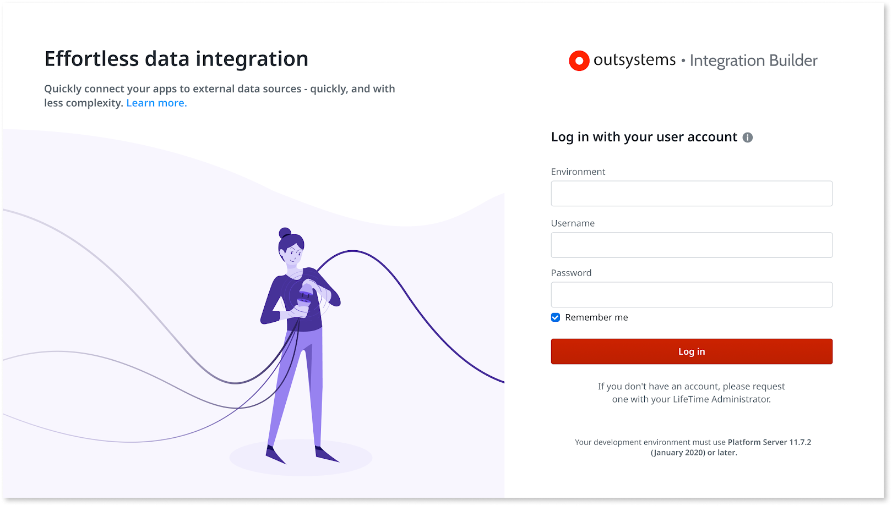
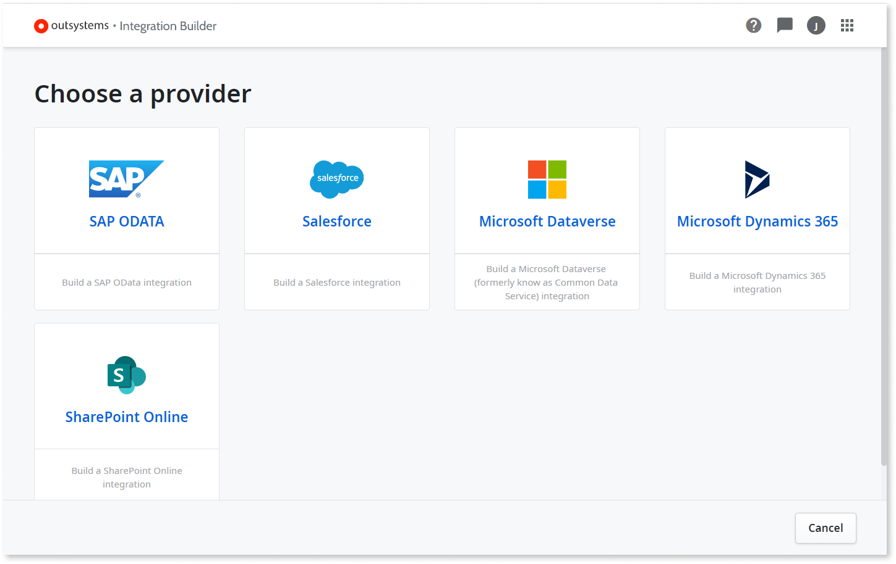
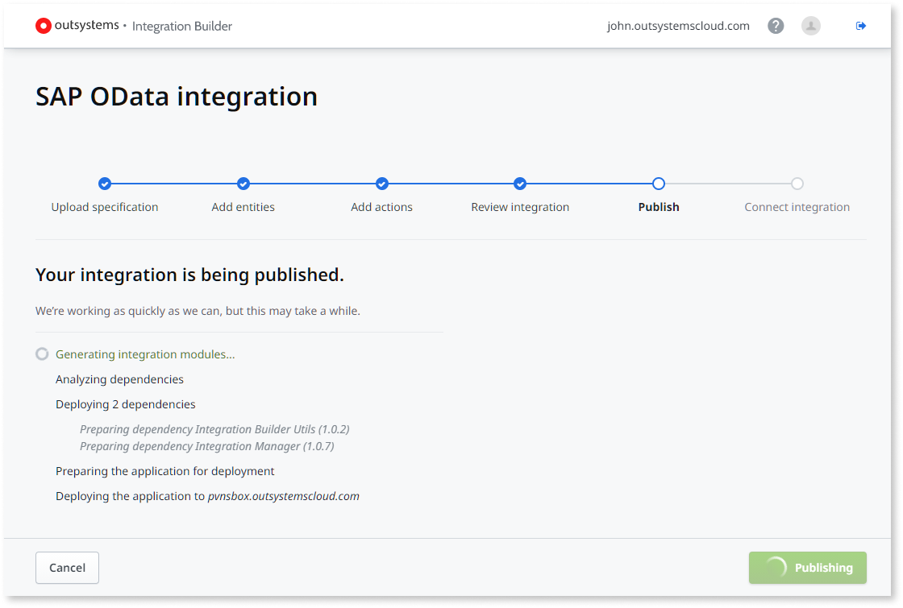
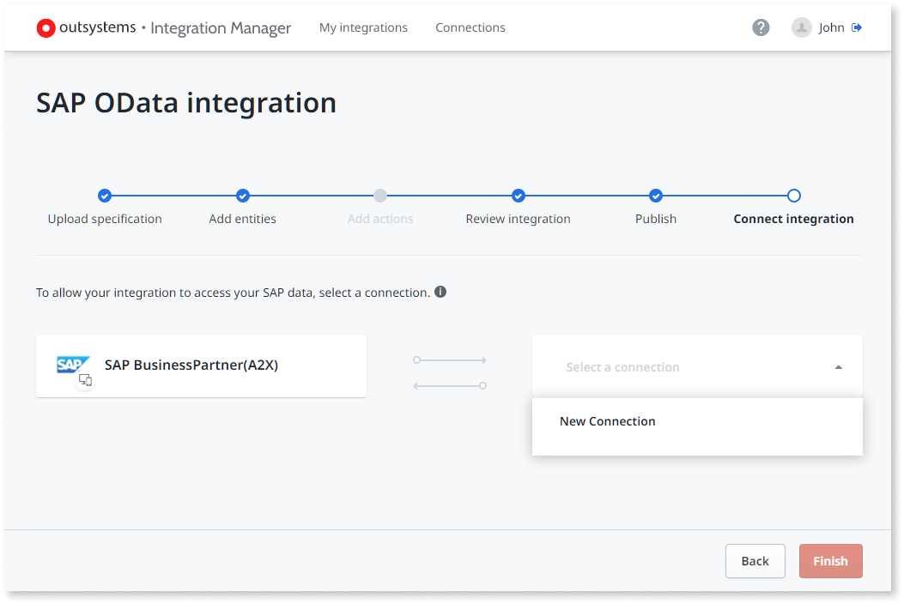
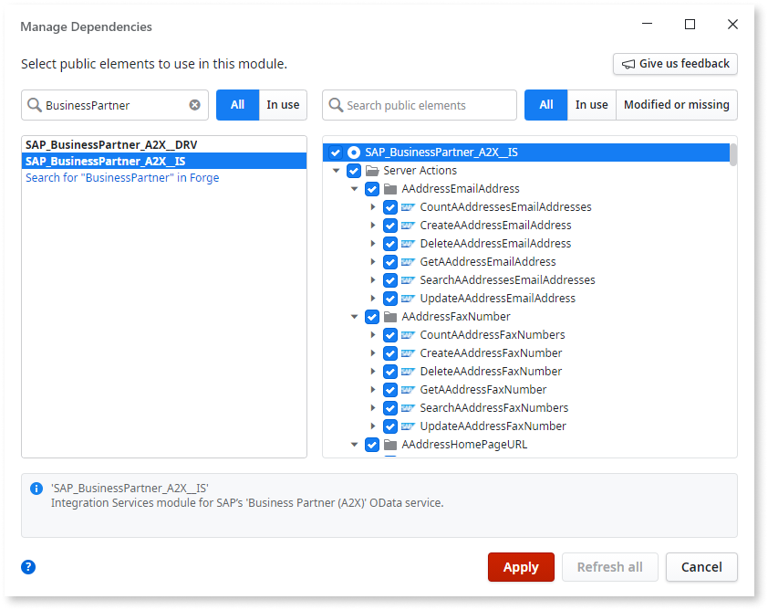

# Use Integration Builder

The sections below walk you through the several stages of creating, publishing, and deploying an integration:

* Create an integration using Integration Builder and use it in your OutSystems app
* Deploy your OutSystems app using LifeTime and configure the integration in the new environment

## Creating and using an integration { #create-use }

To create an integration using Integration Builder and use that integration in an OutSystems application you must perform the following general steps:

1. Log in to Integration Builder with your development environment URL and your username and password.
1. Create a new integration for an external system (for example, SAP) and configure its settings.
1. Publish the integration in your OutSystems environment.
1. Create a connection for the integration in your OutSystems environment.
1. Use the Server Actions exposed by the integration in your OutSystems application.

The following sections provide more details about these steps.

### Log in to Integration Builder

To log in to Integration Builder do the following:

1. Open Integration Builder, available at <https://integrationbuilder.outsystems.com>.

    

1. In the **Environment** field, enter the address of your OutSystems development environment.

    

    For security and governance reasons, you can only connect to a **development** environment. Integration Builder publishes integrations to the environment you enter on the login page.

    

1. Enter your IT user credentials.

1. Click **Log in**.

On your first login, Integration Builder greets you with an onboarding guide. To see the guide again, select **?** > **Reset onboarding** and go to the homepage of Integration Builder.

### Create and configure a new integration { #create-configure-integration }

1. In the Integration Builder homepage, click **New integration**.

1. Select the service provider that's the data source of your integration (for example, SAP).

    

1. Follow the wizard steps to configure the integration. These steps vary according to the integration you're creating. They can be the following:

    * Authorize Integration Builder to access the external system (Salesforce) or provide a service specification (SAP OData).
    * Select the objects that you want to interact with in your OutSystems applications.
    * Define a few basic settings for the generated integration, like application and module names, and application icon.
    * Define if you want to generate an open integration, editable in Service Studio, losing the ability to change it in the future using Integration Builder.

1. After configuring the integration, review its configuration. You can go back to a previous step and change any values.

### Publish the integration

In the "Review integration" step, click **Publish** to publish the integration modules to your OutSystems environment. This operation might take a few minutes.

Integration Builder also publishes some dependencies along with the integration. Check [Apps installed in your OutSystems environment](#other-apps) for more information.

If an error occurs when publishing, Integration Builder displays a **Download application package** link to download the application OAP file. You can download this application package and publish it manually in your development environment.

### Create a connection for the integration { #create-connection }

After creating an integration you must associate it with a connection before being able to use it. Connections store external system credentials in the context of an OutSystems environment, and they're used in runtime by the integration.

You can create a new connection or use an existing one. Use [Integration Manager](works.md#architecture) to create connections and associate them with integrations.

Creating a connection requires administrator permissions in the external system. 
If you don't have administration permissions, you need to request some parameters from the external system administrator. Integration Builder can help you during this process by sending an email to the administrator with the all the information they need.

To create a connection do the following:

1. After publishing an integration, click **Go to connections**. The browser navigates to Integration Manager, an app that Integration Builder also deployed to your OutSystems environment along with the integration.

    Alternatively, open Integration Manager directly by navigating to `https://<your_environment>/OSIntegrationManager/`, select the **Connections** tab, and click on the integration you want to configure.

1. In the **Select a connection** drop-down, click **New Connection**.

    

1. To connect the external system select one the following:
    
    * For **SAP OData** **with administrator permissions**, enter a connection name and the basic elements for accessing the external system, then select **Create connection**.
    
    * For **Salesforce**, **SharePoint Online**, **Microsoft Dataverse** or **Microsoft Dynamics 365** **with administrator permissions** in the external system, enter a connection name and the basic elements for accessing the external system, then select **Create connection**.

    * For **Salesforce**, **SharePoint Online**, or **Microsoft Dataverse** **withouth administrator permissions** in the external system, Integration Builder can send an email to the administrator requesting the information you need. Once you have the information, enter it into Integration Builder, and select **Create connection**.

    

    For more information on this step, review the articles for each integration:

    *   [Salesforce integration](connectors/integration-salesforce.md#authorize-integration)
    *   [SharePoint Online integration](connectors/integration-ms-sharepoint.md#authorize-integration)
    *   [Microsoft Dynamics 365 integration](connectors/integration-ms-dynamics.md#authorize-integration)
    *   [Microsoft Dataverse integration](connectors/integration-ms-dataverse.md#authorize-integration)
    *   [SAP OData integration](connectors/integration-sap.md#authorize-integration)

    

After creating a connection, associate it to the integration do the following:

1. In Integration Manager, select the **My integrations** tab.

    

1. In the **Integration name** column, click the link of the integration you want to associate with the connection.

1. Select the connection you want to use in the **Select a connection** drop-down.

### Use the integration in Service Studio { #use }

1. In Service Studio, open the application module of the OutSystems application where you want to use the integration.

1. Open **Manage Dependencies** and select the service module of your integration on the right. The service module has a "_IS" suffix by default.

    

1. Add a dependency for the Service Actions you want to call in your application.

1. Click **Apply**.

1. Add calls to the Server Actions exposed by the integration module to your application logic. Check [Structure of generated integrations](structure.md) for more information on the available elements in the generated integration.

## Configuring your integration after deployment

After deploying your application to another environment using LifeTime (for example, from DEV to QA environment), you must associate a connection to the integration in the new environment using [Integration Manager](works.md#architecture).

Integration Manager is deployed to every OutSystems environment as a dependency of your integration. Check the [dependencies deployed with your integration](#other-apps).

Do the following:

1. Open Integration Manager in the target environment by navigating to `https://<target_environment>/OSIntegrationManager/` and select the **My integrations** tab.

1. Create a new connection for the integration you deployed, or select an existing connection. Check [Create a connection for the integration](#create-connection) for more information.

## Apps installed in your OutSystems environment { #other-apps }

In addition to the integration application, Integration Builder also publishes the following dependencies to your OutSystems environment when you publish an integration:

Integration Builder Utils
:   Contains utility actions used by modules generated by Integration Builder.

Integration Manager
:   Application that manages authentication for integrations created with Integration Builder. Check where Integration Manager fits in the [Integration Builder architecture](works.md#architecture).

**Note:** You shouldn't use any of the public APIs available in Integration Builder Utils or Integration Manager. These modules are maintained by OutSystems and future releases may change their public APIs.

