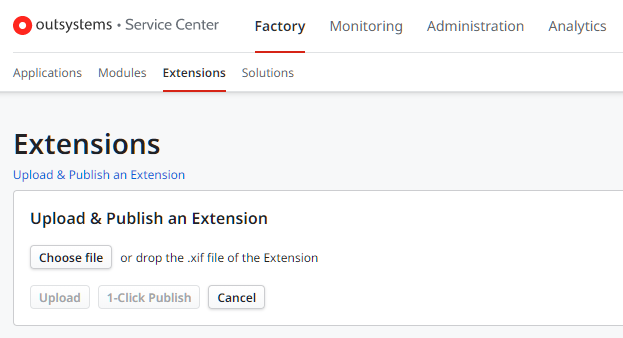

# 1-Click Publish the Extension

The 1-Click Publish executes, in a single step, all the operations necessary to publish an extension in an OutSystems environment.

## 1-Click Publish operations

The 1-Click Publish involves the following operations:

Verify
:   Checks whether the extension is valid. For more information, see [Verify the Extension](<extension-verify.md>).

Update Source Code
:   Synchronizes the source code you added in the .NET IDE with the definition of the extension elements. See [Update the Extension Source Code](<extension-update-source-code.md>).

Compile
:   Generates the main DLL (Dynamic Link Library) of the extension. See [Compile the Extension](<extension-compile.md>).

Save
:   Saves the extension and packs all the resources in an XIF (Extension and Integration Framework) file.

Upload
:   Uploads the extension to the Platform Server you are connected to.

Publish
:   Publishes the extension in the Platform Server you are connected to. This operation makes the extension available in this Platform Server.

## Perform the 1-Click Publish

To execute the 1-Click Publish do the following:

1. Click **1-Click Publish** in the toolbar, or select **File** > **1-Click Publish**.

    This operation requires that you connect to the server where you wish to deploy the extension. If you're not yet connected, Integration Studio automatically prompts you to select a server, after which it establishes the connection. See how to [Select Server window](<../../../ref/integration-studio/menu/file/server-select-window.md>).

1. Check the [1-Click Publish Window](<../../../ref/integration-studio/menu/file/extension-1-cp-window.md>) to see how the process is going.

## 1-Click Publish access rights

To publish a new extension you must have the "Change & Deploy Applications" permission.

If you don't have LifeTime installed in your infrastructure, User Management is done in Service Center. In this case, to publish a new extension you must have the "Allow Extensions" permission. Additionally, if your extension exports entities, you must also have the "Allow Foreign Entities" permission.

## 1-Click Publish in Service Center

It's also possible to use Service Center to publish your extension in an OutSystems environment.

To execute the 1-Click Publish in Service Center, do the following:

1. Make sure you have your extension saved locally in a XIF file. To save an extension file in Integration Studio, select **File** > **Save**.

1. Open the Service Center management console of the environment where you want to publish your extension and navigate to **Factory** > **Extensions**.

1. Click **Upload & Publish an Extension**, under the "Extensions" heading.

    

1. Choose your XIF file (or drag the XIF file and drop it in this upload area) and click **1-Click Publish**.
