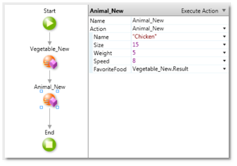

# Import Web Services from a .NET Assembly

To provide support for a wider range of Web Services, Integration Studio allows you to import the definition of Web Service clients, known as Web References in OutSystems terminology: the Web Reference is encapsulated within an extension which can then be used in Service Studio.

Learn more on how to [Consume a SOAP Web Service](<../../soap/consume/consume-web-service.md>) in Service Studio.

 This feature is only available for the .NET stack.

## Creating a .NET Assembly Proxy Using Visual Studio

The first step is to get the WSDL address. Once you obtain it you can create a new Visual Studio Project: choose a new Visual C# Class Library project, and set it with the .NET framework 3.5 or higher.

On the Solution Explorer, right-click on the new project and select 'Add Service Reference...'. On the 'Add Service Reference' window, click on the 'Advanced...' button and then click the 'Add Web Reference...' button. Then, type the WSDL address of the Web Service on the URL field.

After Visual Studio detects the methods exposed by the Web Service, press the 'Add Reference' button. Then simply build the project by pressing `F6` or by right-clicking on the project and choosing 'Build'.

## Creating a .NET Assembly Proxy Using the Command Line

Since Visual Studio only lets you generate a proxy at a time, in scenarios where you need to import multiple services which use the same structures (**shared data types**), you will end up with multiple representations of the same structure, e.g., Employee1, Employee2, Employee3...

It is possible to overcome this issue using the [Disco.exe](<https://msdn.microsoft.com/en-us/library/cy2a3ybs(v=vs.90)>) and [Wsdl.exe](<https://msdn.microsoft.com/en-us/library/7h3ystb6(v=vs.90)>) tools available in the .NET Framework SDK:

1. Launch a "Visual Studio Command Prompt" from the "Visual Studio Tools" folder;

1. Run `disco.exe <first_wsdl_path>` to generate the file `results.discomap`. Rename the file to `wsdl1.discomap`. If the two Web Services have the same end point you will need to save the generated files into separated folder, otherwise the next step will erase the generated files for the first Web Service;

1. Run `disco.exe <second_wsdl_path>`. Again rename the generated file to `wsdl2.discomap`;

1. Run `wsdl.exe /shareTypes /out:proxy.cs wsdl1.discomap wsdl2.discomap` to generate the C# proxy;

1. Run `csc.exe /target:library proxy.cs` to compile the proxy into a DLL. Make sure you are using the C# compiler from .NET Framework 3.5 (or higher).

## Importing the .NET Assembly

In Integration Studio, click File > Import and then choose "Import Actions from .NET Assembly... (.NET Only)" to import the DLL you just created. Learn more on how to [Import Actions from .NET Assembly](<net-assembly-import-action.md>).

Integration Studio introspects the DLL and asks you to select the Web Service methods to import.

Finally, select which methods to import. After the wizard is finished, Integration Studio generates Service Studio actions and structures. Now you can develop any custom logic as in any other extension.

## Using the Web Services

After importing, notice that several constructors (`<Structure_Name>_New`) have been automatically created. Use these constructors to instantiate the structures when invoking the Web Services.

As any other extension, simply publish it to the server using the "1-Click Publish" button. When the operation is finished, the extension encapsulating the Web Service can then be used on any module through references.

Once the Web Reference definition changes, you need to create a new extension to encapsulate the new Web Reference, and set all the modules to reference this new extension.

## Supported Web Service Constructs

Due to the OutSystems language expressiveness, there are certain constructs that are not directly supported in Service Studio, but are supported by importing the .NET assembly of a Web Service client definition:

* Web Services using inheritance in their data types
* Web Services with recursive data types
* Web Services with multi-dimensional Arrays

## Generated Structures

As an example, consider the classes below.

When introspecting the .NET assembly, Integration Studio creates a single structure with the same name as the base class. The 'Type' attribute specifies which class the structure represents once instantiated.

Notice also that the fields from all classes in the inheritance chain, are present in the 'Life' structure as attributes, and their description states the class they belong to. Despite having the same structure to represent the whole inheritance, you should use the constructors provided to easily instantiate the desired class.

## Using Recursive Data Types

When using recursive data types, Integration Studio serializes the elements which cause the recursion.

In the example above, the Animal class is recursive because it extends the Life class but at the same time contains a FavoriteFood field of Life data type itself. In this case, the FavoriteFood field is serialized to break this recursive definition, therefore the imported Animal class has the FavoriteFood data type changed from Life to SerializedLife.

To assist you in the creation of the structures, Integration Studio provides a constructor action for each structure. The constructors receive as parameters all the fields of the class and internally convert the ones which cause recursion to their correct data type. For this reason, you should use the constructors to build the structures from the **bottom-up** and avoid dealing with serialization in the construction process.

As an example, if you need to instantiate a chicken object, you should:

1. Instantiate the corn (chicken favorite food) structure by using the `Vegetable_New` constructor action. It receives the Name, Size, Weight and HasFruit parameters.
1. Instantiate the chicken structure, by using its constructor (`Animal_New`). It receives the Name, Size, Weight, Speed and FavoriteFood parameters.
1. Pass the result of the `Vegetable_New` as the FavoriteFood argument for the `Animal_New` action.

After creating the chicken object, if you need to access its FavoriteFood, since it has SerializedLife data type, you need to use the `Deserialize` action provided. Simply call `Life_Deserialize` and pass as parameter the chicken attribute FavoriteFood, and this action converts it from SerializedLife to Life, so that you can read its values.

In the same way, if you need to directly assign the FavoriteFood to change its attributes, you need to:

1. Use the `Life_Deserialize` action to convert the FavoriteFood from SerializedLife to Life data type.
1. Change the FavoriteFood as needed.
1. Serialize the FavoriteFood by using the `Life_Serialize` action. This converts FavoriteFood from Life back to Serialized Life.
1. Assign the serialized version to the FavoriteFood attribute of the chicken.
