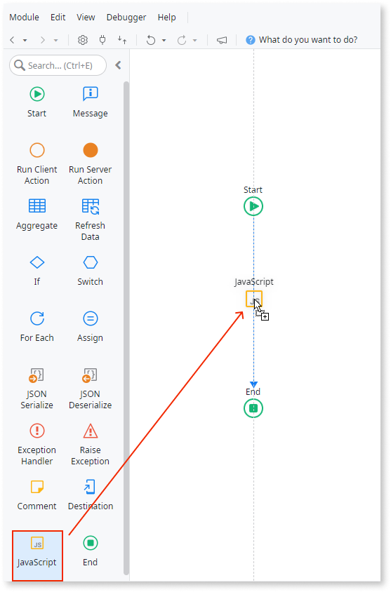
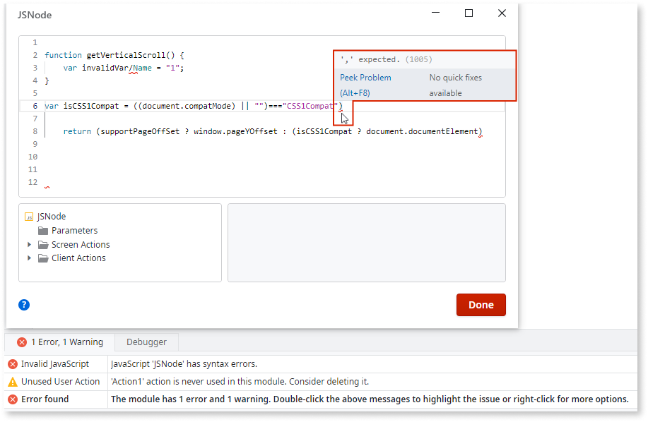
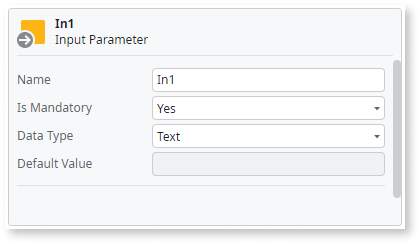

# Extend Your Mobile and Reactive Apps Using JavaScript

JavaScript code can be used in client actions of Reactive and Mobile apps through the **JavaScript element**, which you can drag from the Toolbox to the action flow.



The JavaScript element allows extending the OutSystems capabilities by using JavaScript code. In the code editor you can type regular JavaScript code, such as:

* Declare variables and assign values to them 
* Invoke user-defined or built-in functions 
* Call client actions, either synchronously or asynchronously, etc. 

The code editor window, opened by double-clicking the element or the element's "JavaScript" property, has auto-complete support for JavaScript keywords and predefined JavaScript objects, as well as for OutSystems available client actions and roles. It also has syntax highlighting and checks the JavaScript code for errors and warnings. The TrueChange pane displays eventual JavaScript syntax errors:



## Use input and output parameters

Each JavaScript element defines its own scope. This means you must define input and output parameters to exchange data with other elements in your client action.

To add and configure input or output parameters of a JavaScript element, right-click in the "Parameters" tree element of the pane below the code editor:

 

Input and output parameters are accessed in JavaScript code through the predefined object "$parameters". The example below shows how to get the value of an input parameter called "Name" and how to set the value of an output parameter called "OutEmail", both defined in the current JavaScript element:

```javascript
var nameValue = $parameters.Name;
$parameters.OutEmail = "john@example.com";
```

<div class="info" markdown="1">

Output parameters can **not** be added dynamically just by setting their value in the "$parameters" object; they must be defined in the JavaScript element code editor window. Otherwise, the TrueChange pane will show an error that will prevent you from publishing your module.

</div>

## Call a Client Action

Client actions are available through the "$actions" predefined object. This object contains references to:

* Global client actions defined in the current module or referenced from other modules 
* Other client actions belonging to the same screen/block, if the JavaScript element is placed in a screen/block client action flow

The return value is a simple JavaScript object containing each client action output parameters.

To call a (synchronous) client action that has an output parameter named "Out1", follow the example below:

```javascript
var result = $actions.GlobalClientAction();
var outValue = result.Out1;
```

<div class="info" markdown="1">

Instead of typing "$actions.&lt;client_action_name&gt;()" in the code editor, you can drag-and-drop the client action either from the element tree below the code editor or from the "Logic" application layer tab to the code editor.

</div>

## Call an OutSystems JavaScript API function

OutSystems JavaScript APIs are available through the predefined object "$public". This object contains references to each supported JavaScript API.

The example below shows a feedback message to users stating that their data have been successfully submitted:

```javascript
$public.FeedbackMessage.showFeedbackMessage("Your data has been submitted.", 1);
```

For more information about the available OutSystems APIs check the [OutSystems JavaScript API Reference](<../../../ref/apis/javascript/README.md>).

### Available objects in each JavaScript element

Besides any local variables and input/output parameters you might define, a
few predefined objects are already defined in the context where your
JavaScript code will be executed. The name of these objects starts with a "$"
sign:

* **$parameters** – Contains the input and output parameters defined for the current JavaScript element. 
* **$actions** – Contains references to client actions callable from the current JavaScript element scope (client actions either defined in the current module or referenced from another module, like system actions). 
* **$roles** – Contains all the custom-defined roles for the current module. 
* **$public** – Contains objects instantiating all public JavaScript API classes and modules. Check the [JavaScript API Reference](<../../../ref/apis/javascript/README.md>) to find all the available modules and functions. 

Other objects commonly available in JavaScript in a browser context can also be used, such as "window", "document", "JSON" and "RegExp" objects.
