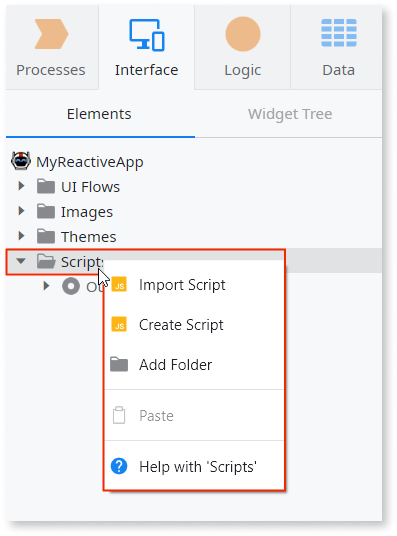
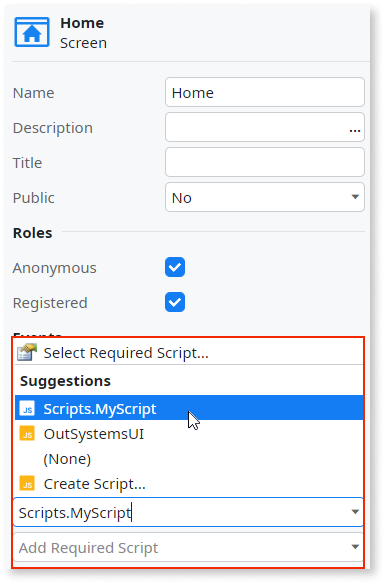

# Use JavaScript Code from an External Library

<div class="info" markdown="1">

OutSystems doesn't recommend using JavaScript libraries that directly manipulate the DOM, such as jQuery. Such libraries can break Reactive and Mobile apps and make them difficult to maintain.

</div>

Before using JavaScript code from an external library or contained in a `.js` file, do the following:

1. Import or create a script under the **Scripts** tree folder. This script may reside in the module (that is, it was created using the context menu options "Create Script" or "Import Script", when right-clicking the "Scripts" folder), or can be a reference to a script defined in another module.

    

1. Declare the external JavaScript code in the **Required Scripts** properties section of the screen/block where it will be used:

    

The script added as a required script is evaluated in the global scope. Thus, you can use functions and objects initialized in this script in any JavaScript element of the screen/block.

For example, to use a function named `getMonthlyPayment()` defined in an external JavaScript code containing functions related to mortgage calculations, call it in your JavaScript code as follows:

```javascript
var initialAmount = 400000;   // initial amount borrowed
var intRate = 3.5 / 100 / 12; // monthly interest rate
var numMonths = 30 * 12;      // number of payments months

// calculate mortgage monthly payment
var monthlyPayment = getMonthlyPayment(initialAmount, numMonths, intRate);
```

## Demo

This demo shows how you can easily add a reference to an external javascript and then use it in your app.

<iframe width="560" height="315" src="https://www.youtube.com/embed/xmvxkkkDL5E" frameborder="0" allow="accelerometer; autoplay; clipboard-write; encrypted-media; gyroscope; picture-in-picture" allowfullscreen="allowfullscreen"></iframe>
