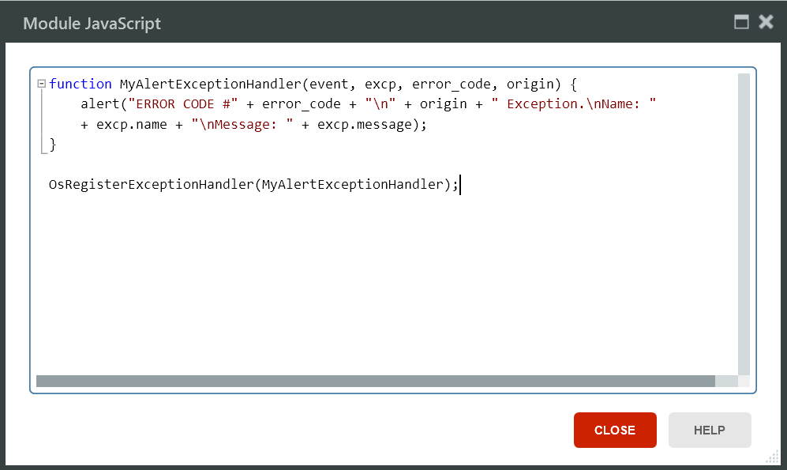

# Handle JavaScript Errors

Applies only to Traditional Web Apps.

You can handle the JavaScript errors occurring in the following specific situations:

* During the Ajax refresh of an unescaped Expression with '&lt;script&gt;' tags
* During the execution of the **RunJavaScript** action of the **HTTPRequestHandler** extension

To handle these types of errors you need to define a JavaScript function that will handle the errors and register it as an error handler function.

## How to Define a JavaScript Function to Handle the Error

By default, OutSystems provides you with a basic error handler function called **OsAlertExceptionHandler** , which displays an alert box with information about the error.

You can use the **OsAlertExceptionHandler** function to handle the JavaScript errors or you can [define your own function](<intro.md>) with the following signature:

`function <ErrorHandlerFunctionName>( event, exception [, errorCode] [, origin] )`

The arguments are:

* **event:** jQuery event.
* **exception:** JavaScript exception instance that raised the error. For more details about the error use the `exception.name` and `exception.message` properties. 
* **errorCode:** Integer that identifies the type of the error (optional argument). 
* **origin:** JavaScript function where the error was trapped (optional argument).

The following error codes are predefined and you can use them in the logic of your function:

* **outsystems.osErrorCodes.UserJavascriptError:** Occurs during the execution of the **RunJavaScript** action of the **HTTPRequestHandler** extension in an Action Flow or during an Ajax refresh of an unescaped expression with '&lt;script&gt;' tags. 
* **outsystems.osErrorCodes.ConnectionError:** This is a connection error and can occur at the beginning or during an Ajax request to the server. 
* **outsystems.osErrorCodes.SystemJavascriptError:** Occurs when an unexpected exception is raised while executing an OutSystems' Ajax JavaScript. 

## How to Register the Error Handler Function

To set your JavaScript function for error handling you must register it. For that, add the following JavaScript code to your Module:

`OsRegisterExceptionHandler(<ErrorHandlerFunctionName>)`

If you want to use **OutSystems OsAlertExceptionHandler** function, you must register it.

The example below shows the definition, in the scope of the Module, of a function to handle the JavaScript errors and its registration as an error handler function:

You may register multiple functions to handle errors. All the registered error handler functions are executed when a JavaScript error occurs.
