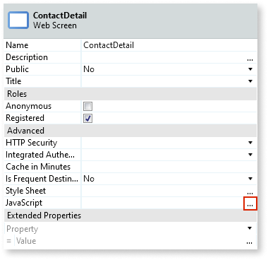
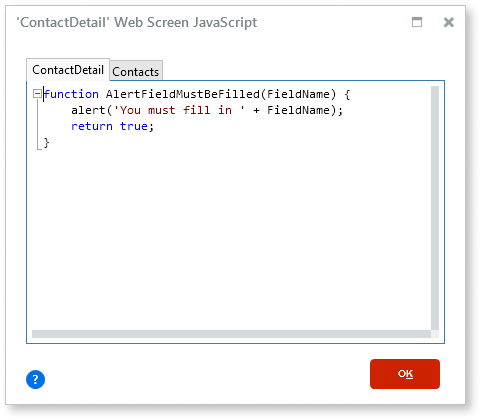
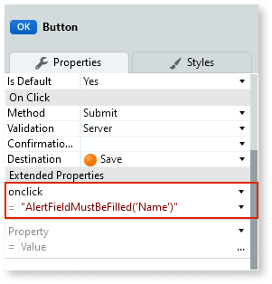
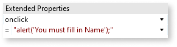
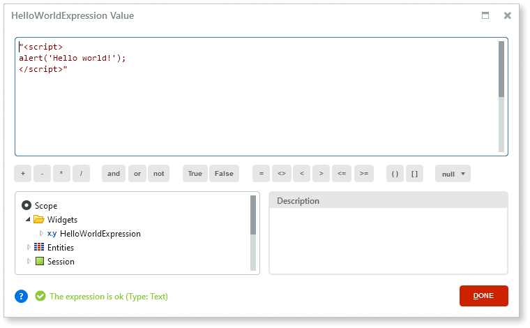
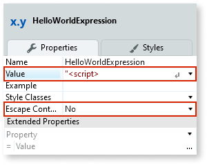
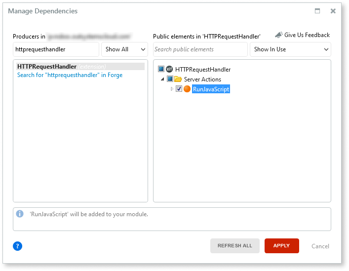
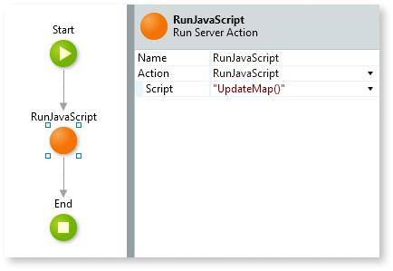
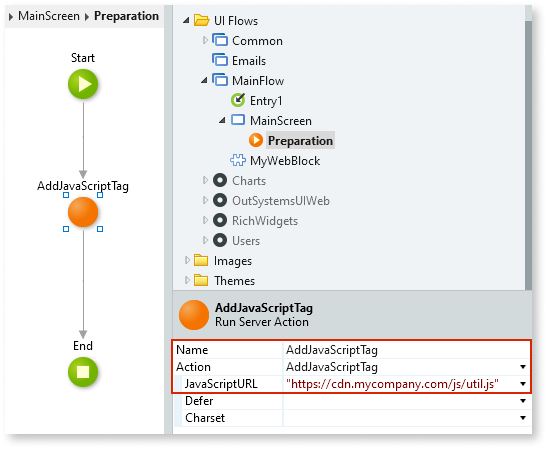

# Extend Your Traditional Web App Using JavaScript

Applies only to Traditional Web Apps.

You can add JavaScript code to Traditional Web Apps to make them more dynamic, adding custom behavior to pages executed on the user's browser while minimizing the number of calls to the server. You can use JavaScript code defined in your OutSystems app or in an external location.

Tools like [Ajax Refresh](<../../../ref/lang/auto/Class.Ajax Refresh.final.md>) already allow you to refresh parts of your screen in an action flow without forcing a page reload. However, you may want to define some custom behavior using JavaScript in your app, or use an existing JavaScript library to improve the user experience.

To run JavaScript code in your Traditional Web App do the following:

1. [**Add a JavaScript code block to one of the supported elements**](#add-js-code-block).  
    The following elements support JavaScript code blocks:

    * Module
    * Web Screen
    * Web Block

    Define large JavaScript code blocks in one of these elements. You can later invoke the code that you defined in this step. This way you can avoid having JavaScript code blocks in several places across your Web Screens and Web Blocks, and have a central place for JavaScript code in a given scope.

    When you deploy your app, OutSystems creates separate `.js` files for the JavaScript code defined at three levels: Module, Web Screen, and Web Block level.

    Each rendered HTML page (corresponding to a Screen in your Traditional Web App) includes these JavaScript files by adding `` tags.

    

1. Set the **Escape Content** property to **No**.

### Run JavaScript code using the RunJavaScript action

In your action flows, either in a Screen Action or a Server Action, you can use the [RunJavaScript](../../../ref/apis/auto/httprequesthandler-api.final.md#RunJavaScript) action of the HTTPRequestHandler extension to get your JavaScript code to run in the context of the browser.

1. In Service Studio, add the **RunJavaScript** Server Action of the HTTPRequestHandler API as a dependency of your module. For more information, check [Reuse functionality from other modules](../../../develop/reuse-and-refactor/expose-and-reuse.md#reuse).

    

1. In the flow of a Screen Action or Server Action, add a **Run Server Action** element and select the **RunJavaScript** Server Action.

1. Enter the JavaScript code you wish to run in the **Script** property of the **RunJavaScript** Server Action.

    

**Note:** If you're using the RunJavaScript action in a Screen Action that handles a click in a Button or in a Link, you must set the **Method** property of the Button/Link to **Ajax Submit**.

You must do this so that the current page doesn't get refreshed when clicking the Button/Link. This way, the JavaScript code defined in the RunJavaScript action runs in the context of the currently loaded page.

## Add and run a JavaScript file hosted elsewhere { #external-js }

Besides defining JavaScript code in one of the supported elements (Module, Web Screen, or Web Block) you can also reference an existing JavaScript file hosted elsewhere in a Screen of your Traditional Web App.

Do the following:

1. Get the full URL of the JavaScript file you wish to include in a Screen of your app. For example, `https://cdn.mycompany.com/js/util.js`.

1. In Service Studio, add the [AddJavaScriptTag](../../../ref/apis/auto/httprequesthandler-api.final.md#AddJavaScriptTag) Server Action of the HTTPRequestHandler API as a dependency of your module. For more information, check [Reuse functionality from other modules](../../../develop/reuse-and-refactor/expose-and-reuse.md#reuse).

1. In the **Preparation** of the Screen where you want to include the JavaScript code, add a call to the **AddJavaScriptTag** Server Action. Set the **JavaScriptURL** argument to the URL you previously identified.

    
