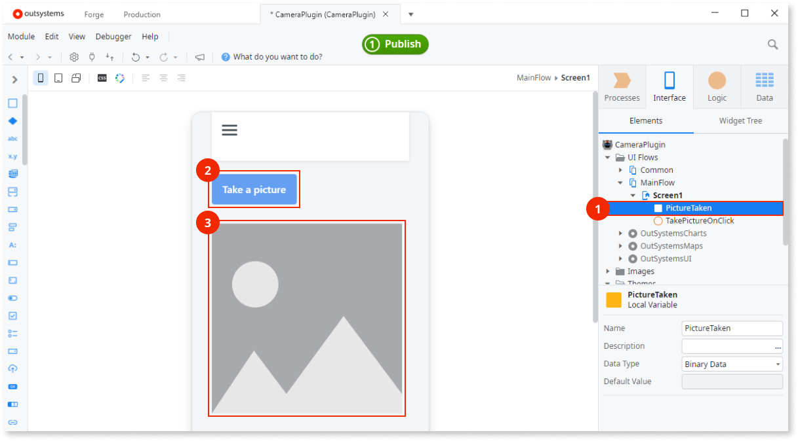
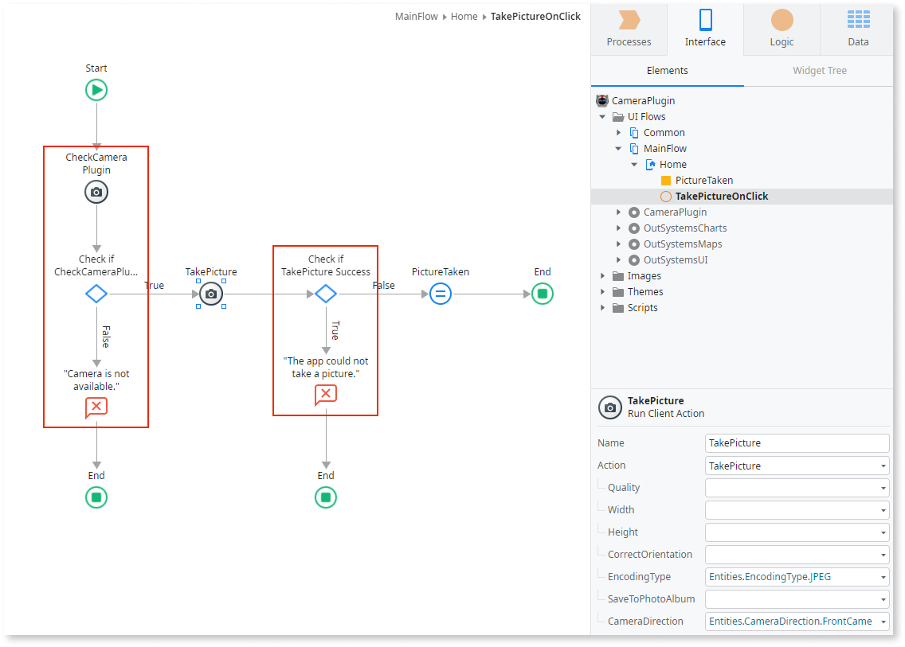

# Camera plugin

Applies only to Mobile Apps.

Use the Camera plugin to let users take pictures and capture video with their mobile devices.
This plugin works with both native mobile apps and progressive web apps (PWAs).
The plugin lets you select options like image quality, orientation, and file format.

See [Adding plugins](../intro.md#adding-plugins) to learn how to install and reference a plugin in your OutSystems apps, and how to install a demo app.

## Demo app

Install the [Camera Demo App](https://www.outsystems.com/forge/component-overview/1390/camera-plugin) from Forge and open the app in Service Studio.
The demo app contains logic for common use cases, which you can examine and recreate in your apps.
For example, the demo app (the next image shows a screen from the demo app) shows how to:

* Take a picture
* Capture a video
* Select media from the gallery
* Edit a picture taken with the camera or selected from the gallery
* Edit the picture that now displays in the app

## Taking a picture

To let users take a picture and have a good user experience:

* Create a user interface
* Create logic to take a picture
* Create logic to handle errors

See the sections that follow for more information.

### Creating a user interface

You can start by defining a variable of the **Binary Data** data type to hold the image data (1).
Use a Button (2) or another widget to run the action that takes a picture.
Use an **Image** widget (3) to show the image after using the camera, by setting **Type** to **Binary Data** and **Image Content** to the variable you created.

For more guidance on how to create an interface, see the UI accelerators that come with the Camera plugin.
In Service Studio, navigate to **Interface** > **UI FLows** > **Camera Plugin** > **Camera Plugin**, and drag these Blocks to your Screen:

* **ChooseImage**
* **TakePicture**

### Creating logic to take a picture

The Camera plugin actions are in the **Logic** tab of Service Studio, in **Client Actions** > **CameraPlugin**.

To prevent errors, it's a best practice to first check if the plugin is available (1) with the action **CheckCameraPlugin**.
If the plugin isn't available to the app, display an error to the user.
Otherwise, open the camera with **TakePicture** to let users take a picture (2).
In the **TakePicture** action, you can set the parameters for quality, width, back or front camera, and more.

Check if taking pictures on the device works by verifying the value of **TakePicture.Success** is **True** (3).
If yes, handle the picture data in **TakePicture.ImageCaptured** by assigning it to a variable of the **Binary Data** data type (4).

## Recording a video

To let users record a video and have a good user experience:

* Create a user interface
* Create logic to record a video
* Create logic to handle errors

See the sections that follow for more information.

### Creating a user interface

You can start by defining a variable of the **MediaResult** data type to hold the video data (1).
Use a Button (2) or another widget to run the action that captures a video.
Use the **PlayVideo** widget (3) to show the video after using the camera, by setting it to the variable you created.

**PlayVideo** is a widget available to play video on a device.
The video can either have just been recorded or locally stored in the device's gallery.
If you want to display videos from other sources you must use the [**Video**](https://success.outsystems.com/documentation/11/developing_an_application/design_ui/patterns/using_traditional_web_patterns/controls/video/) widget.

Beware that video files stored in the cache are deleted when the app closes.
When setting the URI parameter to a video file stored in the cache, beware that the video you're trying to play may have been already deleted.

For more guidance on creating an interface, see the UI accelerators that come with the Camera plugin.
In Service Studio, navigate to **Interface > UI FLows > Camera Plugin > Camera Plugin**, and drag these Blocks to your Screen:

* **ChooseFromGallery**
* **CaptureVideo**

### Creating logic to record a video

The Camera plugin actions are in the **Logic** tab of Service Studio, in **Client Actions > CameraPlugin**.

To prevent errors, it's a best practice to first check if the plugin is available (1) with the action **CheckCameraPlugin**.
If the plugin isn't available to the app, display an error to the user.
Otherwise, open the camera with **RecordVideo** to let users capture a video (2).
In the **RecordVideo** action, you can set the parameters for saving the recorded media to the device’s gallery.

Check if recording videos on the device works by verifying the value of **RecordVideo.Success** is **True** (3).
If yes, handle the picture data in **RecordVideo.MediaResult** by assigning it to a variable of the **MediaResult** data type (4).

## Selecting media from the gallery

Let users choose a media file from the device gallery, either a picture, a video, or both, with the **ChooseFromGallery** action.
The action is in the **Logic** tab of Service Studio, in **Client Actions > CameraPlugin**.

The action **ChooseFromGallery** opens a media browser to let users select a media file (1).
[Check for errors](#handling-errors) by verifying **ChooseFromGallery.Success** is **True** (2).
After users select the image, the binary data of the image is in the variable **ChooseFromGallery.MediaResult.** (3).

## Image quality and app responsiveness

When you set **100%** image **Quality** or use the **PNG** format, your app handles a large amount of image data.
Users might notice a delay after taking an image with the highest quality settings.
The more data the app has to handle, the less responsive it can become on low-end devices.

When setting the image quality, consider the use case for your app.
Check the following table.

|Example use case|Image quality|Notes|
|-|-|-|
|Profile image|JPEG 60% (default)|Sufficient quality for a profile image.|
|Insurance claims|JPEG 85-100% or PNG|Higher quality lets users examine all details in the image.|

Changing the image quality setting applies only to .JPEG files.

## Handling errors

The app with the camera plugin can run on many Android or iOS devices, with different hardware and configurations.
To ensure a good user experience and prevent the app from crashing, handle the errors within the app.

Here is the list of actions you can use to handle the errors.

|Variable|Action|Description|
|-|-|-|
|**IsAvailable** **CheckCameraPlugin**| True if the camera plugin is available in the app.|
|**Success**|**TakePicture**|True if there aren't errors while taking a picture.|
|**Success**|**ChooseGalleryPicture**|True if there aren't errors while opening a picture from the gallery.|
|**Success**|**EditPicture**| True if there aren't errors while editing a picture.|
|**Success**|**RecordVideo**|True if there aren't errors while recording a video.|
|**Success**|**ChooseFromGallery**|True if there aren't errors while opening a media file from the gallery.|
|**Success**|**PlayVideo**|True if there aren't errors while playing a video.|

You can use these actions with the **If** nodes to check for errors and control how the app works.

## Reference

More information about the plugin.

### Actions

Here is the reference of the actions you can use from the plugin.
The Camera plugin uses a Cordova plugin, for more information check [cordova-plugin-camera](https://github.com/OutSystems/cordova-plugin-camera).

|Action|Description|Available in PWA|
|-|-|-|
|**CheckCameraPlugin**|Checks if the plugin is available in the app.|Yes*|
|**TakePicture**|Opens the camera on the user device.|Yes*|
|**RecordVideo*****|Opens the camera on the user device.|No|
|**ChooseFromGallery**|Opens the gallery on the user device.|No**|
|**EditPicture**|Opens an edit interface to edit the picture.|No**|
|**PlayVideo**|Opens a native video player to play local files.|No|
|**ChooseGalleryPicture**|Opens the gallery on the user device.|Yes|

(*) Camera plugin works in progressive web apps (PWAs) from version 6.0.0 and later, in **mobile devices only**.
See [OutSystems system requirements](https://success.outsystems.com/Documentation/11/Setting_Up_OutSystems/OutSystems_system_requirements) for more information about the supported devices and browser versions.

(**) Under development.

(***) When SaveToGallery is set to True, the value of the returned URI points to the gallery file on Android. On iOS, it points to a temporary file, stored in the cache.

## Picture options

Change the properties of the **TakePicture** action to adjust how the app handles the images.

|Property|Description|
|-|-|
|**Quality**|The quality of the picture, in percentage.
See also the [notes about Quality](#image-quality-and-app-responsiveness).|
|**Width**|The width of the picture, in pixels.|
|**Height**|The height of the picture, in pixels.|
|**CorrectOrientation**|If **True**, the plugin fixes the orientation if users take a photo and rotate the device.|
|**EncodingType**|Select the **JPEG** or **PNG** format.|
|**SaveToPhotoAlbum**|If **True**, the app saves the image to the device.|
|**CameraDirection**|Select the front or back camera as the default when taking a new picture.|
|**AllowEdit**|If **True**, an Edit step is added after the take or choose picture step.|

The properties of the **TakePicture** action apply to native mobile apps only.
In PWAs, the app takes pictures with the default camera settings that depend on the device's browser.

## Video options

Change the properties of the **RecordVideo** action to adjust how the app handles the images.

|Property|Description|
|-|-|
|**SaveToGallery**|If **True**, the app saves the video to the device.|
|**AllowEdit**|If **True**, an Edit step is added after the take or choose picture step.|

The properties of the **RecordVideo** action apply to native mobile apps only.
In PWAs, the app takes video with the default camera settings that depend on the device's browser.

### MABS compatibility

The table shows the compatibility of the Camera plugin with the Mobile Apps Builds Service (MABS).

|Plugin version|Compatible with MABS version|Notes|
|-|-|-|
|7.2.0 and later|MABS 8.1 and later.||
|7.1.0 and later|MABS 7.0 and later.||
|5.1.0 and later|All MABS versions.||
|5.0.0 and later|MABS 5.0 and later.|For Android P with Support Library 28.|
|5.0.0 and earlier|MABS 5.0 and earlier.|For older MABS versions only.|

## Known issues and workarounds

A list of known issues and possible workarounds.

### Taking multiple pictures not working in PWAs

In PWA, taking multiple pictures requires the use of browser stream capabilities.
To ensure the app has access to the stream, add the theme **CameraPlugin** as an element to your app.
**Keep the theme as a dependency even when the IDE reports it as not used by the app**.

### In PWA, taking multiple pictures isn't working in some devices

In some devices, the workaround mentioned above shows a defective UI.
There is, currently, no workaround to this issue.

### Crashes on iOS 13.2 and 13.3

**Applies to PWAs.**

In iOS 13.2 and 13.3 the camera may stop working because of the [WebKit 206219 bug](https://bugs.webkit.org/show_bug.cgi?id=206219).
If the camera stops working, swipe the open app up in App Switcher and reopen the app.
WebKit is working on the fix.

### Pictures appear rotated

**Applies to PWAs.**

In some Chrome versions, the picture displays rotated in the **Image** widget.
There is no workaround.

### CameraDirection setting has no effect

**Applies to Android only.**

In some versions of Android, the app ignores the **CameraDirection** setting.
Users can change the camera direction (back or front) once the camera app opens.

### The resolution and quality settings apply to app images only

When you change the resolution or quality setting, the plugin applies it only to the image the app uses.
The device ignores the settings when saving the images in the device gallery.
This means that the size of the image in the gallery depends on the device's hardware.

### Choose from gallery wont allow for items to be selected

**Applies to Android only.**

In Android 13, when using "ChooseFromGallery", users are unable to select content from device's gallery.
When targeting Android 13, users should build their apps using MABS9 or later.