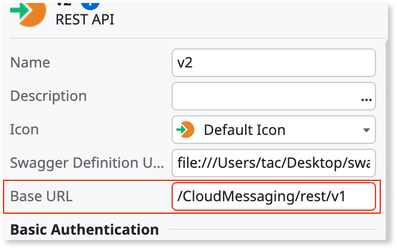
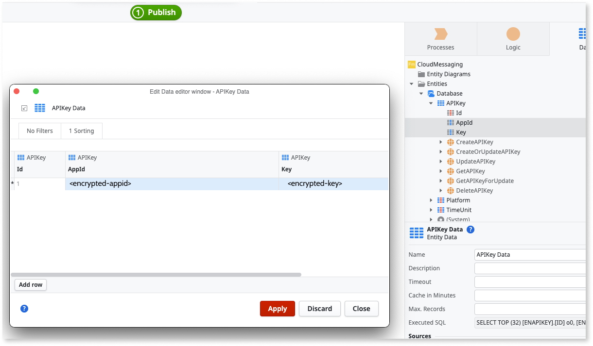
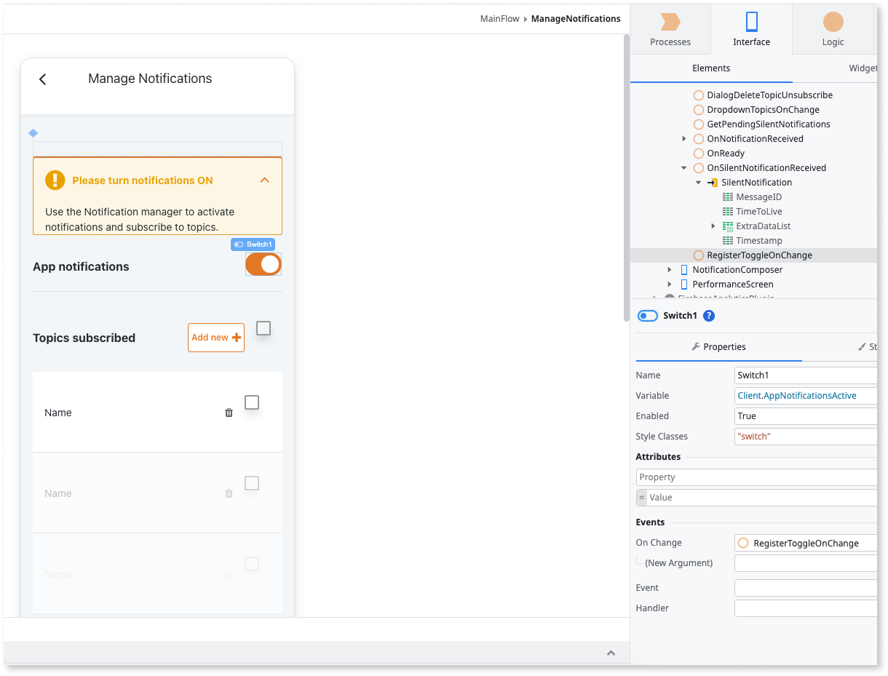
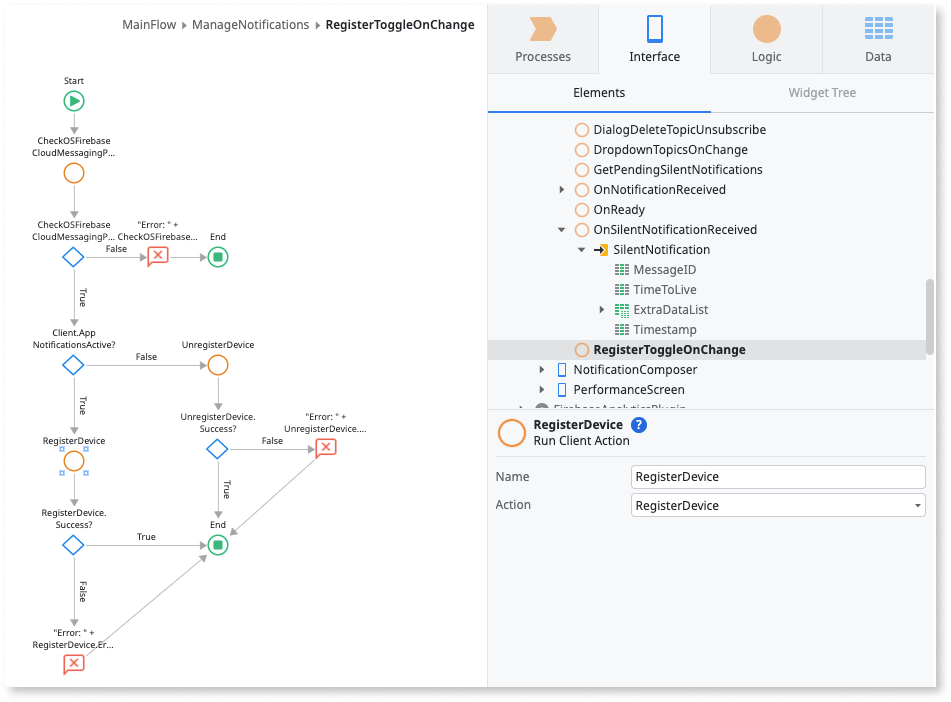
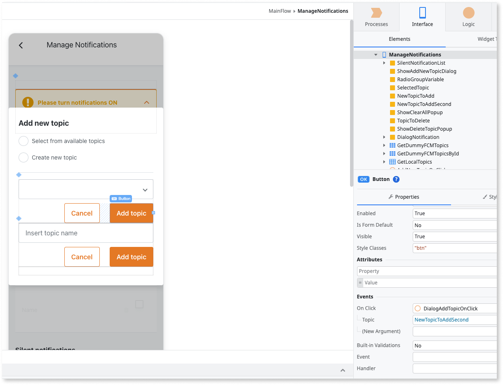
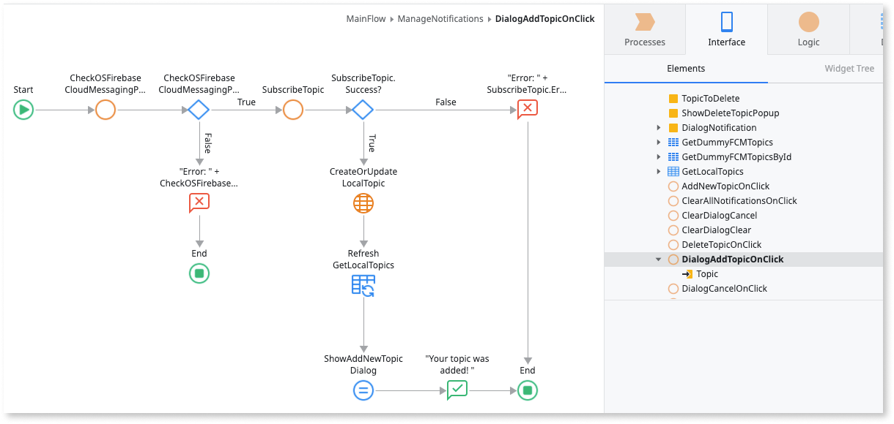
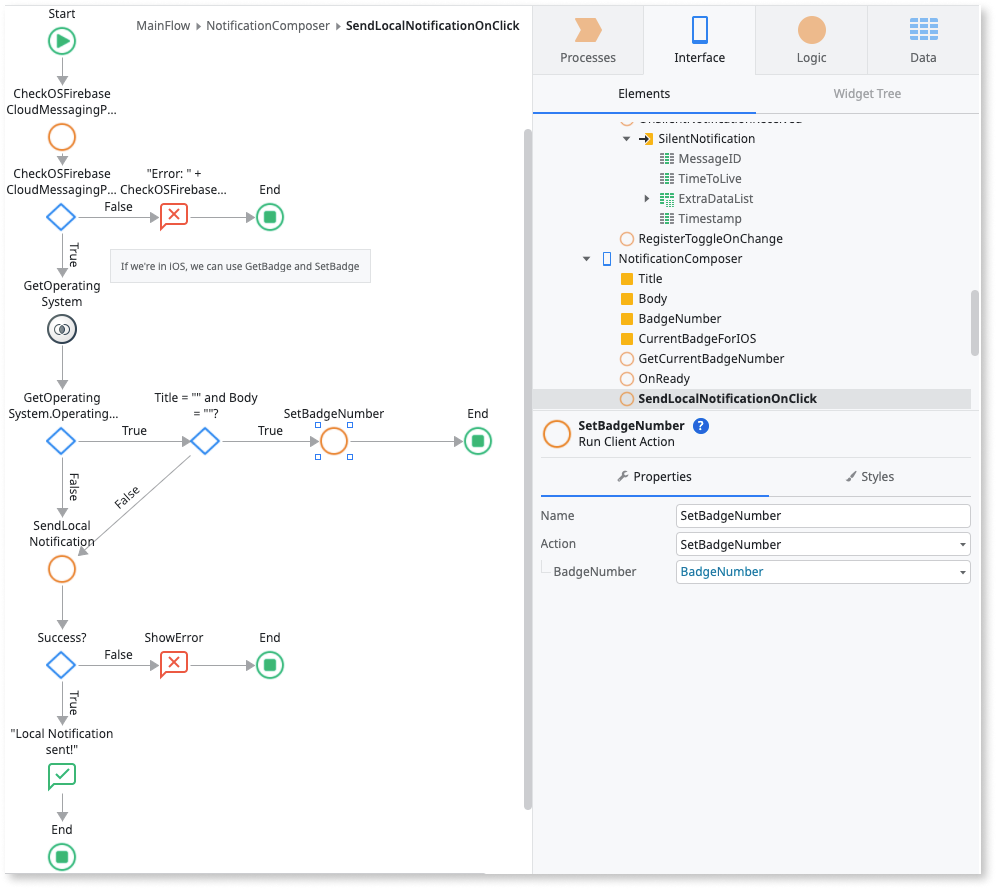
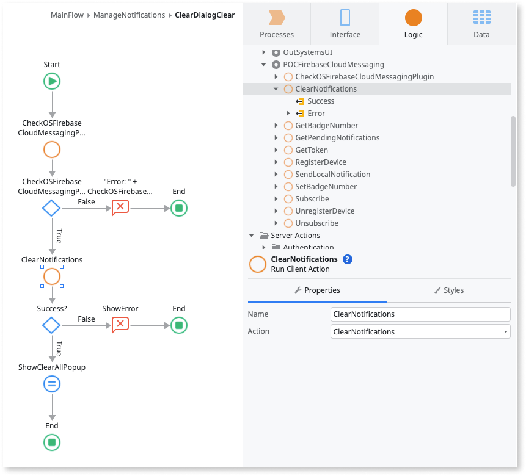

# Firebase Cloud Messaging Plugin

The [Firebase Cloud Messaging plugin](https://www.outsystems.com/forge/component-overview/13299) lets you set a notification experience that resorts to Firebase cross-platform messaging solution. Using this plugin you can to send normal and silent notifications to your mobile app end-users.

While normal notifications have an associated UI with visual and auditory cues and are displayed in the notifications center or in the scope of your app, silent notifications are notifications that have no UI representation. Despite being silent, these notifications can deliver a data package to the app (called extra data), in the form of a list of key-value pairs.

To implement and manage the notification experience of our OutSystems apps, you use the [Cloud Messaging Configurator](https://www.outsystems.com/forge/component-overview/13300) app to consume REST API methods that allow you to set up a notification back-end service. After this use the Firebase Cloud Messaging plugin actions to implement basic notifications functionalities on your app.

As a good practice, verify the plugin is available during runtime in your app to prevent the app from crashing. Use the **Logic** > **Client Actions** > **CloudMessagingPlugin** > **CheckCloudMessagingPlugin** action to check for the plugin availability. If the plugin isn't available to the app, display an error to your users.

<div class="info" markdown="1">

To learn how to install and reference a plugin in your OutSystems apps, and how to install a sample app, see [Adding plugins](../intro.md#adding-plugins).

</div>

## Sample app

OutSystems provides a sample app that contains logic for common use cases. Install the Firebase sample app from Forge and then open it in Service Studio.

This sample app shows you how to do the following:

* Register a device for push notifications and retrieve its token from Firebase.

* Manage subscription of Topics.

* Deal with silent notifications and expose its Extra Data.

* Use a message composer to test the push notification experience.

## Compose and Manage push notifications

The following steps show how to create a notification back-end service and how to prepare a mobile app to deal with push notifications:

1. [Set up a notification back-end service using the send Notifications REST API methods](#set-back-end).

1. [Enable basic notification functionalities in your app using the plugin's actions](#enable-notifications).

1. [Manage the experience of in-app notifications using the Notifications block](#notification-ux).

## Set up a notification back-end service { #set-back-end }

To set up a notification back-end service, do the following:

1. Install the [Cloud Messaging Configurator](https://www.outsystems.com/forge/component-overview/13300) forge component in your environment. This component includes the REST API Methods necessary to send notifications to a list of users or topics.

1. Open the Cloud Messaging Configurator module.

1. In the **APIKey** entity, set **AppId** and **Key** using encrypted values. These values are used to authenticate your REST API, so make sure you keep this secret secure.

    

1. Create a new app to serve as your notification back-end. This app can be Reactive Web or Mobile.

1. In the new back-end app, create a module.

1. In the newly created module, consume the **Cloud Messaging Configurator** REST API methods. For more details on how to consume a REST API follow this [documentation](../../rest/consume-rest-apis/consume-a-rest-api.md).

1. After importing the REST API methods you get an invalid URL error. In the consumed REST API properties, change the **Base URL** to include your environment address, setting it as `https://<your-environment>/CloudMessagingConfigurator/rest/v1`. Replace `<your-environment>` with your environment address.

    

1. Then use the AppId and Key you defined in step 3 to authenticate your REST calls. In the consumed REST API properties, add the following **HTTP headers**:

    * `X-Send-AppId` = `<your-appid>`, replacing `<your-appid>` with the **AppId** defined in step 3.

    * `X-Send-Key` = `<your-key>`,, replacing `<your-key>` with the **Key** defined in step 3.

At this point you can start to create the UI for your notification back-end service. For example, associate a **SendNotifcationToUsers** method to a button to send a notification to all users on the associated Firebase project (using an app with the Cloud Messaging plugin).

Other methods available are **SendNotificationToTopics**, **SendSilentNotificationToUsers**, and **SendSilentNotificationToTopics**.

## Enable basic notification functionalities in your app { #enable-notifications }

In this section we present you some of the actions that allow you to leverage basic notifications functionalities on your mobile app.

On first use you might want to request permission to receive notifications to your app user. For that you can use the RegisterDevice action on initialization of your app. On first use, this action will display a native request permission dialog and upon acceptance of the user, the device will be registered on the Firebase Cloud Messaging service and will be ready to receive notifications. On future verifications you can always use the CheckPermission action to verify if the app has permission to receive notifications.

Alternatively you can also provide an explicit way to register and unregister the device from the Firebase cloud Messaging service. For that you can use the RegisterDevice / UnregisterDevice actions and associate them to a UI element such as a toggle.





After registering the device on the Firebase Cloud Messaging service, the active device's token becomes available and can be retrieved using the action GetToken.

To manage topic subscriptions you can use the SubscribeTopic / UnsubscribeTopic actions. The user will need to set the topic name to which the app will subscribe (or unsubscribe). If the topic doesn't exist yet on the Firebase Cloud Messaging project, it creates a new one.





To retrieve all pending silent notifications you can use the GetPendingNotification action. This action will output a silent notifications list with Timestamp, MessageID, TimeToLive, and an ExtraData list of key-value pairs. Silent notifications are notifications that have no UI representation in the form of a visual or auditory stimulus in the app. Despite being silent, these notifications can deliver a data package to the app (called extra data), in the form of a list of key-value pairs.

As part of the notification experience, the developer might want to control the badge number which is a value that appears on the top-right corner of the app icon. The way you control the badge number differs from operative system:

* For iOS you can use the GetBadgeNumber action to retrieve the current badge number and the SetBadgeNumber to specify a given number to be shown on the app icon badge.

* For Android you can only specify a given badge number after receiving a notification. Thus, you can use the SendLocalNotification action and set the badge number through the action parameter BadgeNumber.



Finally, you might want to give the opportunity to your user to clear all app's notifications remaining in the notification center. For this you can associate the ClearNotifications action to a piece of UI such as a button.



## Manage the experience of in-app notifications { #notification-ux }

A Cloud Messaging notification is by default presented in the notification center, however the developer might want to handle the notification content in-app when the app is on foreground. To enable this you can use the **NotificationsHandler** block. This block triggers events that pass the parameters of both notifications and silent notifications to the context of the app.

You need to add this block to each screen that might handle the notification content.

## Optional setup for notification Channel Name and Description - Android only

By default the Cloud Messaging plugin defines values for the notification channel name and description on local notifications. But in some instances the developer might want to define a different default value. You can do this by adding the following properties on the extensibility configurations of your app:

```JSON
{
    "preferences": {
        "android": [
            {
                "name": "NotificationChannelDefaultName",
                "value": "This is my channel Name"
            },
            {
                "name": "NotificationChannelDefaultDescription",
                "value": "This is my channel Description"
            }
        ],
    }
}
```

## Limitations

### On Silent Notifications

For iOS.

With a device in low battery state, the silent notification will not be processed by the app.

For more information see: Apple documentation

### On Subscribe to Topic

For both iOS and Android.

Firebase SDKs for Android and iOS do not support subscribing to topics for which the name contains spaces, like `TV Shows`.

## On Compatibility with Firebase Performance

For both iOS and Android.

Using the Firebase Cloud Messaging in combination with Firebase Performance requires v1.0.4 (or higher) of the latter.
