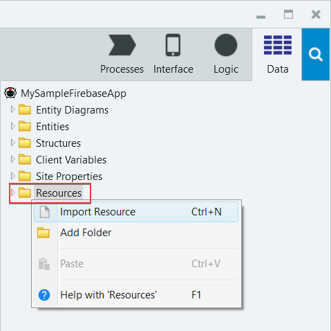
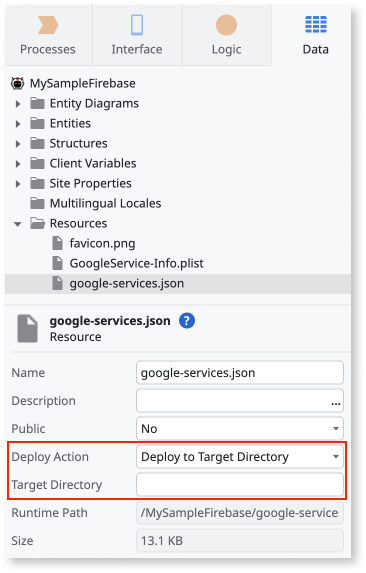
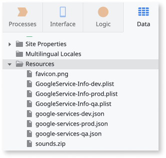
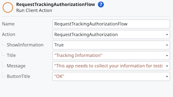

# Firebase plugins

<div class="info" markdown="1">

Applies only to Mobile Apps.

</div>

Firebase is a Google mobile development platform that speeds up the mobile app creation and design processes. You can use the Firebase services in the Mobile app through the following OutSystems Firebase-based plugins:

* [Analytics](https://www.outsystems.com/forge/component-overview/10704/firebase-analytics-plugin)
* [Crash Reporting](https://www.outsystems.com/forge/Component_Overview.aspx?ProjectId=10705)
* [Dynamic Links](https://www.outsystems.com/forge/component-overview/10988/dynamic-links-plugin-firebase)
* [Performance Monitoring](https://www.outsystems.com/forge/Component_Overview.aspx?ProjectId=10706)
* [Firebase Cloud Messaging](https://www.outsystems.com/forge/component-overview/12174/cloud-messaging-plugin-firebase)

<div class="info" markdown="1">

To migrate your app from the unsupported Firebase Mobile plugin, see [Migrating to the supported Firebase-based mobile plugins](https://success.outsystems.com/Support/Enterprise_Customers/Upgrading/Migrating_to_the_supported_Firebase-based_mobile_plugins).

</div>

## Prerequisites

To use the Firebase plugins, you must complete the following prerequisites:

* Set up a Firebase project in the [Google Firebase console](https://console.firebase.google.com/).

* [Add an Android and an iOS app in Firebase](https://support.google.com/firebase/answer/9326094?hl=en) and download the configuration files:

    * **GoogleService-Info.plist** for iOS
    * **google-services.json** for Android

## Demo app

Install [Firebase Mobile Sample App](https://www.outsystems.com/forge/component_overview.aspx?projectid=10707&projectname=firebase-mobile-sample-app) from Forge. Then open the app in the Service Studio. The demo app contains logic for common use cases, which you can examine and recreate in your apps. If you want to build the app and run it, check the prerequisites on the Forge page.

## Adding and using a Firebase plugin

To add a Firebase plugin to your mobile app, complete the following steps:

1. Install the **Firebase** plugin and reference it in your mobile app. For detailed instruction, see [Adding plugins](../intro.md#adding-plugins) for detailed instructions.

1. Add the [Google services configuration files](#adding-google-services-configuration-files) to the mobile app.

    <div class="info" markdown="1">

    You only need to add Google services configuration file for the first Firebase plugin in your mobile app. The next Firebase plugin you add uses the same configuration files.

    </div>

1. In Service Studio, go to **Logic** > **Client Action**, then select your Firebase plugin and use the actions in your logic.

    

    <div class="info" markdown="1">

    To learn how to use the Firebase Cloud Messaging plugin, see [Firebase Cloud Messaging Plugin](../firebase/firebase-messaging.md) compatible with O11.

    </div>

## Adding Google services configuration files

You must provide the plugin configuration file as settings in the Service Studio for an app with a Firebase Plugin. To add the Firebase configuration to your app, complete the following steps:

1. In Service Studio, go to the **Data** tab.

1. Right-click the **Resources** folder and select **Import Resource**. The **Import Resource** dialog opens.

    

1. Select the **google-services.json** file and confirm the selection. Service Studio adds the file under the **Resources** folder.

    Repeat this step for the **GoogleService-Info.plist** file.

1. In the **Deploy Action** list, select **Deploy to Target Directory**. Leave the **Target Directory** field empty.

    


1. In your app's Extensibility Configurations, add the following:

        {
            "resources": {
                "android": {
                    "AndroidResource": {
                        "src": "www/google-services.json",
                        "target": "app/google-services.json"
                    }
                },
                "ios": {
                    "IosResource": {
                        "src": "www/GoogleService-Info.plist",
                        "target": "GoogleService-Info.plist"
                    }
                }
            }
        }

1. (Optional) If you want to use different configurations for each environment, repeat steps 2 to 6 for each environment. For details on pointing the mobile application to the correct configuration files in each environment, see [Override Mobile Extensibility Configurations](../../../managing-the-applications-lifecycle/deploy-applications/override-extensibility-configurations.md).

    

### Additional setup for the Dynamic Links plugin

The Firebase Dynamic Links Plugin requires the following additional setup steps to work correctly:

* Include a global preference in the Extensibility Configurations of the application using the plugin. Ensure that the value for this preference matches the URL prefix you set in the Dynamic Links page in the Firebase console. For example:
```JSON
{
     "preferences": {
         "global": [
            {
                "name": "FIREBASE_DOMAIN_URL_PREFIX",
                "value": "outsystemsfirebase.page.link"
            },
        ]
    }
}
```

* For iOS, use a provisioning profile from Apple that contains the Associated Domains capability. For more information, see [Configuring an Associated Domain](https://developer.apple.com/documentation/xcode/configuring-an-associated-domain) by Apple. Ensure that the app is compliant with Apple’s Data Use and Sharing guidelines.

Starting with iOS 14.5, apps on the App Store must request the user’s permission to collect tracking data through the AppTrackingTransparency framework. For more information, see [App Tracking Transparency](https://developer.apple.com/documentation/apptrackingtransparency).



To trigger the native AppTrackingTransparency framework, use the **RequestTrackingAuthorization** client action from the Firebase Analytics Plugin. Apple recommends triggering this prompt as soon as the app loads.
If you want to present an alert before the iOS tracking permission dialog, enable the parameter **ShowInformation** on the action. To provide more context to app users in the dialog, set a **Title** and **Message**.

By default, the **NSUserTrackingUsageDescription** field is set to `AppName needs your attention.`. As explained by Apple [here](https://developer.apple.com/documentation/apptrackingtransparency), this property must contain "a message that informs the user why an app is requesting permission to use data for tracking the user or the device.". You can set your custom description by including an iOS-specific preference (`USER_TRACKING_DESCRIPTION_IOS`) in the Extensibility Configurations of the application, as follows:
```JSON
{
    "preferences": {
        "ios": [{
            "name": "USER_TRACKING_DESCRIPTION_IOS",
            "value": "This is an example of a description."
        }]
    }
}
```

You can use the **RequestTrackingAuthorization** action multiple times in the same app because iOS remembers a user's choice and only prompts users again after they uninstall and then reinstall the app on the device.

By default, an app using the Firebase Analytics plugin is able to trigger the native AppTrackingTransparency framework. It also contains the **NSUserTrackingUsageDescription** field in the app's **\*-Info.plist** file. If you don't want to trigger the framework and don't want to include the description field in the **.plist** file, you can disable this through the Extensibility Configurations as follows:

```JSON
{
    "preferences": {
        "ios": [{
            "name": "EnableAppTrackingTransparencyPrompt",
            "value": "false"
        }]
    }
}
```

<div class="info" markdown="1">

If your app collects user data for advertising purposes, also known as Attribution, within Firebase Analytics context, it must prompt the AppTrackingTransparency framework.

</div>
