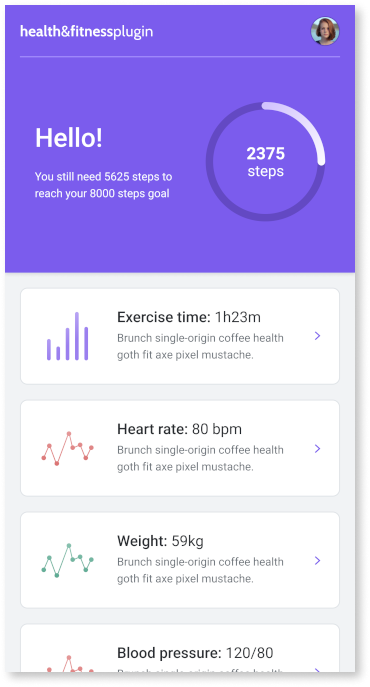
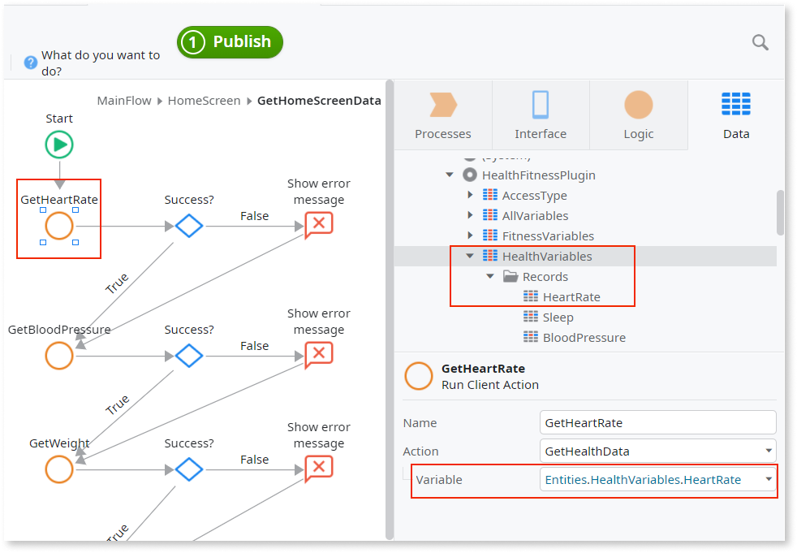
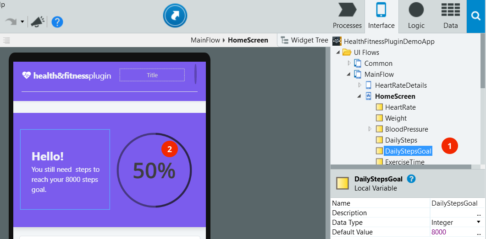
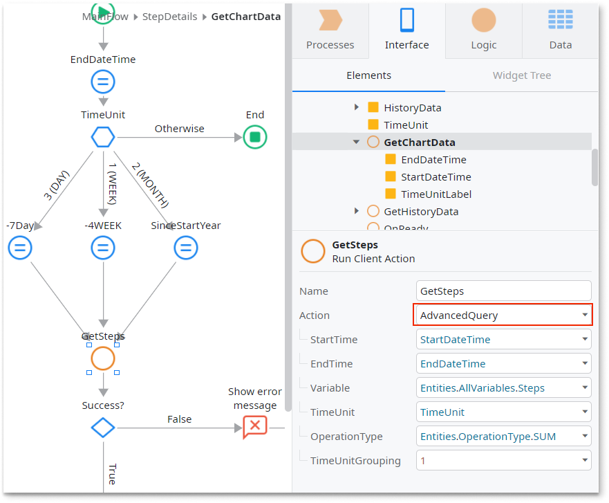

# Health & Fitness Plugin

OutSystems is preparing a Health & Fitness plugin for a general release. The team invites all developers and UX people to submit their feedback. How can the team make the plugin better? For what use cases you need documentation most? Let us know [at this forum topic](https://www.outsystems.com/forums/discussion/73732/health-fitness-plugin-under-development-feedback-wanted/)! 

The [Health & Fitness plugin](https://www.outsystems.com/forge/component-overview/11715/) enables you to access and use health and fitness data in a mobile app. The plugin provides access to the Apple HealthKit and Google Fit APIs by letting you use data relevant to your health and fitness use cases.

The plugin is unaware of the provider you use for data, but you always need to request permissions from users to access data. The plugin saves no health and fitness data to the device. In cases where your app writes data to the APIs, the package name is the identifier of the data source. 

As a good practice, verify the plugin is available in the app and prevent the app from crashing. Use the **Logic** > **Client Actions** > **HealthFitnessPlugin** > **CheckHealthFitnessPlugin** action for check for the plugin availability. If the plugin isn't available to the app, display an error to your users.

To learn how to install and reference a plugin in your OutSystems apps, and how to install a sample app, see [Adding plugins](../intro.md#adding-plugins).

## Sample app

OutSystems provides a sample app that contains logic for common use cases. Install the [Health & Fitness sample app](https://www.outsystems.com/forge/component-overview/11715/) from Forge and then open it in Service Studio.

This sample app shows you how to do the following with the health and fitness data:

* Request permission to access
* Do simple queries that return the last logged value
* Do advanced queries for a specific period that return a list of values
* Use the data in user interface, such as cards, tables, and graphs

 

## Enabling your users to track their health and fitness data

The following steps show how to design a use case that includes health and fitness data.

1. Create logic to request permission to access heath and fitness data
1. Create a user interface
1. Create logic to access and store heath and fitness data
1. Optionally, create logic to write and store new health and fitness data

Refer to the sample app for examples.

### Requesting access to health and fitness data

Before your app can access data, request permission from the users to access their health and fitness data. From Service Studio, select the **Logic** > **Client Actions** > **HealthFitnessPlugin** and use the **RequestPermission** action.

You can define the variables and the following permissions access types:

* Read
* Write
* Read and write

In the screen logic, request the permissions from the app users, in an action that's triggered by **On Initialize** event.

The plugin comes with groups of permissions. Use the groups of permissions as accelerators to check for access when you request data.

The plugin has groups of default variables in **Data** > **Entities** > **HealthFitnessPlugin** that define the permission type for:

* HealthVariables
* FitnessVariables
* ProfileVariables
* SummaryVariables

Refer to the sample app for more examples.

### Creating a user interface

Start, for example, by defining a variable that corresponds to the type of output you want to show. Create a variable that holds the data so that you can access, store, and display the number of steps taken in a day (1).

 

To show the step count for the day, you can use an **Expression** and customize the look and feel of the parent widget (2).

### Create logic to access and use health and fitness data

The plugin reads and writes the data through the **AdvancedQuery** client action. In the **AdvancedQuery** action, set the values for the predefined variables.

The health or fitness query parameters might include:  

* period: start, end
* time unit: second, minute, hour, day, week, month, year
* operation type: sum, min, max, average 
  
 

Verify that access and storage of health or fitness data on the device works. Check the value of **AdvancedQuery**. If **Success** is True, handle the data in **AdvancedQuery.** by assigning it to a variable of the same data type. Refer to the sample app for an example.

### Create logic to write health and fitness data

To write health and fitness data you can use the **WriteData** action. Set the parameters for the type of health or fitness variable you want and the new value you want to store.

To check that writing the health or fitness data on the device is working, verify the value of **WriteData.Success** is **True**.

### Handling errors

The app with the plugin can run on many Android or iOS devices, with different hardware and configurations. To ensure a good user experience and prevent the app from crashing, handle the errors within the app.

Following is a list of actions you can use to make sure there are no errors:

| Variable        | Action                   | Description                                                    |
| --------------- | ------------------------ | -------------------------------------------------------------- |
| **IsAvailable** | CheckHealthFitnessPlugin | True if the plugin is available in the app.                    |
| **Success**     | AdvancedQuery            | True if there aren't errors while accessing and storing data.  |
| **Success**     | GetFitnessData (*)       | True if there aren't errors while accessing and storing  data. |
| **Success**     | WriteData                | True if there aren't errors while writing data.                |

(*) There are several actions in the Health & Fitness plugin that begin with **Get** and have a **Success** variable.
