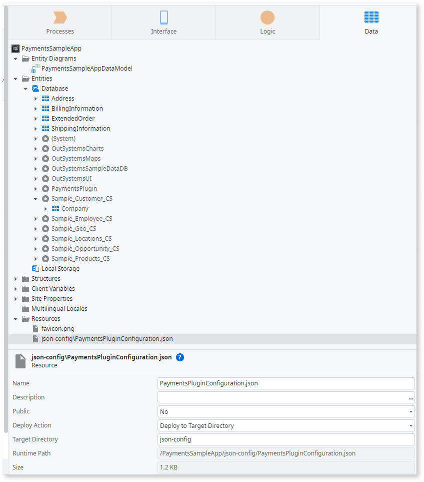

# Payments Plugin

Applies only to Mobile Apps.

Use the [Payments
Plugin](https://www.outsystems.com/forge/component-overview/13678/payments-plugin)
to let users complete payments using Apple Pay and Google Pay. The plugin
allows users to provide details of the payment, the merchant's information, the
amount and currency of the transaction, and billing contacts.

After adding the plugin to your app, your logic should verify if the plugin is
available, in your app, at run time. Use the

**Logic** > **Client Actions** > **PaymentsPlugin** > **CheckPaymentsPlugin**

action to check for the plugin availability. Knowing whether the plugin is
available for your users' devices allows your app to take appropriate actions
while interacting with that user. Attempting to use a plugin that's
unavailable at runtime causes the app to crash.

See [Adding plugins](../intro.md#adding-plugins) to learn how to install and
reference a plugin in your OutSystems apps and how to install a demo app.

## Sample app

OutSystems provides a sample app that contains logic for common use cases.
Install the Payments sample app from Forge and open it in Service Studio.

This sample app shows you how to do the following:

* Get the ApplePay and GooglePay configurations from the Payments
  Configurator and setup the plugin with that information;

* Add the logic to a button to trigger the payment flow.

## Enable a frictionless payment experience in your app

The following steps show how to enable your users to pay with Apple Pay or
Google Pay:

1. In Payments Configurator, configure a mobile payment service for your app.

1. In your app, create logic to set up the plugin and to check if payment is possible.

1. In your app, create a button and logic to trigger the payment.

### Configure a mobile payment service for your app

Before triggering a payment in an app, you need to configure a new payment
method service for use in that app. For that, you can use the [Payments Plugin
Configurator](https://www.outsystems.com/forge/component-overview/13679/payments-plugin-configurator),
a Reactive Web app that lets you configure the base information for [Apple
Pay](https://developer.apple.com/documentation/apple_pay_on_the_web/applepaypaymentrequest)
and [Google
Pay](https://developers.google.com/pay/api/android/reference/request-objects).

Access Payments Configurator at
`https://<your-environment>/PaymentsConfigurator/`, replacing
`<your-environment>` with the address of your development environment.

To configure a new mobile payment service or edit an existing one, you need to
add the following information (depending on the provider):

| Relevant information | Description |
| - | - |
| Merchant ID | The merchant id. |
| Name | The merchant name. |
| Country | The merchant country. |
| Allowed networks| The networks that the merchant allows (VISA, MasterCard, Amex, etc).
| Supported capabilities | The capabilities that the merchant supports (Debit, Credit, 3DS, etc). |
| Supported card countries | The supported card countries that the merchant support. The default value is "All countries" and you can only specify the countries on ApplePay configuration. |
| Allowed countries to ship (Google Pay only) | The supported countries the merchant ships to. (Google Pay only) |
| Required contacts for shipping | The shipping contact information that you require from the user to execute the payment (name, email, phone number and postal address). |
| Required contacts for billing | The billing contact information that you require from the user to execute the payment (name, email, phone number and postal address). |
| Payment Service Provider (PSP) | The identification of the Payment Service Provider (PSP) that you are going to use to process the payment. (GooglePay only) |

Notice that the Payment Service Provider in the Payments Configurator is just
to identify the PSP that you are going to use on your application. You should
still integrate and configure the Payment Service Provider API that you want to
use on Service Studio. Don’t forget you need a PSP license for the plugin to
work.

### Create logic to set up the plugin

Check the plugin's availability using the **CheckPaymentsPlugin** client action. The screenshot below shows the action from the sample app. From the interface tab; `UI Flows` > `Main Flow` > `ShoppingCart` > `OnReady`.

In the OnReady action of the screen that you are going to add the provider
button to trigger the payment, do the following:

1. To check if the plugin works correctly during runtime, add the
   CheckPaymentsPlugin action after the Start node.

1. Handle the response from the CheckPaymentsPlugin. After the
   CheckPaymentsPlugin, add an **If**.

1. Set the Condition of the **If** to CheckPaymentsPlugin.**IsAvailable**.

1. In the False branch of the **If**, add a Message, set the message Type to
   Error, and set a Message for the user.

The SetupPaymentsPlugin client action does the setup of the plugin.​​ This
action gets the information inside the configurator about Apple Pay or Google
Pay configurations. The screenshot below shows the second part of the action
from; `UI Flows` > `Main Flow` > `ShoppingCart` > `OnReady`.

In the OnReady action, below the flow that you defined in the previous step, do
the following:

1. After checking the plugin's availability, add the **SetupPaymentsPlugin**
   action.

1. For testing purposes, you can use a test environment for payments:

    1. For **Android** (Google Pay), you have the
    SetupPaymentsPlugin.**Environment** parameter to set the environment of
    your payments (Test or Production). During development, you should use the
    Test option. Don’t forget to change this to Production when you are
    releasing your application to the store.

    1. For **iOS** (Apple Pay), you can learn more about [Sandbox
    Testing](https://developer.apple.com/apple-pay/sandbox-testing/) to achieve
    the same experience.

1. Handle the response from the SetupPaymentsPlugin. After the
   SetupPaymentsPlugin, add an **If** node to evaluate the success of this
   operation.

1. In the False branch of the **If**, add a Message, set the message Type to
   Error, and set a Message for end users in case of failure to set up the
   payments plugin.

1. You can get the JSON configuration file, PaymentsPluginConfiguration.json,
   from the App Details on your Payments Configurator. After editing the
   details of an app in the Payments Configurator, select the `Download
   configurations` button.

    

1. Add a **PaymentsPluginConfiguration.json** file in the Resources folder of
   your app (note that the Target Directory parameter of the Resource must be
   filled with json-config). You shouldn’t edit the generated json file.

    

1. Notice that you need to repeat steps 5 and 6 each time you change the
   ApplePay and/or GooglePay configurations on the Payments Configurator.

Optionally, as a best practice, you should verify if ApplePay or GooglePay is
available and configured on the device. Then if there’s any valid card to
make the payment, you can call the **IsReadyToPay** client actions.

To make this verification, do the following:

1. After setting up the plugin, add the **IsReadyToPay** action.

1. Handle the response from the **IsReadyToPay**. Using the response, you can
   set the logic to apply conditions for your app, based on whether the user
   has Apple Pay or Google Pay available, or neither, configured on the device
   and if there’s any valid card to make the payment.

The sample app uses that response to enable/disable the pay button and to
handle error messages on the screen, depending on each platform (Android or
iOS)

### Create a button and logic to trigger the payment

The plugin executes the payment through the **TriggerPayment** client action.​​

To trigger the payment on your app's screen, do the following:

1. In your app's login screen, add a **Button** for each payment method service
   you want to enable. Ensure you follow the provider's branding guidelines
   when creating each button ([Apple
   Pay](https://developer.apple.com/design/human-interface-guidelines/apple-pay/overview/introduction/)
   and [Google
   Pay](https://developers.google.com/pay/api/android/guides/ux-best-practices)
   guidelines).

2. For each button you added in the previous step, add an action to handle the
   **OnClick** event. In the properties of the payment button open the
   **Events** > **OnClick** dropdown and select the
   **New Client Action**.**OnClick** event.

    

3. In the action flow of each action, you created in the previous step, check if
   the plugin is working properly during runtime. After the Start node, add the
   **TriggerPayment** action.

    

4. Handle the response from **TriggerPayment**. After **TriggerPayment**, add
   an **If** node.

5. In the **False** branch of the **If** node, add a **Message**, set the
   payment process fails.

6. In the **True** branch of the **If**, you can create a logic to redirect for
   a confirmation screen, as in the sample app.

## Known issues and workarounds

None.

### Compatibility with operating systems

The mobile payments plugin is available for both iOS (Apple Pay) and Android
(Google Pay).
