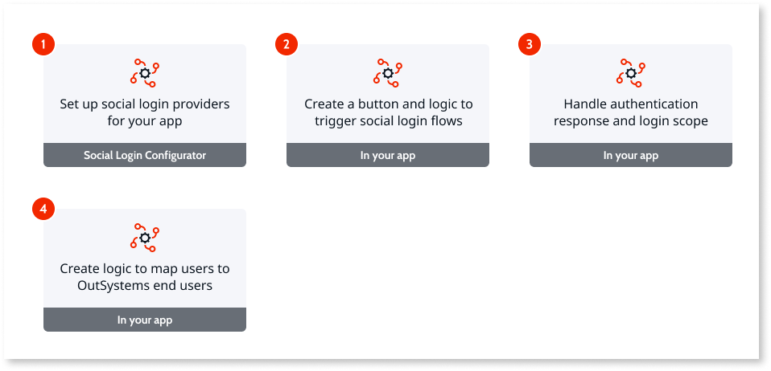
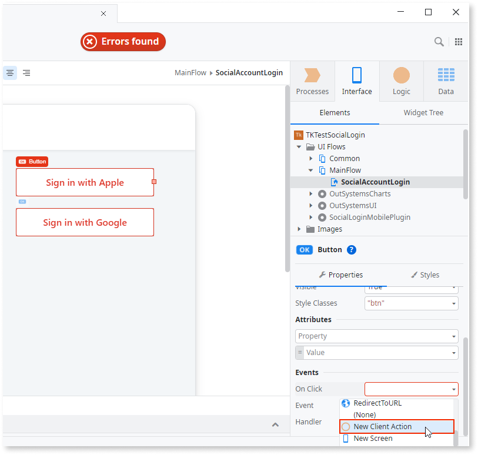
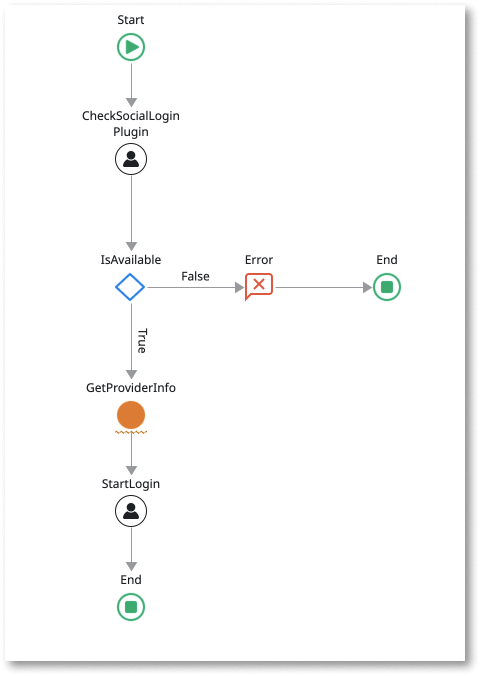

# Social Login plugin

<div class="info" markdown="1">

Applies only to Mobile Apps.

</div>

The [Social Login plugin](https://www.outsystems.com/forge/component-overview/7895/social-login-mobile) provides a login service that uses an external provider, namely Google, Apple, Facebook, or LinkedIn.
The plugin enables you to request access to a subset of your user's data stored by the provider, such as name, email, and profile picture.
You can then use this information to create or start a user session on your app.

As a good practice, verify the plugin is available during runtime in your app to prevent the app from crashing.
Use the **Logic** > **Client Actions** > **SocialLoginPlugin** > **CheckSocialLoginPlugin** action to check for the plugin availability.
If the plugin isn't available to the app, display an error to your users.

<div class="info" markdown="1">

To learn how to install and reference a plugin in your OutSystems apps, and how to install a sample app, see [Adding plugins](../intro.md#adding-plugins).

</div>

## Sample app

OutSystems provides a sample app that contains logic for common use cases.
Install the Social Login sample app from Forge and then open it in Service Studio.

This sample app shows you how to do the following:

* Trigger a native social login flow using Apple, Google, Facebook, or LinkedIn as providers.

* Trigger a Progressive Web App (PWA) social login using Apple, Google, Facebook, or LinkedIn as providers.

* Use the profile info (including name, email, and profile picture) returned by the provider on a screen.

<div class="info" markdown="1">


The next step in the development of a mobile app is to use the profile information (name, email, and profile picture) returned by the provider.
Use these to create a user or manage a session on the OutSystems Users service.
This isn't shown in the sample app but is possible by using the User systems database and its entity actions.

</div>

## Enable a frictionless social login experience in your app

The following steps show how to enable your users to log in to your app using an existing social media account:



1. [In Social Login Configurator, set up social login providers for your app](#set-providers).

1. [In your app, create a button and logic to trigger social login flows](#login-flow).

1. [In your app, handle authentication response and login scope](#auth-response).

1. [In your app, create logic to map users to OutSystems end users](#map-users).

### Set up social login providers for your app { #set-providers }


Before being able to provide the option for social login in an app, you need to configure the providers used in that app.
For that, you **must** use the Social Login Configurator, a Reactive Web app that lets you set up a new provider to use with your app.

Access the Social Login Configurator at `https://<your-environment>/SocialLoginConfigurator/`, replacing `<your-environment>` with the address of your development environment.

To configure a new provider or edit an existing one you need to add the following information (there are differences depending on the provider):

#### Apple

Relevant Information | Description
---|---
Identifier | A public identifier your app on the provider side. It's a string type value available to any registered developer on Apple Developer. You can access the Identifier value on the Certificates, Identifiers, and Profiles pages of your app.
Key ID | Key ID corresponding to your Secret (`.p8`).
Team ID | Identifier of your team on Apple Developer.
Secret (`.p8`) | A confidential code known only to your app and the authorization server. It's a string type value type value available to any registered developer on Apple Developer. You can access the Secret value during the configuration creation on Apple Developer.

Check the information on the OAuth configuration of Apple login in [Getting Started - Sign in with Apple - Apple Developer](https://developer.apple.com/sign-in-with-apple/get-started/).

#### Google

You need to create a configuration for the different ways you want to distribute your app.
This is in the **Define your App Type** field.
For example, if your app is distributed both as an Android app and as a PWA, you need two provider configurations.

Relevant Information | Description
---|---
Client ID | A public identifier your app on the provider side. It's a string type value available to any registered developer on the Google Cloud Platform. You can access the ClientID value on the OAuth Consent tab on your app's Credentials screen.
Client Secret | A confidential code known only to your app and the authorization server. It's a string type value type value available to any registered developer on the Google Cloud Platform. You can access the ClientSecret value on the OAuth Consent tab on your app's Credentials screen.

While developing and testing your app, you can use the debug certificate fingerprint (SHA-1) that you obtain from your debug keystore file.
Then use it for the Android OAuth client configuration on the Google Cloud Console.

For Android apps in production, you must obtain the release certificate fingerprint (SHA-1 hash) using your production Keystore file (.jks).
Then update the Android OAuth client configuration on the Google Cloud Console to use it.

Find out how to obtain debug and release certificates [here](https://developers.google.com/android/guides/client-auth#self-signing_your_application).

Find more information on OAuth configuration of Google login in [Start Integrating Google Sign-In into Your Android App](https://developers.google.com/identity/sign-in/android/start-integrating).

#### Facebook

You need to create a configuration for the different ways you want to distribute your app.
Define configuration in the **Define your App Type** field.
Note that, for example, if your app is distributed both as an Android app and as a PWA, you need to create two provider configurations.

Relevant Information | Description
---|---
App ID | A public identifier your app on the provider side. It's a string type value available to any registered developer on Meta for Developers. You can access the AppID value in your app's settings.
App Secret | A confidential code known only to your app and the authorization server. It's a string type value available to any registered developer on Meta for Developers. You can access the AppSecret value in your app's settings.

Check the information on the OAuth configuration of Facebook login in [Facebook Login - Documentation - Facebook for Developers](https://developers.facebook.com/docs/facebook-login/).

#### Linkedin

Relevant Information | Description
---|---
Client ID | A public identifier your app on the provider side. It's a string type value available to any registered developer on LinkedIn Developer. You can access the Identifier value on the "Authentication" side navigation link, underneath the header "Authentication Keys".
Client Secret | A confidential code known only to your app and the authorization server. It's a string type value available to any registered developer on LinkedIn Developer. You can access the Identifier value on the "Authentication" side navigation link, underneath the header "Authentication Keys".

Check the information on the OAuth configuration of LinkedIn login in [Sign In with LinkedIn documentation](https://docs.microsoft.com/en-us/linkedin/consumer/integrations/self-serve/sign-in-with-linkedin?context=linkedin/consumer/context)

### Create a button and logic to trigger social login flows { #login-flow }

The plugin triggers a social login flow through the **StartLogin** client action.

To enable social logins in your app's login screen, do the following:

1. In your app's login screen, add a **Button** for each social login provider you want to enable.
Ensure you follow the provider's branding guidelines when creating each button.

1. For each button you added in the previous step, add an action to handle the **On Click** event.
In the properties of each social login button, open the **Events** > **On Click** dropdown and select **New Client Action**.

    

1. In the action flow of each action you created in the previous step, check if the plugin is working properly during runtime.
After the **Start** node, add a **CheckSocialLoginPlugin** action.

1. Handle the response from CheckSocialLoginPlugin. After **CheckSocialLoginPlugin**, add an **If**.

1. Set the **Condition** of the **If** to `CheckSocialLoginPlugin.IsAvailable`.

1. In the **False** branch of the **If**, add a **Message**, set the message **Type** to `Error`, and set a **Message** to show to end users.

1. Connect the **Message** to an **End**.

1. In the **True** branch of the **If**, add a **StartLogin** action.

1. Connect **StartLogin** to an **End**.

    

1. In the **Data** tab, create a **Site Property** named `EnvironmentAddress`, and set its default value to your environment address, `https://<your-environment>`. To obtain the value of this property, create a **Server Action**.
When you deploy your app to another environment make sure you set its value to the corresponding environment address.

1. In the properties of the **StartLogin** action, set the values for the  mandatory inputs:

    Provider
    : The social login provider.

    ClientID
    : A text type value available to any registered developer on the Provider development platform. You can access the ClientID value on the settings of your OAuth configuration.

    RedirectURI
    : A text type value that will send you the authorization result for any backend service you may be using. You can specify the RedirectURI on the settings of your Provider OAuth configuration.

    The Redirect URI is a combination of your environment URL and the **AuthenticationRedirect** URL. Set the **Redirect URI** by doing the following:

    1. Get the **AuthenticationRedirect** URL for each provider from the following list, or by opening the Social Login Configurator app in Service Studio, and then in the **Logic** tab, go to **REST integration** > **SocialLoginAuth**:

        * For Apple, `/SocialLoginConfigurator/rest/SocialLoginAuth/AuthenticateRedirectApple`
        * For Google, `/SocialLoginConfigurator/rest/SocialLoginAuth/AuthenticateRedirectGoogle`
        * For Facebook, `/SocialLoginConfigurator/rest/SocialLoginAuth/AuthenticateRedirectFacebook`
        * For LinkedIn, `/SocialLoginConfigurator/rest/SocialLoginAuth/AuthenticateRedirectLinkedIn`

    1. Set the **Redirect URI** to:

            EnvironmentAddress + "<authentication-redirect-url>"

        `EnvironmentAddress` is the site property that holds the environment address and `<authentication-redirect-url>` is the **AuthenticationRedirect** URL for the provider.

1. For the following social login providers and app type combinations:

    Social Login provider | App Type
    ---|---
    Apple | Android
    Google | iOS
    Facebook | Android, iOS
    LinkedIn | Android, iOS

    you'll need to add configurations to your app's Extensibility Configurations:

    ```JSON
        {
            "preferences": {
                "global": [
                    {
                        "name": "SOCIAL_CONF_API_ENDPOINT",
                        "value": "https://<your-environment>/SocialLoginConfigurator/rest/v1/configurations"
                    }
                ]
            }
        }
    ```

    It's via the REST endpoint in these Extensibility Configurations that we'll have access to what you have configured in the Social Login Configurator Reactive Web App.

<div class="warning" markdown="1">

 Previous versions of the Social Login Plugin and Configurator required the download and use of the **SocialLoginConfigurations.json** file.
 This is deprecated from Social Login Mobile Plugin Version ≥ 4.0.0 and Social Login Configurator Version ≥ 4.0.0.
 Delete this file from your app's Resources (if present).

</div>

### Handle authentication response and login scope { #auth-response }

So that your app can handle failed login attempts and access the output information of a social login, also known as login scope, you need to add the **Authenticate** block from **SocialLoginMobilePlugin** to the screen where the **StartLogin** action occurs.
Do the following:

1. In the login screen where you call **StartLogin**, add the **Authenticate** block from **SocialLoginMobilePlugin** to the **Bottom** placeholder.

1. Then, create an action to handle the **OnAuthenticationCompleted** event. In the properties of **Authenticate**, in the **Handler** dropdown select **New Action**.

1. In the action flow of the handler action, after the **Start**, add an **If**.

1. Set the **Condition** of the **If** to `Success`.

1. In the **False** branch of the **If**, add a **Message**, set the message **Type** to `Error`, and set a display **Message** for end users.
This message displays if the authentication fails, and you may use the **Error.ErrorMessage** from the **Authenticate** block.

1. Connect the **Message** to an **End**.

1. Connect the **True** branch of the **If** to a **Destination** and select the screen where you want users to navigate after a successful login.

After setting up your block handler, you can use the login scope by passing the OnAuthenticationCompleted block variables to any destination of your choice.

The login scope includes the following variables:

Scope | Variable type | Description | Additional Info
---|---|---|---
ID | Text | User's ID stored by the social login provider. |
FirstName | Text | User's first name stored by the social login provider. |
LastName | Text | User's last name stored by the social login provider. |
Email | Text | User's email stored by the social login provider. |
Picture | URL | User's profile picture stored by the social login provider. | Not available for Social Logins with Apple
Token | Text | User's access token stored by the social login provider. |

### Create logic to map users to OutSystems end users { #map-users }

Ensure you map social login users to [OutSystems end users](../../../develop/security/end-user-manage/intro.md).
Note that users that sign in using the social login count as non-anonymous end users.
This means that they count towards the user limits established in your subscription.

Use the methods available in the [Users API](../../../ref/apis/auto/users-api.final.md) to create or update end-user records.

## Known issues and workarounds

Check the following known issues and possible workarounds.

### Compatibility with operating systems

#### iOS only.

The native login flow for Apple sign is only available for iOS 13 and later versions.
For earlier iOS versions, use the PWA login flow.
