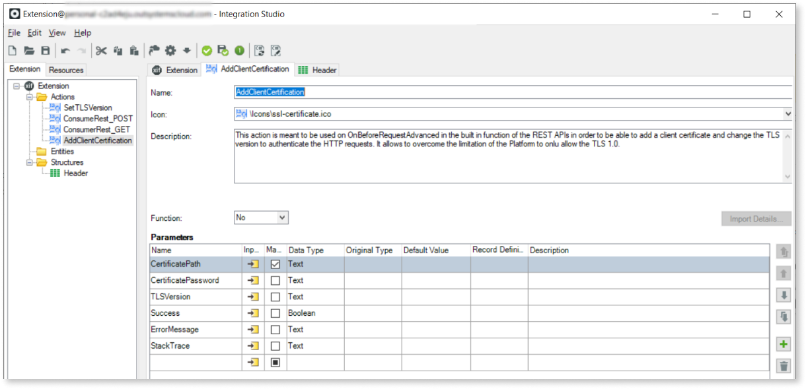
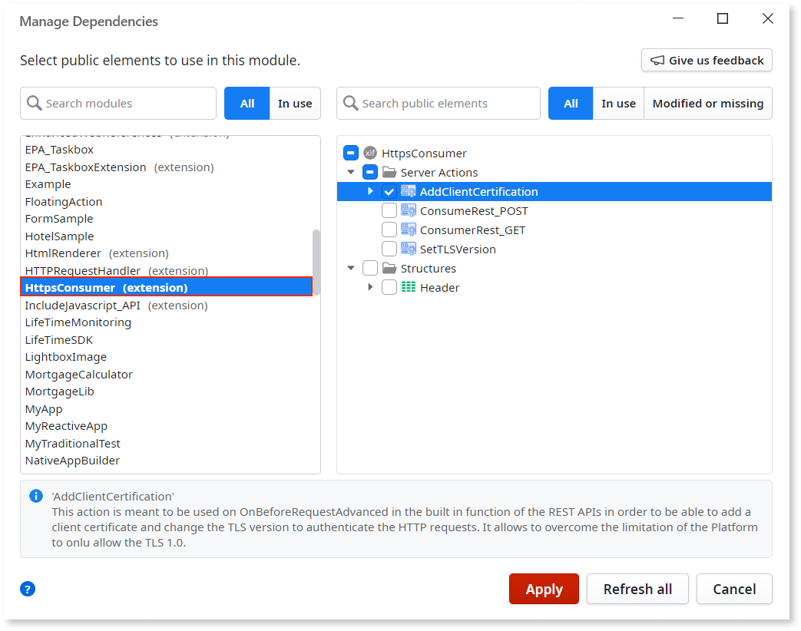
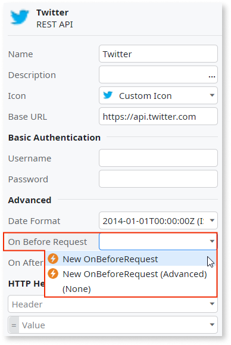
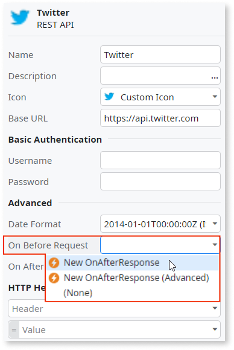
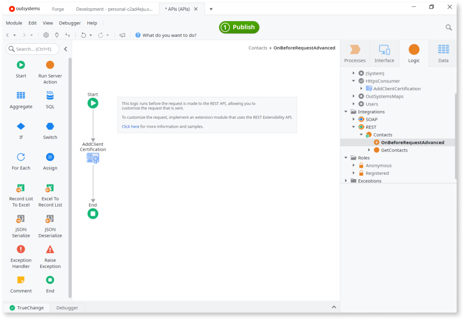

# Advanced Customizations

When using a REST API, you can use your own .NET code to customize the information that is sent in requests or received in responses. For these advanced scenarios, create an extension using Integration Studio and use the [REST Extensibility API](../../../ref/apis/rest-extensibility-api.md) in your code.

Example use cases:

* Use a specific algorithm to encode part of the request content
* Add support for client-certificate authentication
* Handle a complex response, or customize it according to your needs

Do the following:

1. In Integration Studio, create an extension to map the .NET code into Service Studio actions. Define actions and their input/output parameters.

    

1. Click **Edit Source Code .NET** in the toolbar to open the extension solution in Microsoft Visual Studio. Use the [REST Extensibility API](../../../ref/apis/rest-extensibility-api.md) in your .NET code to obtain and manipulate requests/responses.  

    

    To see examples of how to use the REST Extensibility API, [search for modules that use REST APIs](https://www.outsystems.com/forge/list?q=REST%20API&t=&o=&tr=False&oss=False&c=&a=&v=11&hd=False&tn=&scat=forge) in the Components category of [OutSystems Forge](https://www.outsystems.com/forge/).

    To learn more about Integration Studio check [Extend Logic with Your Own Code](../../integration-studio/getting-started/intro.md).

1. In Service Studio, add a dependency on the extension actions you will use by opening the **Manage Dependencies** dialog.

    

1. In the REST API, use the following properties:

    * **On Before Request** property: set to `New OnBeforeRequest (Advanced)` to create a "OnBeforeRequestAdvanced" callback under the REST API tree element. Use it to customize the request before it is sent.

        

    * **On After Response** property: set to `New OnAfterResponse (Advanced)` to create a "OnAfterResponseAdvanced" callback under the REST API tree element. Use it to customize the response after it has arrived.

        

    After setting the value, you will have an action named "OnBeforeRequestAdvanced" or "OnAfterResponseAdvanced" under the REST API.

1. Double-click the newly created action to edit it.

1. Use the referenced extension actions in the action flow to customize the request or response.

