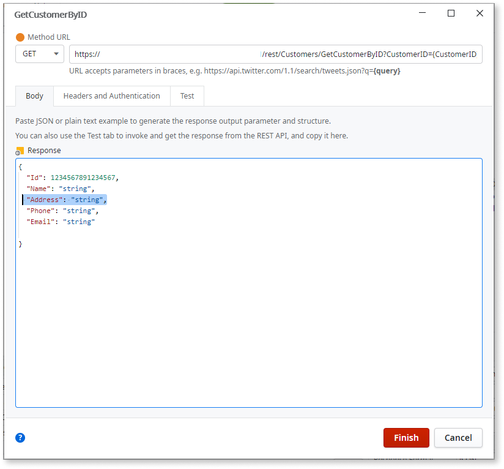

# Change a REST API Method

When a REST API method that you are consuming changes, you can update the
definition of the REST API method to reflect those changes. For example, when
new parameters are added to a REST API method.

Start by looking into the REST API documentation and understand what you will
need to change when invoking the REST API method.

## Update the REST API Method

To update the definition of the REST API method, do the following:

1. In the **Logic** tab, open the **Integrations** folder and expand the REST element containing the method you want to change.

2. Double-click on the REST API Method you want to change.

3. Update the REST API Method information to reflect the change you want to execute, such as adding new parameters to the request structure:

     

4. Click **OK**. 

## Adapt your application to the changes

When you change the definition of the REST API method, OutSystems
automatically updates the REST API Method and the associated structures
according to your changes:

You can now adapt the action flows or screens of your application to reflect
the updated functionality.
