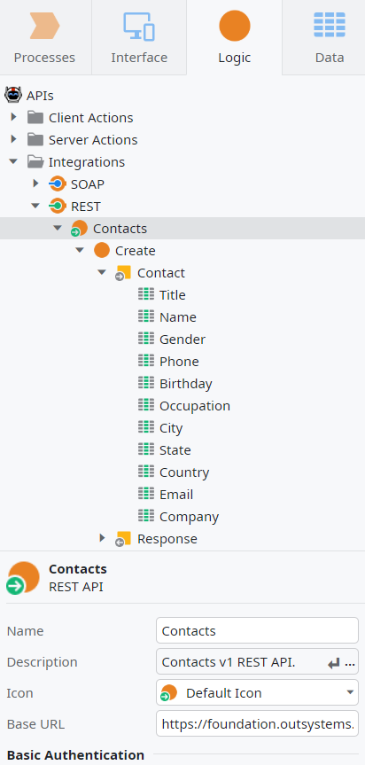
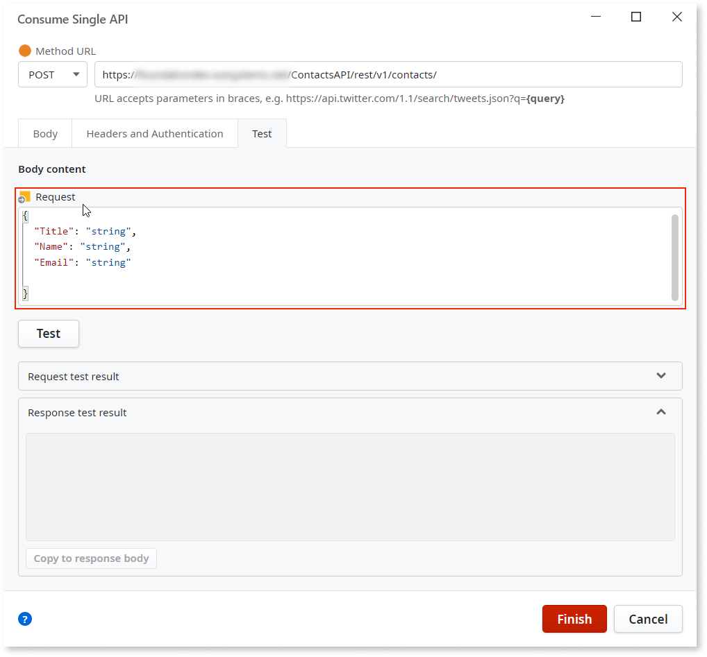
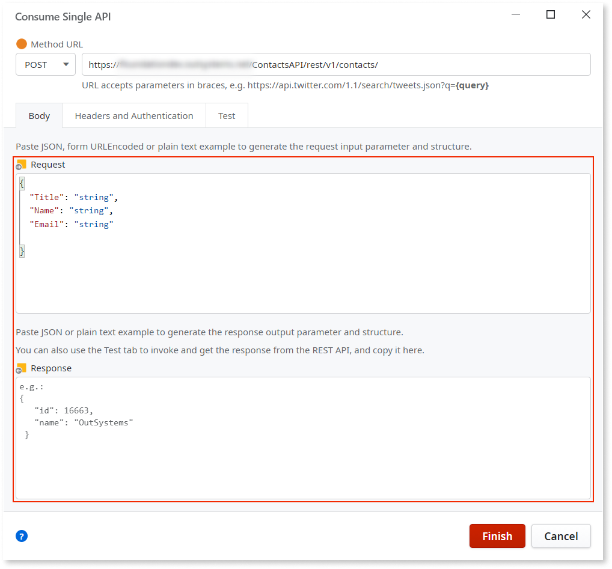
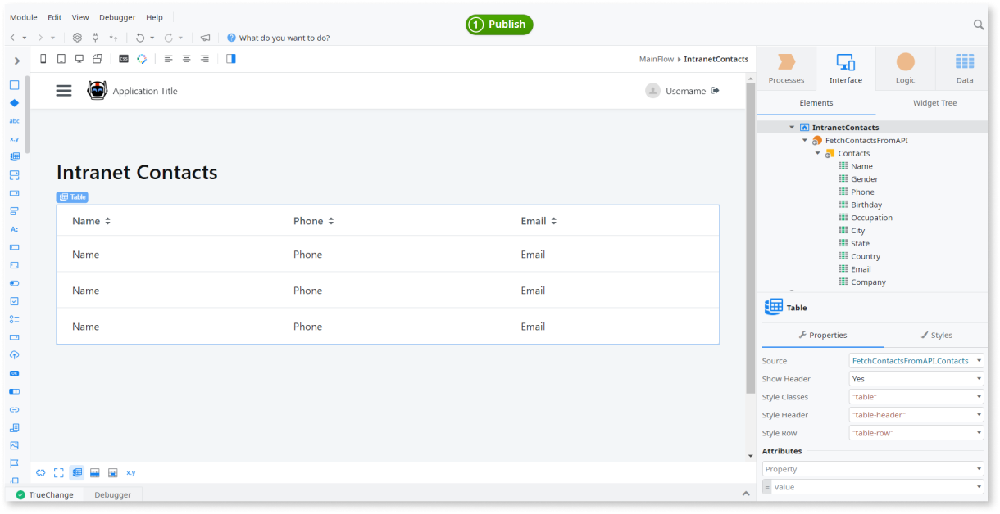

# Consume One or More REST API Methods

Make sure you gather all the information you need from the REST API documentation before starting.

In Service Studio you can:

* consume all REST API methods described in a Swagger specification file, provided either by entering a URL or by selecting a specification file from the local file system.

* Consume a single REST API method.

## Consume all methods of a REST API { #all-methods }

You can consume all methods of a REST API if that API is compliant with the [Swagger specification](https://swagger.io/specification/) – REST APIs exposed by OutSystems are compliant with this specification.  

You can import Swagger specifications either by providing a URL or by selecting a specification file from the local file system.

Do the following: 

1. In the **Logic** tab, open the **Integrations** folder.

1. Right-click on the **REST** element and select **Consume REST API...**.

    

1. In the displayed dialog, choose **Add All Methods**.

    

1. If you're importing an OpenAPI 3.0 specification file and the specification includes more than one server endpoint, choose the desired endpoint and click **Finish**.

    

    _Note:_ You can't change the server endpoint after importing the REST API.

When importing the REST API, Service Studio does the following:

* Creates the REST API 
* Creates the REST API Method with the corresponding input and output parameters
* Creates the Structures to hold the corresponding input and output parameters under a new tree element with the REST API name
* Maps the [REST Data Types into OutSystems Data Types](../../../ref/extensibility-and-integration/rest-apis/consumed-rest-api/mapping.md)

## Consume a single method of a REST API { #single-method }

In OutSystems you can consume a **single method** of a REST API, based on example content for the request and/or response. You may need to specify input parameters in the URL and/or a body for manipulation methods like `POST` or `PUT`.

Do the following: 

1. In the **Logic** tab, open the **Integrations** folder.

1. Right-click on the **REST** element and select **Consume REST API...**.

    

1. In the displayed dialog, choose **Add Single Method**.

    

1. Fill the information about the **Method URL**. You can include parameters between braces in the URL for the method's input parameters.

    Examples:  
    `GET https://api.example.com/Portal/rest/Contacts/GetAll`  
    `GET https://api.example.com/Portal/rest/Contacts/Get?Id={Id}`  
    `POST https://api.example.com/Portal/rest/Contacts/Create`  

    Each input parameter defined between braces in the URL becomes an input parameter of the method.
    
1. If the REST API you are consuming requires specific headers or uses HTTP Basic Authentication, open the **Headers / Auth** tab and fill the necessary information.

      

1. Fill the information about the Request and the Response. The easiest way to do this is to perform a test to the API and use the test result.

    Alternatively, you can add the JSON structure or plain text example directly in the **Request** and **Response** fields in the **Body** tab. Open the **Test** tab. If you have parameters in your **Method URL**, you need to insert the parameter values to execute the test:

      

    For manipulation methods, such as `POST` or `PUT`, fill the **Request** of the Body Content with the corresponding request structure:  

      

1. Click **Test**. If the test is successful, you will see the method’s response in the Response area of **Test** tab.

    Use that information to fill in the Response in the **Body** tab by clicking **Copy to Response body** in the **Response** area. Leave only the needed fields. 
    
    For manipulation methods (such as `POST` or `PUT`), do the same for the Request, by pressing **Copy to Request body** in the Request area:   

      

    Usually, the most common fields are obtained this way. To know in full detail all the available fields, check the API documentation.

1. Check if the **Request** and **Response** information is correct in the **Body** tab and click **OK**:   

    

When importing the REST API method, Service Studio does the following:

* Creates a REST API element under the **REST** element in the tree
* Creates a REST API Method with the corresponding input and output parameters
* Creates the Structures to hold the corresponding input and output parameters under a new tree element with the REST API name
* Maps the [REST Data Types into OutSystems Data Types](../../../ref/extensibility-and-integration/rest-apis/consumed-rest-api/mapping.md)

## Use a REST API Method in your Application { #use }

OutSystems translates the methods exposed by a REST API into **OutSystems actions**, with the same semantics as any action created by you in Service Studio.

You can now use the newly created methods in your application the same way you use any Server Action:

1. Go to the action flow where you want to use the REST API Method. 
  
      

1. In the **Logic** tab, open the **Integrations** folder and the **REST** element. 

1. Expand the REST API element and drag the REST API Method into your action flow.
  
      

1. Use the method's output parameters as you do for any other action.
  
    
